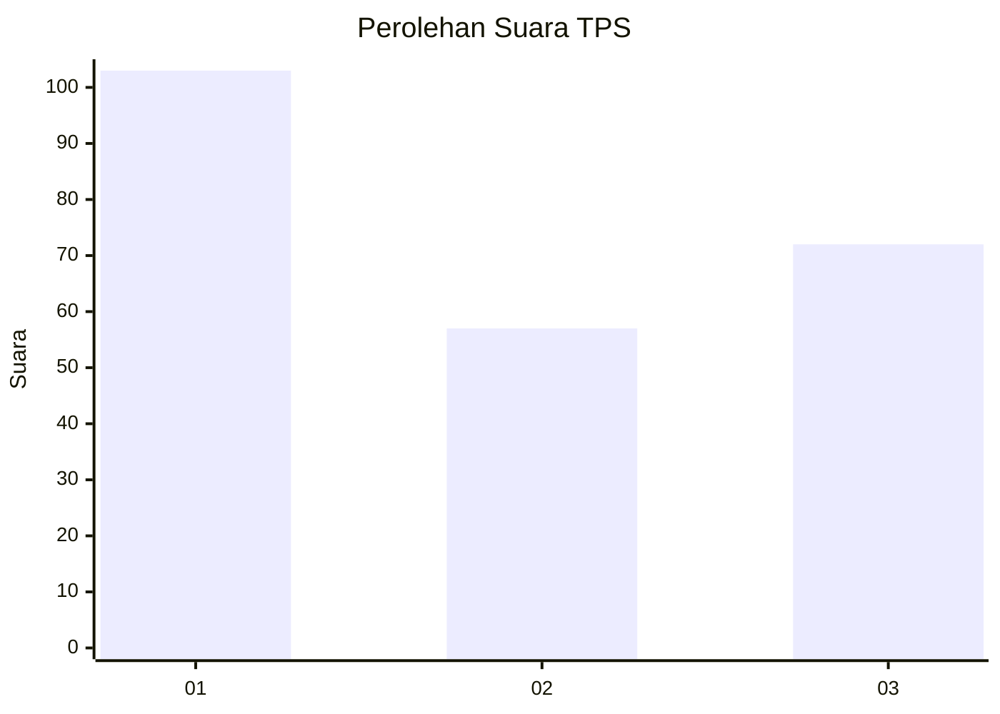
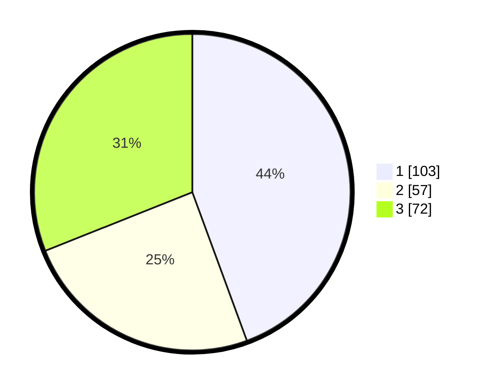

# Hasil

## Grafik

## Tabel

| No. | Nama Paslon    | Suara | Suara (raw) | Persentase |
|:--- |:-------------- | -----:| -----------:| ----------:|
| 1   | ANIES MUHAIMIN | 103   | [103][p-1]  | 44,40      |
| 2   | PRABOWO GIBRAN | 57    | [57][p-2]   | 24,57      |
| 3   | GANJAR MAHFUD  | 72    | [72][p-3]   | 31,03      |

[p-1]: https://github.com/gigit-pemilu/pemilu-2024-35-jawa-timur/blob/main/pilpres/hitung-suara/sub/35-jawa-timur/sub/78-kota-surabaya/sub/09-sukolilo/sub/1001-keputih/sub/050-tps/sub/paslon-1.txt
[p-2]: https://github.com/gigit-pemilu/pemilu-2024-35-jawa-timur/blob/main/pilpres/hitung-suara/sub/35-jawa-timur/sub/78-kota-surabaya/sub/09-sukolilo/sub/1001-keputih/sub/050-tps/sub/paslon-2.txt
[p-3]: https://github.com/gigit-pemilu/pemilu-2024-35-jawa-timur/blob/main/pilpres/hitung-suara/sub/35-jawa-timur/sub/78-kota-surabaya/sub/09-sukolilo/sub/1001-keputih/sub/050-tps/sub/paslon-3.txt

## Foto C Plano

https://sirekap-obj-formc.kpu.go.id/d726/pemilu/ppwp/35/78/09/10/01/3578091001050-20240215-000943--21bc4ca0-d6fe-4567-aab0-b54e62a18ed0.jpg

https://sirekap-obj-formc.kpu.go.id/d726/pemilu/ppwp/35/78/09/10/01/3578091001050-20240215-001039--4c94a5b0-b361-44fb-bff1-f553b59da382.jpg

https://sirekap-obj-formc.kpu.go.id/d726/pemilu/ppwp/35/78/09/10/01/3578091001050-20240215-001103--272bc25b-694f-4ce3-a129-662677428377.jpg

## Metadata

| Key        | Value               |
| ---------- | ------------------- |
| Time Stamp | 2024-02-25 18:00:00 |

