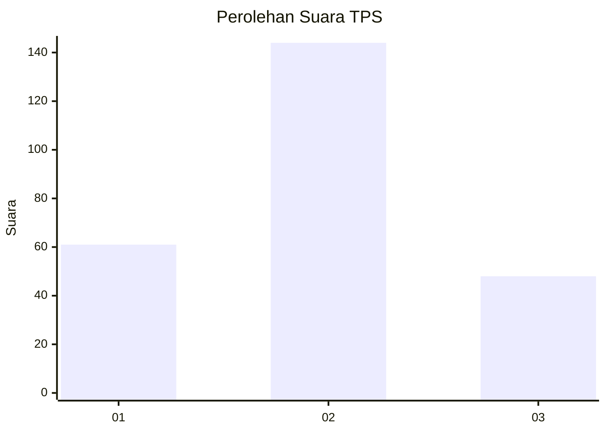
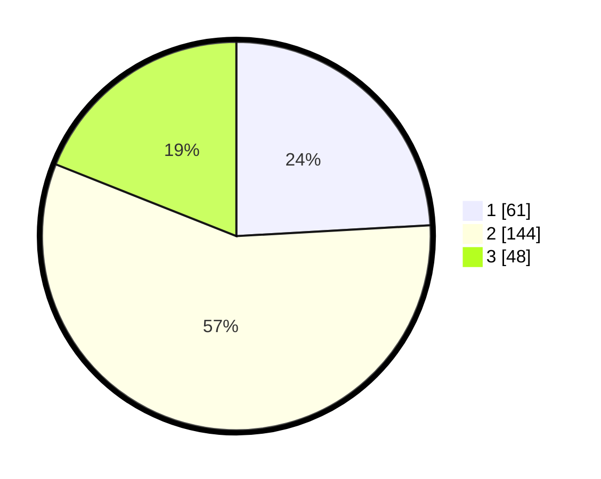

# Hasil

## Grafik

## Tabel

| No. | Nama Paslon    | Suara | Suara (raw) | Persentase |
|:--- |:-------------- | -----:| -----------:| ----------:|
| 1   | ANIES MUHAIMIN | 61    | [61][p-1]   | 24,11      |
| 2   | PRABOWO GIBRAN | 144   | [144][p-2]  | 56,92      |
| 3   | GANJAR MAHFUD  | 48    | [48][p-3]   | 18,97      |

[p-1]: https://github.com/gigit-pemilu/pemilu-2024/blob/main/pilpres/hitung-suara/sub/35-jawa-timur/sub/78-kota-surabaya/sub/09-sukolilo/sub/1001-keputih/sub/053-tps/sub/paslon-1.txt
[p-2]: https://github.com/gigit-pemilu/pemilu-2024/blob/main/pilpres/hitung-suara/sub/35-jawa-timur/sub/78-kota-surabaya/sub/09-sukolilo/sub/1001-keputih/sub/053-tps/sub/paslon-2.txt
[p-3]: https://github.com/gigit-pemilu/pemilu-2024/blob/main/pilpres/hitung-suara/sub/35-jawa-timur/sub/78-kota-surabaya/sub/09-sukolilo/sub/1001-keputih/sub/053-tps/sub/paslon-3.txt

## Foto C Plano

https://sirekap-obj-formc.kpu.go.id/6b3f/pemilu/ppwp/35/78/09/10/01/3578091001053-20240215-031027--70e8bf92-c66d-422a-a2e7-aff9121ed0fd.jpg

https://sirekap-obj-formc.kpu.go.id/6b3f/pemilu/ppwp/35/78/09/10/01/3578091001053-20240215-031332--48b11507-f592-4a3b-940f-1568f9ab9a71.jpg

https://sirekap-obj-formc.kpu.go.id/6b3f/pemilu/ppwp/35/78/09/10/01/3578091001053-20240215-031446--649609fb-1be4-4749-9992-dcbab20b0872.jpg

## Metadata

| Key        | Value               |
| ---------- | ------------------- |
| Time Stamp | 2024-02-25 16:00:00 |

