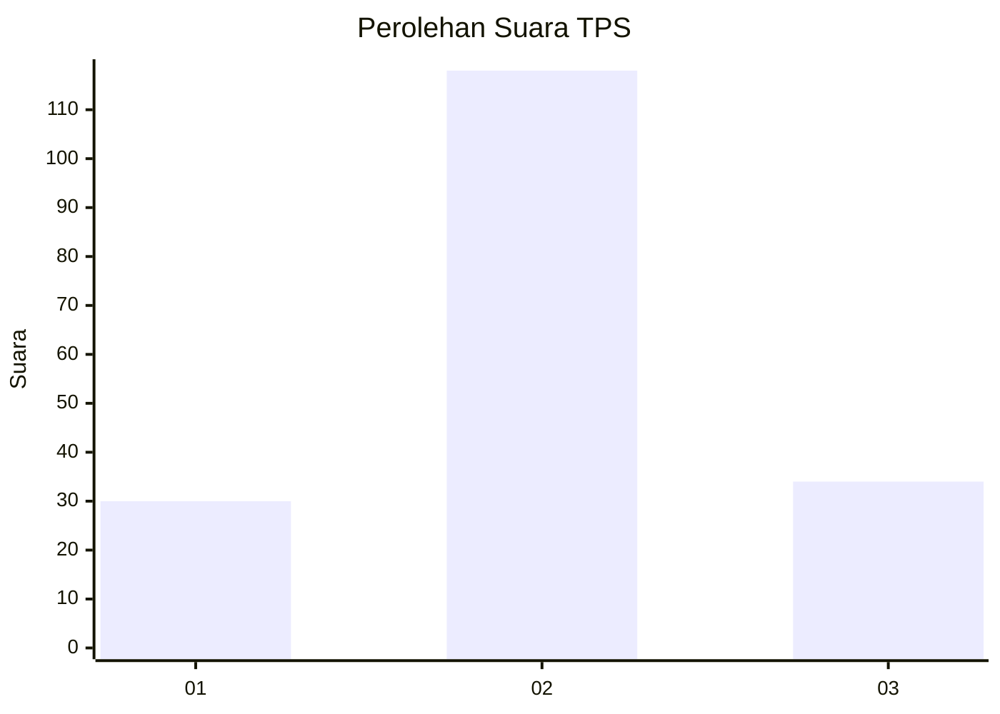
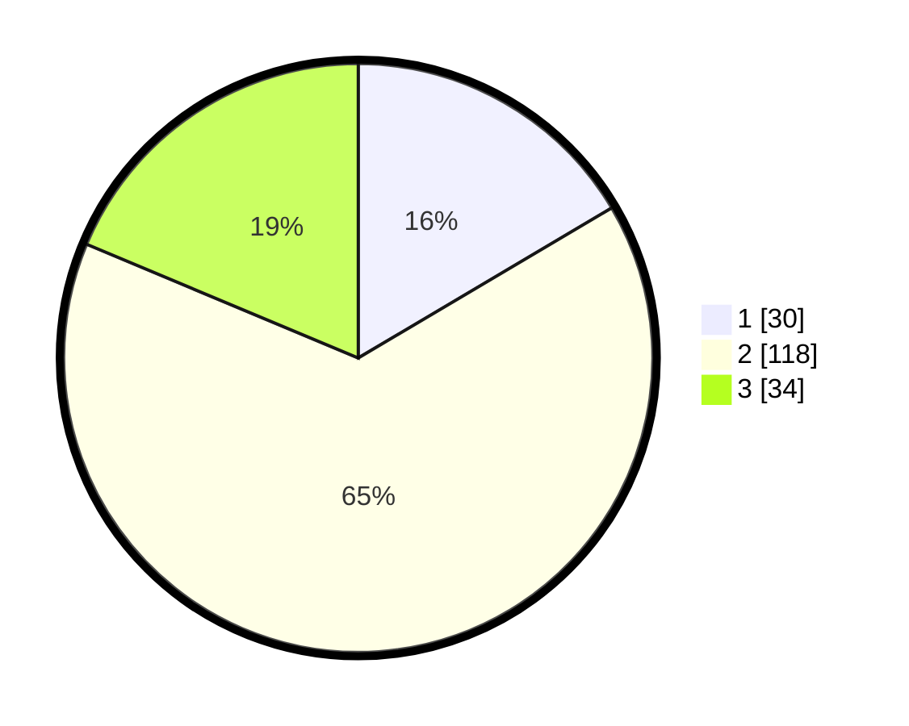

# Hasil

## Grafik

## Tabel

| No. | Nama Paslon    | Suara | Suara (raw) | Persentase |
|:--- |:-------------- | -----:| -----------:| ----------:|
| 1   | ANIES MUHAIMIN | 30    | [30][p-1]   | 16,48      |
| 2   | PRABOWO GIBRAN | 118   | [118][p-2]  | 64,84      |
| 3   | GANJAR MAHFUD  | 34    | [34][p-3]   | 18,68      |

[p-1]: https://github.com/gigit-pemilu/pemilu-2024/blob/main/pilpres/hitung-suara/sub/35-jawa-timur/sub/78-kota-surabaya/sub/09-sukolilo/sub/1002-gebang-putih/sub/016-tps/sub/paslon-1.txt
[p-2]: https://github.com/gigit-pemilu/pemilu-2024/blob/main/pilpres/hitung-suara/sub/35-jawa-timur/sub/78-kota-surabaya/sub/09-sukolilo/sub/1002-gebang-putih/sub/016-tps/sub/paslon-2.txt
[p-3]: https://github.com/gigit-pemilu/pemilu-2024/blob/main/pilpres/hitung-suara/sub/35-jawa-timur/sub/78-kota-surabaya/sub/09-sukolilo/sub/1002-gebang-putih/sub/016-tps/sub/paslon-3.txt

## Foto C Plano

https://sirekap-obj-formc.kpu.go.id/cb6d/pemilu/ppwp/35/78/09/10/02/3578091002016-20240215-014936--debecdce-ab7f-457e-920f-acf4a5c95869.jpg

https://sirekap-obj-formc.kpu.go.id/cb6d/pemilu/ppwp/35/78/09/10/02/3578091002016-20240215-015725--b51d8aa2-36c0-44ac-a92f-1047e81e04e6.jpg

https://sirekap-obj-formc.kpu.go.id/cb6d/pemilu/ppwp/35/78/09/10/02/3578091002016-20240215-015948--8b1fce06-8eba-4cc7-9995-ffcdc9dea289.jpg

## Metadata

| Key        | Value               |
| ---------- | ------------------- |
| Time Stamp | 2024-02-25 12:00:00 |

