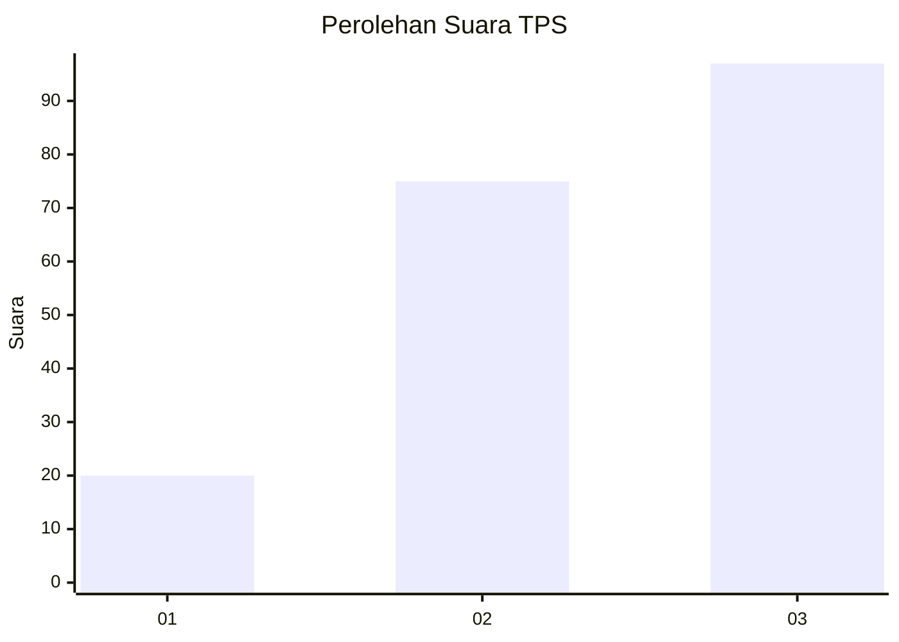
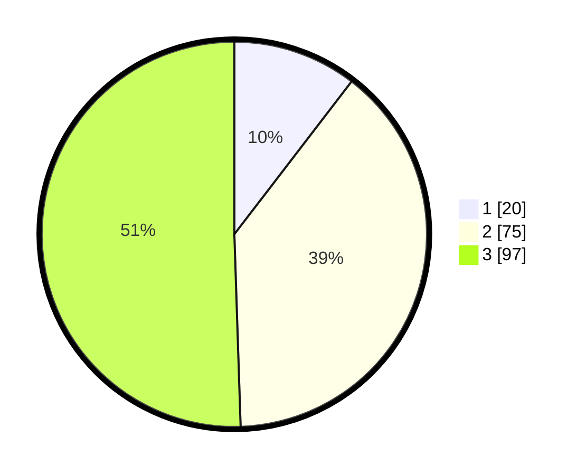

# Hasil

## Grafik

## Tabel

| No. | Nama Paslon    | Suara | Suara (raw) | Persentase |
|:--- |:-------------- | -----:| -----------:| ----------:|
| 1   | ANIES MUHAIMIN | 20    | [20][p-1]   | 10,42      |
| 2   | PRABOWO GIBRAN | 75    | [75][p-2]   | 39,06      |
| 3   | GANJAR MAHFUD  | 97    | [97][p-3]   | 50,52      |

[p-1]: https://github.com/gigit-pemilu/pemilu-2024/blob/main/pilpres/hitung-suara/sub/35-jawa-timur/sub/78-kota-surabaya/sub/09-sukolilo/sub/1003-klampis-ngasem/sub/029-tps/sub/paslon-1.txt
[p-2]: https://github.com/gigit-pemilu/pemilu-2024/blob/main/pilpres/hitung-suara/sub/35-jawa-timur/sub/78-kota-surabaya/sub/09-sukolilo/sub/1003-klampis-ngasem/sub/029-tps/sub/paslon-2.txt
[p-3]: https://github.com/gigit-pemilu/pemilu-2024/blob/main/pilpres/hitung-suara/sub/35-jawa-timur/sub/78-kota-surabaya/sub/09-sukolilo/sub/1003-klampis-ngasem/sub/029-tps/sub/paslon-3.txt

## Foto C Plano

https://sirekap-obj-formc.kpu.go.id/3200/pemilu/ppwp/35/78/09/10/03/3578091003029-20240214-233804--71a6bfdc-0d4c-4d67-bcea-0c896c3ce667.jpg

https://sirekap-obj-formc.kpu.go.id/3200/pemilu/ppwp/35/78/09/10/03/3578091003029-20240214-233821--237d5c63-96b3-44c3-a716-32b0e9cf07c5.jpg

https://sirekap-obj-formc.kpu.go.id/3200/pemilu/ppwp/35/78/09/10/03/3578091003029-20240214-233838--21a63633-b6d5-4657-8c1b-144360568c73.jpg

## Metadata

| Key        | Value               |
| ---------- | ------------------- |
| Time Stamp | 2024-02-25 12:00:00 |

