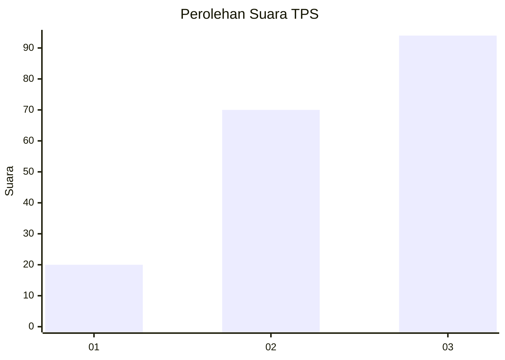
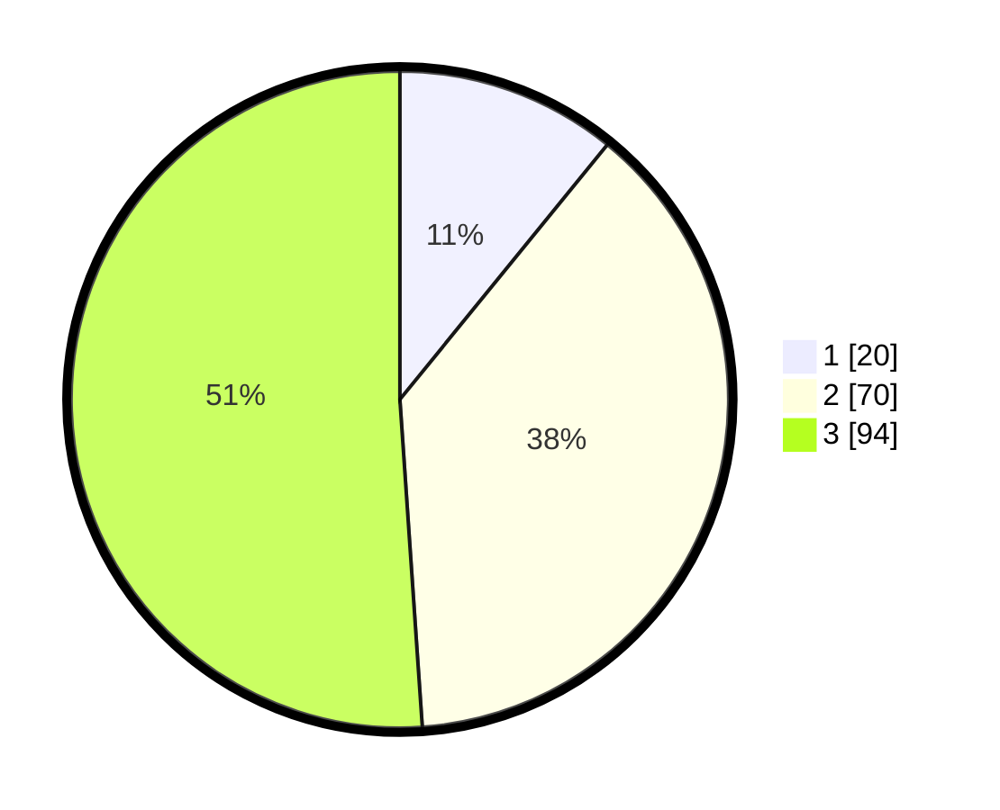

# Hasil

## Grafik

## Tabel

| No. | Nama Paslon    | Suara | Suara (raw) | Persentase |
|:--- |:-------------- | -----:| -----------:| ----------:|
| 1   | ANIES MUHAIMIN | 20    | [20][p-1]   | 10,87      |
| 2   | PRABOWO GIBRAN | 70    | [70][p-2]   | 38,04      |
| 3   | GANJAR MAHFUD  | 94    | [94][p-3]   | 51,09      |

[p-1]: https://github.com/gigit-pemilu/pemilu-2024-35-jawa-timur/blob/main/pilpres/hitung-suara/sub/35-jawa-timur/sub/78-kota-surabaya/sub/09-sukolilo/sub/1003-klampis-ngasem/sub/036-tps/sub/paslon-1.txt
[p-2]: https://github.com/gigit-pemilu/pemilu-2024-35-jawa-timur/blob/main/pilpres/hitung-suara/sub/35-jawa-timur/sub/78-kota-surabaya/sub/09-sukolilo/sub/1003-klampis-ngasem/sub/036-tps/sub/paslon-2.txt
[p-3]: https://github.com/gigit-pemilu/pemilu-2024-35-jawa-timur/blob/main/pilpres/hitung-suara/sub/35-jawa-timur/sub/78-kota-surabaya/sub/09-sukolilo/sub/1003-klampis-ngasem/sub/036-tps/sub/paslon-3.txt

## Foto C Plano

https://sirekap-obj-formc.kpu.go.id/08fd/pemilu/ppwp/35/78/09/10/03/3578091003036-20240218-162016--e6955ffd-a82c-4d2c-b2bd-e530ff565acf.jpg

https://sirekap-obj-formc.kpu.go.id/08fd/pemilu/ppwp/35/78/09/10/03/3578091003036-20240218-162123--75dcc0ae-8e2e-4563-a2e4-8175760653e4.jpg

https://sirekap-obj-formc.kpu.go.id/08fd/pemilu/ppwp/35/78/09/10/03/3578091003036-20240218-162243--f0071702-39f6-436c-8db3-9616f6632bf0.jpg

## Metadata

| Key        | Value               |
| ---------- | ------------------- |
| Time Stamp | 2024-02-25 16:00:00 |

