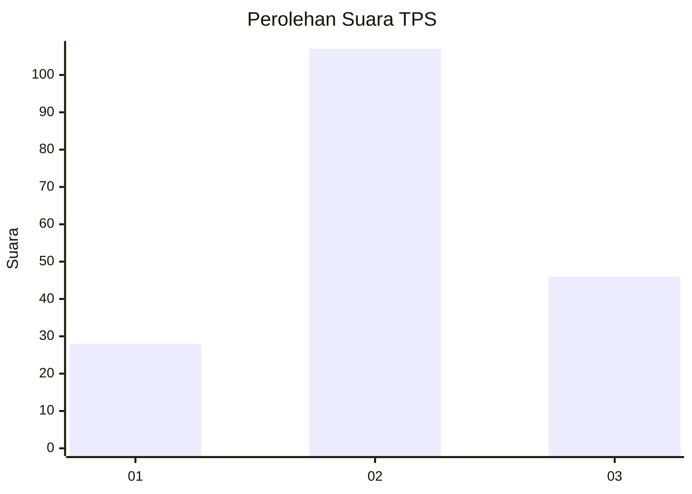
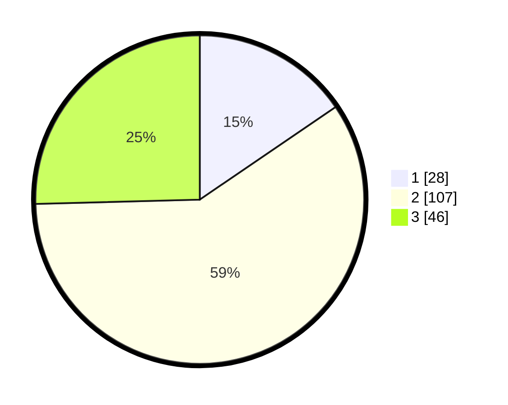

# Hasil

## Grafik

## Tabel

| No. | Nama Paslon    | Suara | Suara (raw) | Persentase |
|:--- |:-------------- | -----:| -----------:| ----------:|
| 1   | ANIES MUHAIMIN | 28    | [28][p-1]   | 15,47      |
| 2   | PRABOWO GIBRAN | 107   | [107][p-2]  | 59,12      |
| 3   | GANJAR MAHFUD  | 46    | [46][p-3]   | 25,41      |

[p-1]: https://github.com/gigit-pemilu/pemilu-2024/blob/main/pilpres/hitung-suara/sub/35-jawa-timur/sub/78-kota-surabaya/sub/09-sukolilo/sub/1004-menur-pumpungan/sub/017-tps/sub/paslon-1.txt
[p-2]: https://github.com/gigit-pemilu/pemilu-2024/blob/main/pilpres/hitung-suara/sub/35-jawa-timur/sub/78-kota-surabaya/sub/09-sukolilo/sub/1004-menur-pumpungan/sub/017-tps/sub/paslon-2.txt
[p-3]: https://github.com/gigit-pemilu/pemilu-2024/blob/main/pilpres/hitung-suara/sub/35-jawa-timur/sub/78-kota-surabaya/sub/09-sukolilo/sub/1004-menur-pumpungan/sub/017-tps/sub/paslon-3.txt

## Foto C Plano

https://sirekap-obj-formc.kpu.go.id/d1cd/pemilu/ppwp/35/78/09/10/04/3578091004017-20240214-232937--5f50fa36-a7a2-4b6b-a144-6b3ce43fe3ad.jpg

https://sirekap-obj-formc.kpu.go.id/d1cd/pemilu/ppwp/35/78/09/10/04/3578091004017-20240214-185345--459d0099-8ec2-4c87-b525-fc659dd39c48.jpg

https://sirekap-obj-formc.kpu.go.id/d1cd/pemilu/ppwp/35/78/09/10/04/3578091004017-20240214-185437--0a5477df-647f-4046-89a3-0981899754f5.jpg

## Metadata

| Key        | Value               |
| ---------- | ------------------- |
| Time Stamp | 2024-02-25 16:00:00 |

