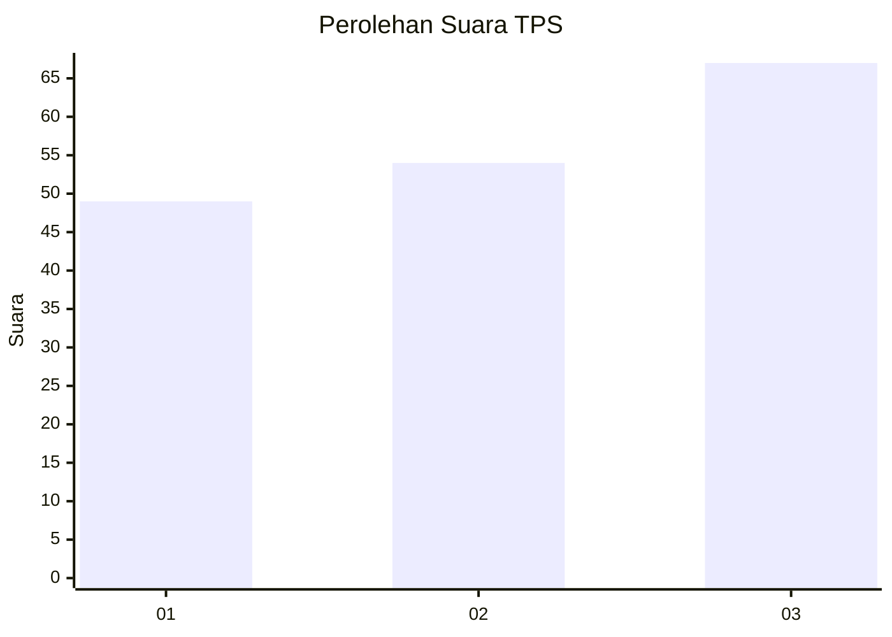
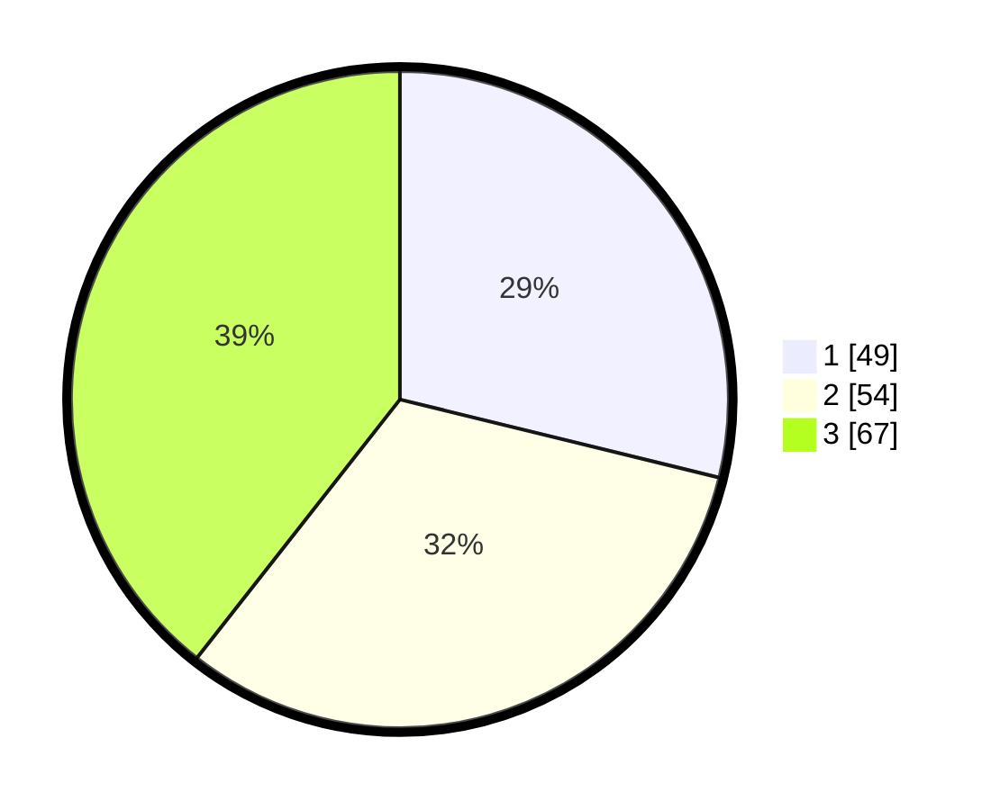

# Hasil

## Grafik

## Tabel

| No. | Nama Paslon    | Suara | Suara (raw) | Persentase |
|:--- |:-------------- | -----:| -----------:| ----------:|
| 1   | ANIES MUHAIMIN | 49    | [49][p-1]   | 28,82      |
| 2   | PRABOWO GIBRAN | 54    | [54][p-2]   | 31,76      |
| 3   | GANJAR MAHFUD  | 67    | [67][p-3]   | 39,41      |

[p-1]: https://github.com/gigit-pemilu/pemilu-2024-35-jawa-timur/blob/main/pilpres/hitung-suara/sub/35-jawa-timur/sub/78-kota-surabaya/sub/09-sukolilo/sub/1004-menur-pumpungan/sub/025-tps/sub/paslon-1.txt
[p-2]: https://github.com/gigit-pemilu/pemilu-2024-35-jawa-timur/blob/main/pilpres/hitung-suara/sub/35-jawa-timur/sub/78-kota-surabaya/sub/09-sukolilo/sub/1004-menur-pumpungan/sub/025-tps/sub/paslon-2.txt
[p-3]: https://github.com/gigit-pemilu/pemilu-2024-35-jawa-timur/blob/main/pilpres/hitung-suara/sub/35-jawa-timur/sub/78-kota-surabaya/sub/09-sukolilo/sub/1004-menur-pumpungan/sub/025-tps/sub/paslon-3.txt

## Foto C Plano

https://sirekap-obj-formc.kpu.go.id/3914/pemilu/ppwp/35/78/09/10/04/3578091004025-20240214-214626--5c53b90f-1e18-4405-8257-ac94de9dc9b1.jpg

https://sirekap-obj-formc.kpu.go.id/3914/pemilu/ppwp/35/78/09/10/04/3578091004025-20240214-214707--5fa7947a-765d-48e0-87b2-4996930fd691.jpg

https://sirekap-obj-formc.kpu.go.id/3914/pemilu/ppwp/35/78/09/10/04/3578091004025-20240214-214711--6dd3d408-a202-46d9-9c70-398815f2fa91.jpg

## Metadata

| Key        | Value               |
| ---------- | ------------------- |
| Time Stamp | 2024-02-25 23:00:00 |

