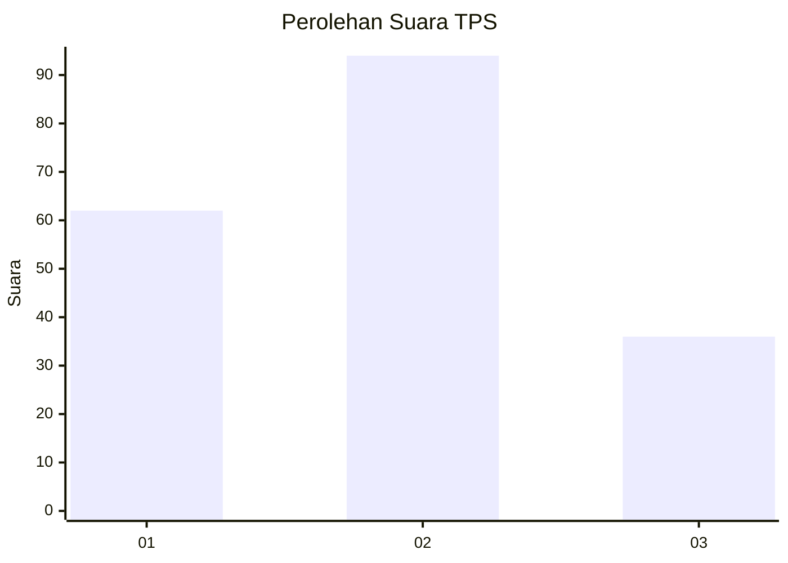
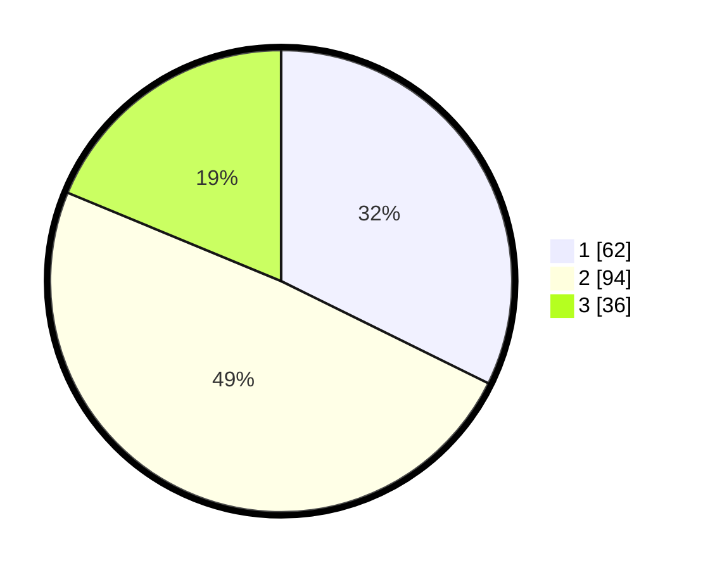

# Hasil

## Grafik

## Tabel

| No. | Nama Paslon    | Suara | Suara (raw) | Persentase |
|:--- |:-------------- | -----:| -----------:| ----------:|
| 1   | ANIES MUHAIMIN | 62    | [62][p-1]   | 32,29      |
| 2   | PRABOWO GIBRAN | 94    | [94][p-2]   | 48,96      |
| 3   | GANJAR MAHFUD  | 36    | [36][p-3]   | 18,75      |

[p-1]: https://github.com/gigit-pemilu/pemilu-2024/blob/main/pilpres/hitung-suara/sub/35-jawa-timur/sub/78-kota-surabaya/sub/09-sukolilo/sub/1005-nginden-jangkungan/sub/007-tps/sub/paslon-1.txt
[p-2]: https://github.com/gigit-pemilu/pemilu-2024/blob/main/pilpres/hitung-suara/sub/35-jawa-timur/sub/78-kota-surabaya/sub/09-sukolilo/sub/1005-nginden-jangkungan/sub/007-tps/sub/paslon-2.txt
[p-3]: https://github.com/gigit-pemilu/pemilu-2024/blob/main/pilpres/hitung-suara/sub/35-jawa-timur/sub/78-kota-surabaya/sub/09-sukolilo/sub/1005-nginden-jangkungan/sub/007-tps/sub/paslon-3.txt

## Foto C Plano

https://sirekap-obj-formc.kpu.go.id/b609/pemilu/ppwp/35/78/09/10/05/3578091005007-20240216-155509--73e54070-3b32-4240-9870-3969b644d9f3.jpg

https://sirekap-obj-formc.kpu.go.id/b609/pemilu/ppwp/35/78/09/10/05/3578091005007-20240216-154922--2a2d7faf-60a6-40a7-b7f5-247199d359c7.jpg

https://sirekap-obj-formc.kpu.go.id/b609/pemilu/ppwp/35/78/09/10/05/3578091005007-20240216-155129--5ff6b123-3f69-4d60-8e48-647f41d3ab91.jpg

## Metadata

| Key        | Value               |
| ---------- | ------------------- |
| Time Stamp | 2024-02-25 20:00:00 |

