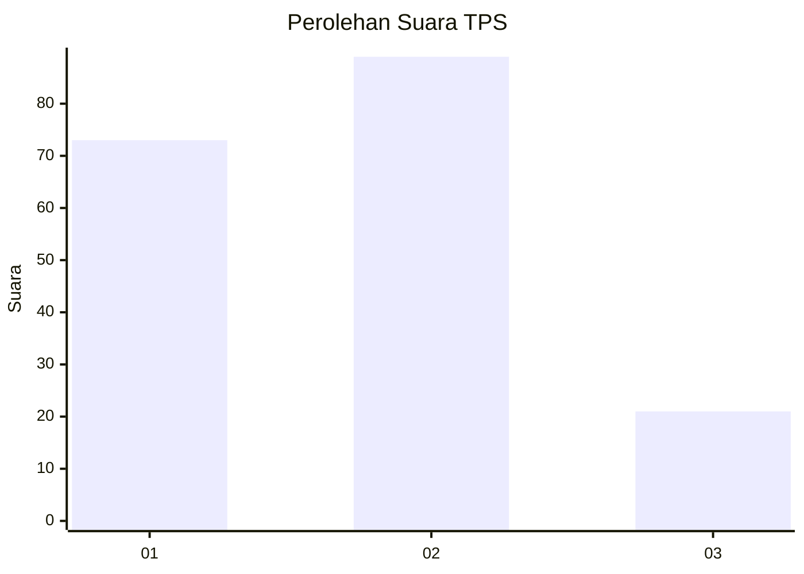
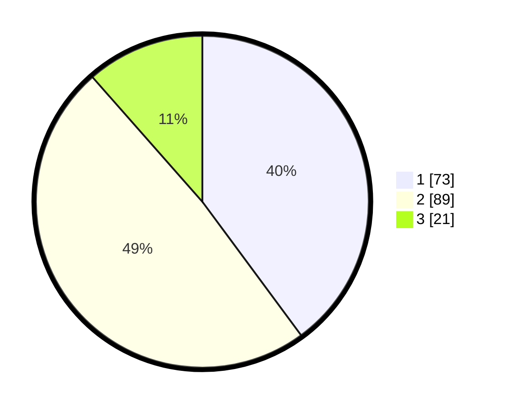

# Hasil

## Grafik

## Tabel

| No. | Nama Paslon    | Suara | Suara (raw) | Persentase |
|:--- |:-------------- | -----:| -----------:| ----------:|
| 1   | ANIES MUHAIMIN | 73    | [73][p-1]   | 39,89      |
| 2   | PRABOWO GIBRAN | 89    | [89][p-2]   | 48,63      |
| 3   | GANJAR MAHFUD  | 21    | [21][p-3]   | 11,48      |

[p-1]: https://github.com/gigit-pemilu/pemilu-2024/blob/main/pilpres/hitung-suara/sub/35-jawa-timur/sub/78-kota-surabaya/sub/09-sukolilo/sub/1005-nginden-jangkungan/sub/008-tps/sub/paslon-1.txt
[p-2]: https://github.com/gigit-pemilu/pemilu-2024/blob/main/pilpres/hitung-suara/sub/35-jawa-timur/sub/78-kota-surabaya/sub/09-sukolilo/sub/1005-nginden-jangkungan/sub/008-tps/sub/paslon-2.txt
[p-3]: https://github.com/gigit-pemilu/pemilu-2024/blob/main/pilpres/hitung-suara/sub/35-jawa-timur/sub/78-kota-surabaya/sub/09-sukolilo/sub/1005-nginden-jangkungan/sub/008-tps/sub/paslon-3.txt

## Foto C Plano

https://sirekap-obj-formc.kpu.go.id/2f19/pemilu/ppwp/35/78/09/10/05/3578091005008-20240215-051830--c5be8d77-4f26-4c20-8269-3ee5b373609e.jpg

https://sirekap-obj-formc.kpu.go.id/2f19/pemilu/ppwp/35/78/09/10/05/3578091005008-20240215-052321--1a91239e-10ef-4b23-8db5-517f9c9c0650.jpg

https://sirekap-obj-formc.kpu.go.id/2f19/pemilu/ppwp/35/78/09/10/05/3578091005008-20240215-052204--92aabf7c-e1c5-4aca-a4fa-002e643b117e.jpg

## Metadata

| Key        | Value               |
| ---------- | ------------------- |
| Time Stamp | 2024-02-25 12:00:00 |

