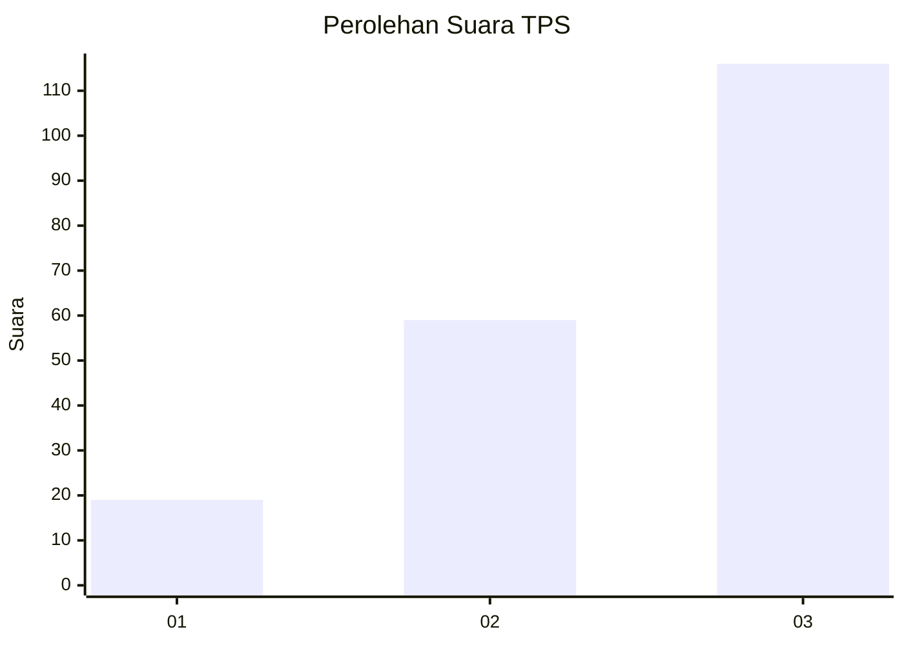
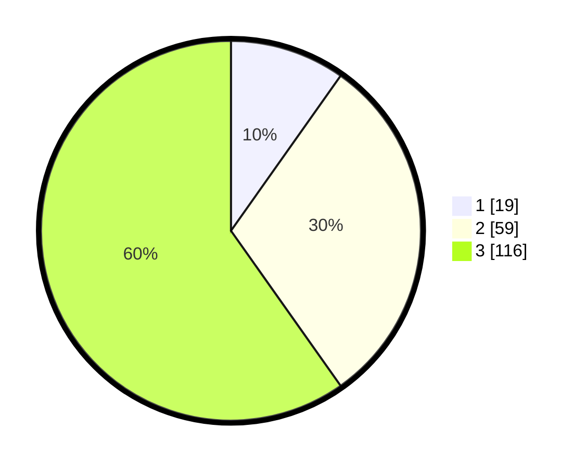

# Hasil

## Grafik

## Tabel

| No. | Nama Paslon    | Suara | Suara (raw) | Persentase |
|:--- |:-------------- | -----:| -----------:| ----------:|
| 1   | ANIES MUHAIMIN | 19    | [19][p-1]   | 9,79       |
| 2   | PRABOWO GIBRAN | 59    | [59][p-2]   | 30,41      |
| 3   | GANJAR MAHFUD  | 116   | [116][p-3]  | 59,79      |

[p-1]: https://github.com/gigit-pemilu/pemilu-2024/blob/main/pilpres/hitung-suara/sub/35-jawa-timur/sub/78-kota-surabaya/sub/09-sukolilo/sub/1005-nginden-jangkungan/sub/040-tps/sub/paslon-1.txt
[p-2]: https://github.com/gigit-pemilu/pemilu-2024/blob/main/pilpres/hitung-suara/sub/35-jawa-timur/sub/78-kota-surabaya/sub/09-sukolilo/sub/1005-nginden-jangkungan/sub/040-tps/sub/paslon-2.txt
[p-3]: https://github.com/gigit-pemilu/pemilu-2024/blob/main/pilpres/hitung-suara/sub/35-jawa-timur/sub/78-kota-surabaya/sub/09-sukolilo/sub/1005-nginden-jangkungan/sub/040-tps/sub/paslon-3.txt

## Foto C Plano

https://sirekap-obj-formc.kpu.go.id/b197/pemilu/ppwp/35/78/09/10/05/3578091005040-20240214-160135--a1e5c3bb-24af-4c39-a4c3-11cda9297f13.jpg

https://sirekap-obj-formc.kpu.go.id/b197/pemilu/ppwp/35/78/09/10/05/3578091005040-20240214-160115--57de0448-1a1b-41e8-a268-f8931524a9d5.jpg

https://sirekap-obj-formc.kpu.go.id/b197/pemilu/ppwp/35/78/09/10/05/3578091005040-20240214-160129--a0a5b51c-2374-4b89-bfc2-28358c753496.jpg

## Metadata

| Key        | Value               |
| ---------- | ------------------- |
| Time Stamp | 2024-02-25 13:00:00 |

