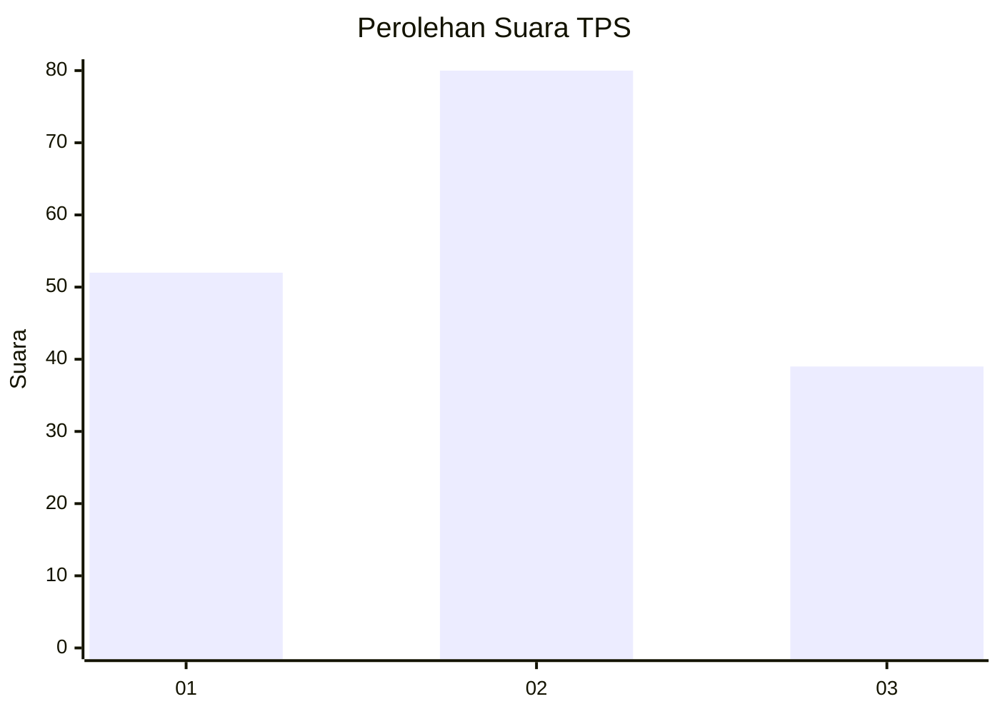
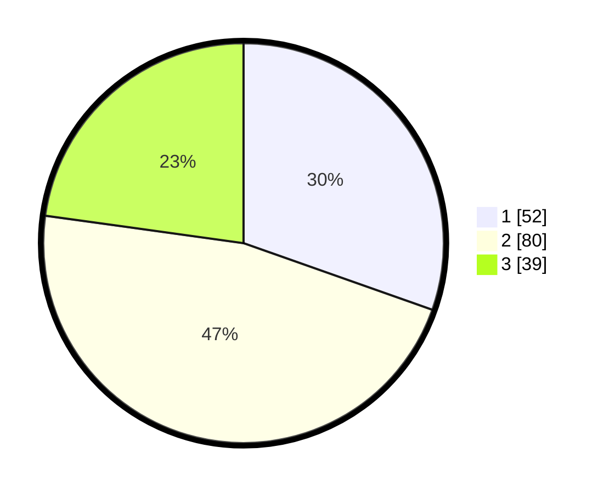

# Hasil

## Grafik

## Tabel

| No. | Nama Paslon    | Suara | Suara (raw) | Persentase |
|:--- |:-------------- | -----:| -----------:| ----------:|
| 1   | ANIES MUHAIMIN | 52    | [52][p-1]   | 30,41      |
| 2   | PRABOWO GIBRAN | 80    | [80][p-2]   | 46,78      |
| 3   | GANJAR MAHFUD  | 39    | [39][p-3]   | 22,81      |

[p-1]: https://github.com/gigit-pemilu/pemilu-2024/blob/main/pilpres/hitung-suara/sub/35-jawa-timur/sub/78-kota-surabaya/sub/09-sukolilo/sub/1006-semolowaru/sub/030-tps/sub/paslon-1.txt
[p-2]: https://github.com/gigit-pemilu/pemilu-2024/blob/main/pilpres/hitung-suara/sub/35-jawa-timur/sub/78-kota-surabaya/sub/09-sukolilo/sub/1006-semolowaru/sub/030-tps/sub/paslon-2.txt
[p-3]: https://github.com/gigit-pemilu/pemilu-2024/blob/main/pilpres/hitung-suara/sub/35-jawa-timur/sub/78-kota-surabaya/sub/09-sukolilo/sub/1006-semolowaru/sub/030-tps/sub/paslon-3.txt

## Foto C Plano

https://sirekap-obj-formc.kpu.go.id/e33a/pemilu/ppwp/35/78/09/10/06/3578091006030-20240215-010538--2b8d198b-1207-4a41-a3a3-ad278034ac50.jpg

https://sirekap-obj-formc.kpu.go.id/e33a/pemilu/ppwp/35/78/09/10/06/3578091006030-20240215-010656--4499900a-6204-462c-bee7-88d2fb7bb5be.jpg

https://sirekap-obj-formc.kpu.go.id/e33a/pemilu/ppwp/35/78/09/10/06/3578091006030-20240215-010754--d5c0ac1e-2823-4217-8056-359ebea23c5e.jpg

## Metadata

| Key        | Value               |
| ---------- | ------------------- |
| Time Stamp | 2024-02-24 22:31:28 |

