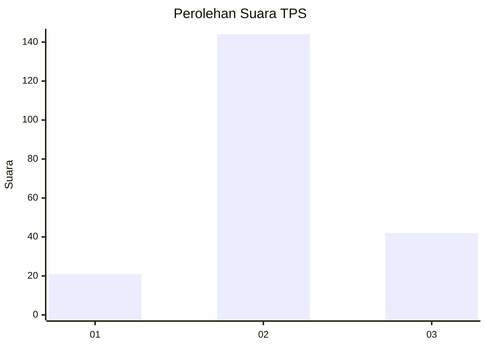
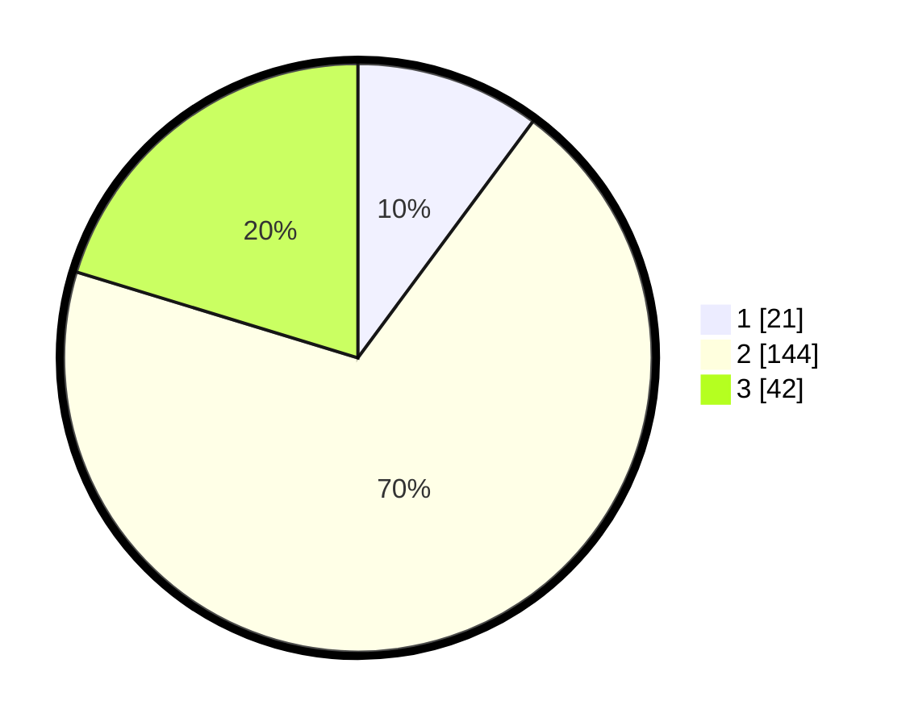

# Hasil

## Grafik

## Tabel

| No. | Nama Paslon    | Suara | Suara (raw) | Persentase |
|:--- |:-------------- | -----:| -----------:| ----------:|
| 1   | ANIES MUHAIMIN | 21    | [21][p-1]   | 10,14      |
| 2   | PRABOWO GIBRAN | 144   | [144][p-2]  | 69,57      |
| 3   | GANJAR MAHFUD  | 42    | [42][p-3]   | 20,29      |

[p-1]: https://github.com/gigit-pemilu/pemilu-2024/blob/main/pilpres/hitung-suara/sub/35-jawa-timur/sub/78-kota-surabaya/sub/09-sukolilo/sub/1007-medokan-semampir/sub/009-tps/sub/paslon-1.txt
[p-2]: https://github.com/gigit-pemilu/pemilu-2024/blob/main/pilpres/hitung-suara/sub/35-jawa-timur/sub/78-kota-surabaya/sub/09-sukolilo/sub/1007-medokan-semampir/sub/009-tps/sub/paslon-2.txt
[p-3]: https://github.com/gigit-pemilu/pemilu-2024/blob/main/pilpres/hitung-suara/sub/35-jawa-timur/sub/78-kota-surabaya/sub/09-sukolilo/sub/1007-medokan-semampir/sub/009-tps/sub/paslon-3.txt

## Foto C Plano

https://sirekap-obj-formc.kpu.go.id/0e82/pemilu/ppwp/35/78/09/10/07/3578091007009-20240214-204625--9ec2b6d3-33ae-470a-91b6-b0d6c85271f9.jpg

https://sirekap-obj-formc.kpu.go.id/0e82/pemilu/ppwp/35/78/09/10/07/3578091007009-20240214-204323--137c3afa-bae2-4884-84f7-bed8bc4df68c.jpg

https://sirekap-obj-formc.kpu.go.id/0e82/pemilu/ppwp/35/78/09/10/07/3578091007009-20240214-195309--4e7e8146-5fb0-4a7a-9776-26c0e01698ed.jpg

## Metadata

| Key        | Value               |
| ---------- | ------------------- |
| Time Stamp | 2024-02-14 21:46:01 |

