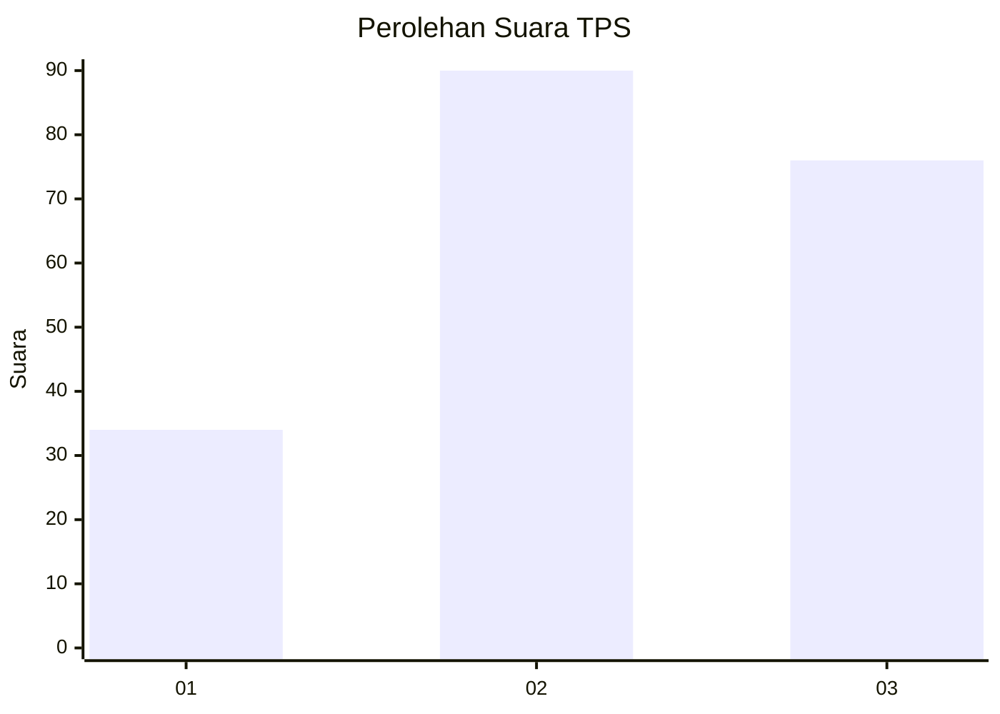
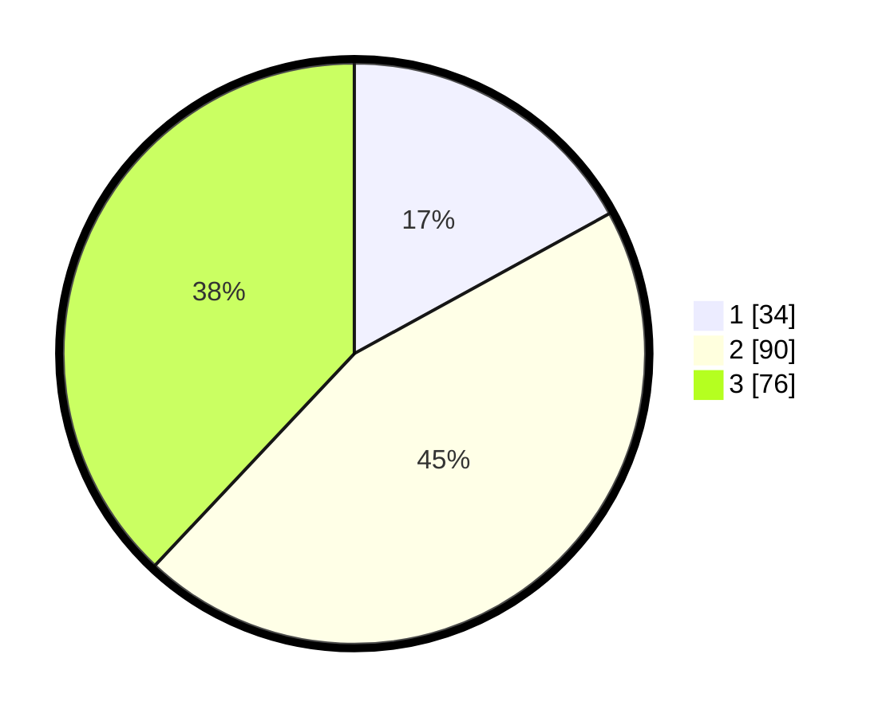

# Hasil

## Grafik

## Tabel

| No. | Nama Paslon    | Suara | Suara (raw) | Persentase |
|:--- |:-------------- | -----:| -----------:| ----------:|
| 1   | ANIES MUHAIMIN | 34    | [34][p-1]   | 17,00      |
| 2   | PRABOWO GIBRAN | 90    | [90][p-2]   | 45,00      |
| 3   | GANJAR MAHFUD  | 76    | [76][p-3]   | 38,00      |

[p-1]: https://github.com/gigit-pemilu/pemilu-2024/blob/main/pilpres/hitung-suara/sub/35-jawa-timur/sub/78-kota-surabaya/sub/10-tambaksari/sub/1001-tambaksari/sub/001-tps/sub/paslon-1.txt
[p-2]: https://github.com/gigit-pemilu/pemilu-2024/blob/main/pilpres/hitung-suara/sub/35-jawa-timur/sub/78-kota-surabaya/sub/10-tambaksari/sub/1001-tambaksari/sub/001-tps/sub/paslon-2.txt
[p-3]: https://github.com/gigit-pemilu/pemilu-2024/blob/main/pilpres/hitung-suara/sub/35-jawa-timur/sub/78-kota-surabaya/sub/10-tambaksari/sub/1001-tambaksari/sub/001-tps/sub/paslon-3.txt

## Foto C Plano

https://sirekap-obj-formc.kpu.go.id/012b/pemilu/ppwp/35/78/10/10/01/3578101001001-20240215-015415--f3f43f6a-11fa-4247-994e-967e1d2f5c62.jpg

https://sirekap-obj-formc.kpu.go.id/012b/pemilu/ppwp/35/78/10/10/01/3578101001001-20240215-015530--6c45bed0-8bbd-4273-91d6-7977820f1f71.jpg

https://sirekap-obj-formc.kpu.go.id/012b/pemilu/ppwp/35/78/10/10/01/3578101001001-20240215-015904--05dc270b-a1d5-4740-b7c1-6aa44e83a1b8.jpg

## Metadata

| Key        | Value               |
| ---------- | ------------------- |
| Time Stamp | 2024-02-24 22:31:28 |

