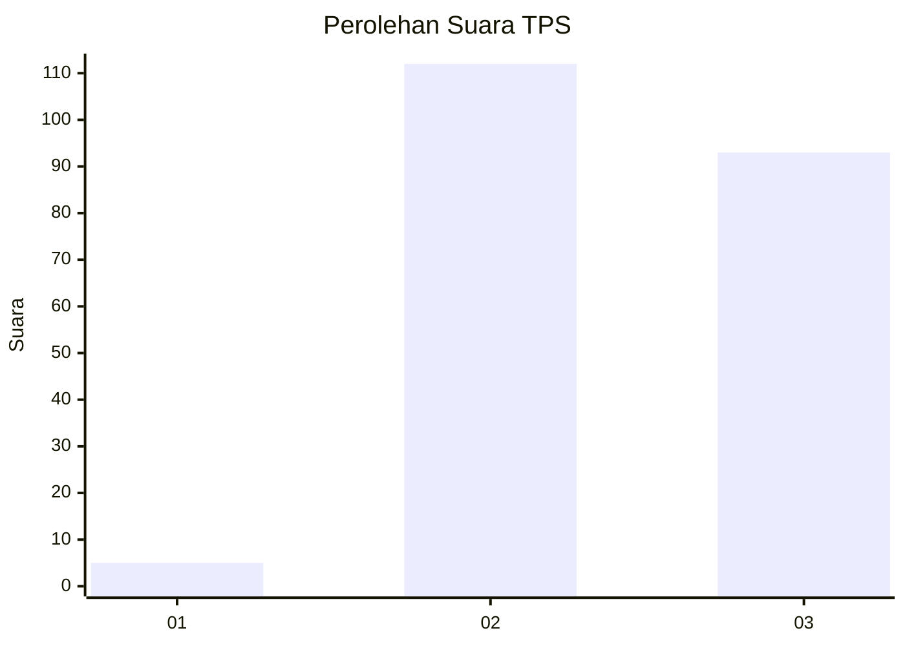
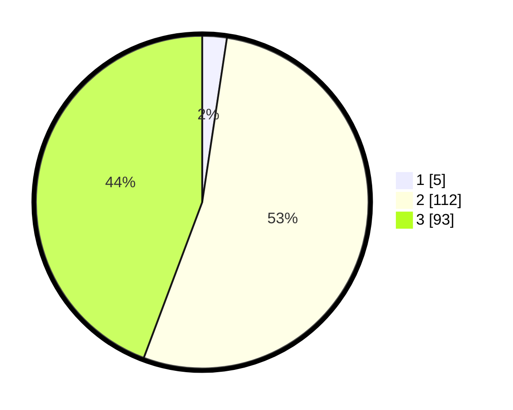

# Hasil

## Grafik

## Tabel

| No. | Nama Paslon    | Suara | Suara (raw) | Persentase |
|:--- |:-------------- | -----:| -----------:| ----------:|
| 1   | ANIES MUHAIMIN | 5     | [5][p-1]    | 2,38       |
| 2   | PRABOWO GIBRAN | 112   | [112][p-2]  | 53,33      |
| 3   | GANJAR MAHFUD  | 93    | [93][p-3]   | 44,29      |

[p-1]: https://github.com/gigit-pemilu/pemilu-2024-35-jawa-timur/blob/main/pilpres/hitung-suara/sub/35-jawa-timur/sub/78-kota-surabaya/sub/10-tambaksari/sub/1001-tambaksari/sub/004-tps/sub/paslon-1.txt
[p-2]: https://github.com/gigit-pemilu/pemilu-2024-35-jawa-timur/blob/main/pilpres/hitung-suara/sub/35-jawa-timur/sub/78-kota-surabaya/sub/10-tambaksari/sub/1001-tambaksari/sub/004-tps/sub/paslon-2.txt
[p-3]: https://github.com/gigit-pemilu/pemilu-2024-35-jawa-timur/blob/main/pilpres/hitung-suara/sub/35-jawa-timur/sub/78-kota-surabaya/sub/10-tambaksari/sub/1001-tambaksari/sub/004-tps/sub/paslon-3.txt

## Foto C Plano

https://sirekap-obj-formc.kpu.go.id/5713/pemilu/ppwp/35/78/10/10/01/3578101001004-20240217-155019--392e01e6-3d2d-473b-bf94-e299ba2667b0.jpg

https://sirekap-obj-formc.kpu.go.id/5713/pemilu/ppwp/35/78/10/10/01/3578101001004-20240214-231736--c0886c59-f202-45a5-8187-e931517a2add.jpg

https://sirekap-obj-formc.kpu.go.id/5713/pemilu/ppwp/35/78/10/10/01/3578101001004-20240214-231911--37eb1223-41c3-4d0a-801e-aa0c78c9f9cd.jpg

## Metadata

| Key        | Value               |
| ---------- | ------------------- |
| Time Stamp | 2024-02-25 12:00:00 |

