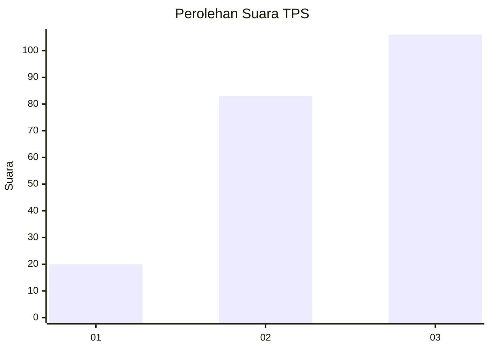
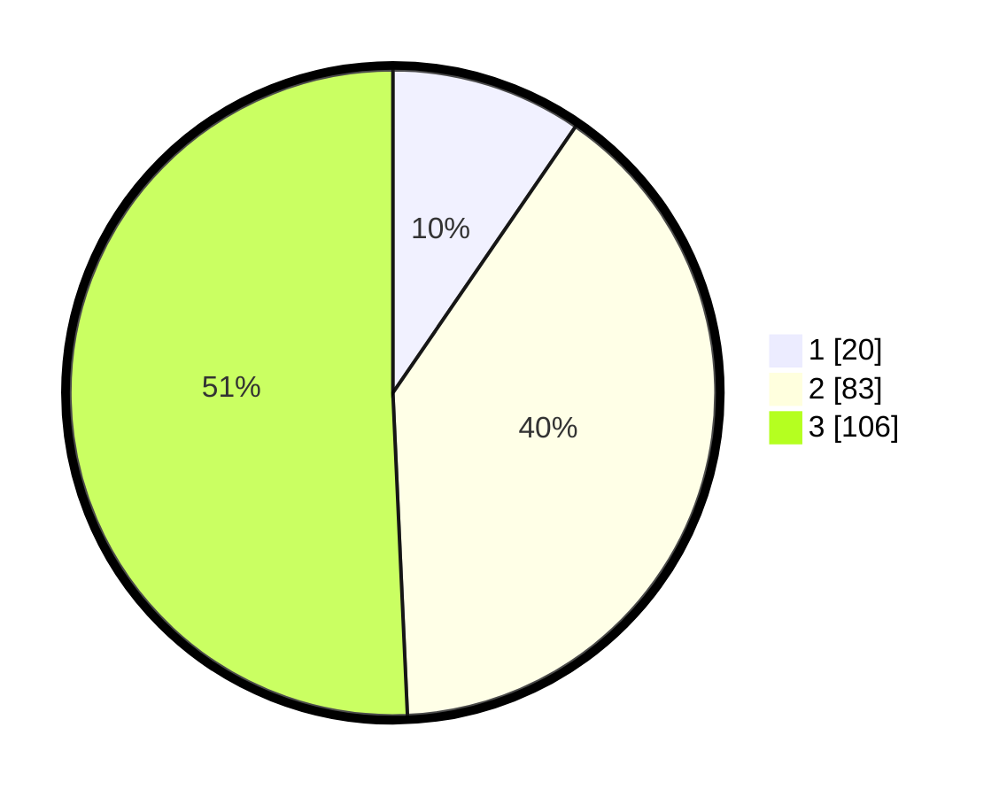

# Hasil

## Grafik

## Tabel

| No. | Nama Paslon    | Suara | Suara (raw) | Persentase |
|:--- |:-------------- | -----:| -----------:| ----------:|
| 1   | ANIES MUHAIMIN | 20    | [20][p-1]   | 9,57       |
| 2   | PRABOWO GIBRAN | 83    | [83][p-2]   | 39,71      |
| 3   | GANJAR MAHFUD  | 106   | [106][p-3]  | 50,72      |

[p-1]: https://github.com/gigit-pemilu/pemilu-2024-35-jawa-timur/blob/main/pilpres/hitung-suara/sub/35-jawa-timur/sub/78-kota-surabaya/sub/10-tambaksari/sub/1001-tambaksari/sub/005-tps/sub/paslon-1.txt
[p-2]: https://github.com/gigit-pemilu/pemilu-2024-35-jawa-timur/blob/main/pilpres/hitung-suara/sub/35-jawa-timur/sub/78-kota-surabaya/sub/10-tambaksari/sub/1001-tambaksari/sub/005-tps/sub/paslon-2.txt
[p-3]: https://github.com/gigit-pemilu/pemilu-2024-35-jawa-timur/blob/main/pilpres/hitung-suara/sub/35-jawa-timur/sub/78-kota-surabaya/sub/10-tambaksari/sub/1001-tambaksari/sub/005-tps/sub/paslon-3.txt

## Foto C Plano

https://sirekap-obj-formc.kpu.go.id/43b6/pemilu/ppwp/35/78/10/10/01/3578101001005-20240215-002549--bf7f71bf-e6ee-4c9b-a73e-9c07845ef01a.jpg

https://sirekap-obj-formc.kpu.go.id/43b6/pemilu/ppwp/35/78/10/10/01/3578101001005-20240215-002650--44541a90-a1c4-491f-87b1-3b0e71d54605.jpg

https://sirekap-obj-formc.kpu.go.id/43b6/pemilu/ppwp/35/78/10/10/01/3578101001005-20240215-002746--4f262072-7d6c-4971-8089-6135974646f5.jpg

## Metadata

| Key        | Value               |
| ---------- | ------------------- |
| Time Stamp | 2024-02-25 11:00:00 |

