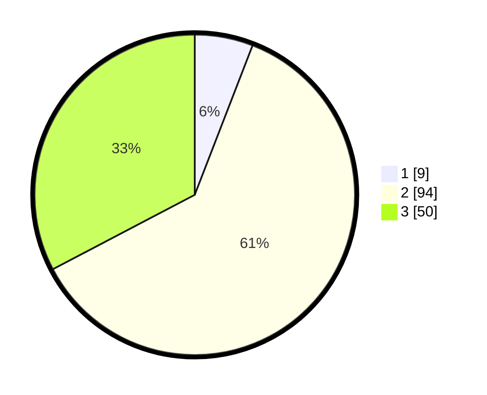

# Hasil

## Grafik

## Tabel

| No. | Nama Paslon    | Suara | Suara (raw) | Persentase |
|:--- |:-------------- | -----:| -----------:| ----------:|
| 1   | ANIES MUHAIMIN | 9     | [9][p-1]    | 5,88       |
| 2   | PRABOWO GIBRAN | 94    | [94][p-2]   | 61,44      |
| 3   | GANJAR MAHFUD  | 50    | [50][p-3]   | 32,68      |

[p-1]: https://github.com/gigit-pemilu/pemilu-2024/blob/main/pilpres/hitung-suara/sub/35-jawa-timur/sub/78-kota-surabaya/sub/10-tambaksari/sub/1001-tambaksari/sub/035-tps/sub/paslon-1.txt
[p-2]: https://github.com/gigit-pemilu/pemilu-2024/blob/main/pilpres/hitung-suara/sub/35-jawa-timur/sub/78-kota-surabaya/sub/10-tambaksari/sub/1001-tambaksari/sub/035-tps/sub/paslon-2.txt
[p-3]: https://github.com/gigit-pemilu/pemilu-2024/blob/main/pilpres/hitung-suara/sub/35-jawa-timur/sub/78-kota-surabaya/sub/10-tambaksari/sub/1001-tambaksari/sub/035-tps/sub/paslon-3.txt

## Foto C Plano

https://sirekap-obj-formc.kpu.go.id/3afd/pemilu/ppwp/35/78/10/10/01/3578101001035-20240217-170805--d5d2be67-20cd-4e11-8b55-340a9ed73e9b.jpg

https://sirekap-obj-formc.kpu.go.id/3afd/pemilu/ppwp/35/78/10/10/01/3578101001035-20240217-171002--8cc43a02-b11c-4f1b-803d-b6d25dc8a6be.jpg

https://sirekap-obj-formc.kpu.go.id/3afd/pemilu/ppwp/35/78/10/10/01/3578101001035-20240217-171133--9384ac1a-2cc8-4016-b56b-72eaf63196b7.jpg

## Metadata

| Key        | Value               |
| ---------- | ------------------- |
| Time Stamp | 2024-02-25 13:00:00 |

