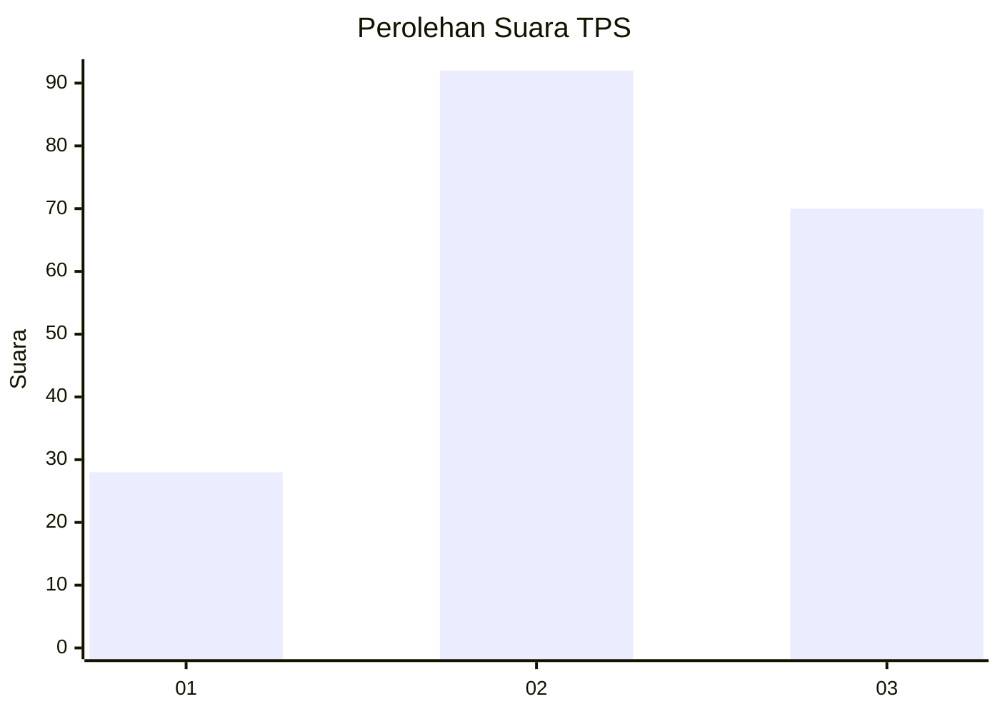
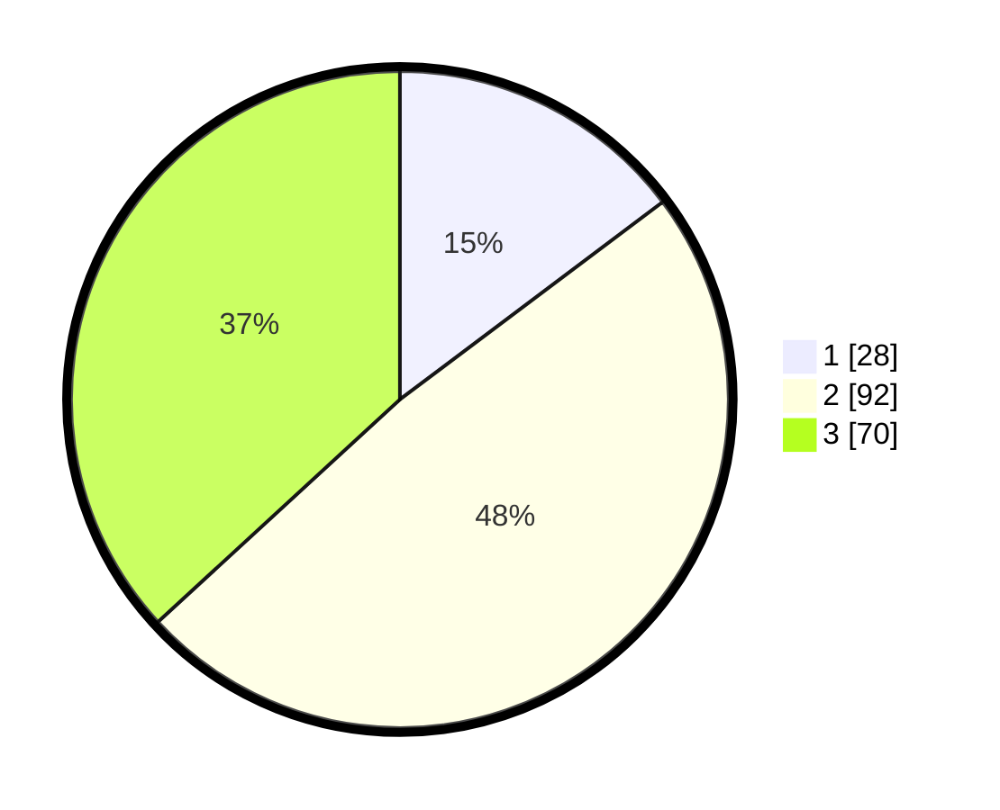

# Hasil

## Grafik

## Tabel

| No. | Nama Paslon    | Suara | Suara (raw) | Persentase |
|:--- |:-------------- | -----:| -----------:| ----------:|
| 1   | ANIES MUHAIMIN | 28    | [28][p-1]   | 14,74      |
| 2   | PRABOWO GIBRAN | 92    | [92][p-2]   | 48,42      |
| 3   | GANJAR MAHFUD  | 70    | [70][p-3]   | 36,84      |

[p-1]: https://github.com/gigit-pemilu/pemilu-2024/blob/main/pilpres/hitung-suara/sub/35-jawa-timur/sub/78-kota-surabaya/sub/10-tambaksari/sub/1002-ploso/sub/002-tps/sub/paslon-1.txt
[p-2]: https://github.com/gigit-pemilu/pemilu-2024/blob/main/pilpres/hitung-suara/sub/35-jawa-timur/sub/78-kota-surabaya/sub/10-tambaksari/sub/1002-ploso/sub/002-tps/sub/paslon-2.txt
[p-3]: https://github.com/gigit-pemilu/pemilu-2024/blob/main/pilpres/hitung-suara/sub/35-jawa-timur/sub/78-kota-surabaya/sub/10-tambaksari/sub/1002-ploso/sub/002-tps/sub/paslon-3.txt

## Foto C Plano

https://sirekap-obj-formc.kpu.go.id/fe37/pemilu/ppwp/35/78/10/10/02/3578101002002-20240214-222358--645b4780-d39d-4e8b-87a1-f771a68444a7.jpg

https://sirekap-obj-formc.kpu.go.id/fe37/pemilu/ppwp/35/78/10/10/02/3578101002002-20240214-222620--492ffc2e-2723-4aad-8780-67928aea8402.jpg

https://sirekap-obj-formc.kpu.go.id/fe37/pemilu/ppwp/35/78/10/10/02/3578101002002-20240214-222832--c44beb71-5dc1-4509-a486-bfe2b2e941cb.jpg

## Metadata

| Key        | Value               |
| ---------- | ------------------- |
| Time Stamp | 2024-02-25 17:00:00 |

