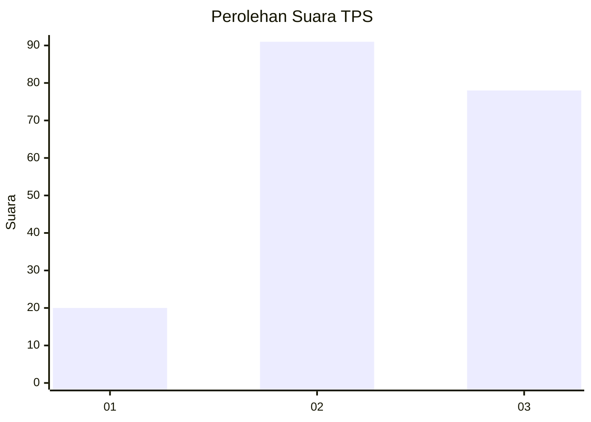
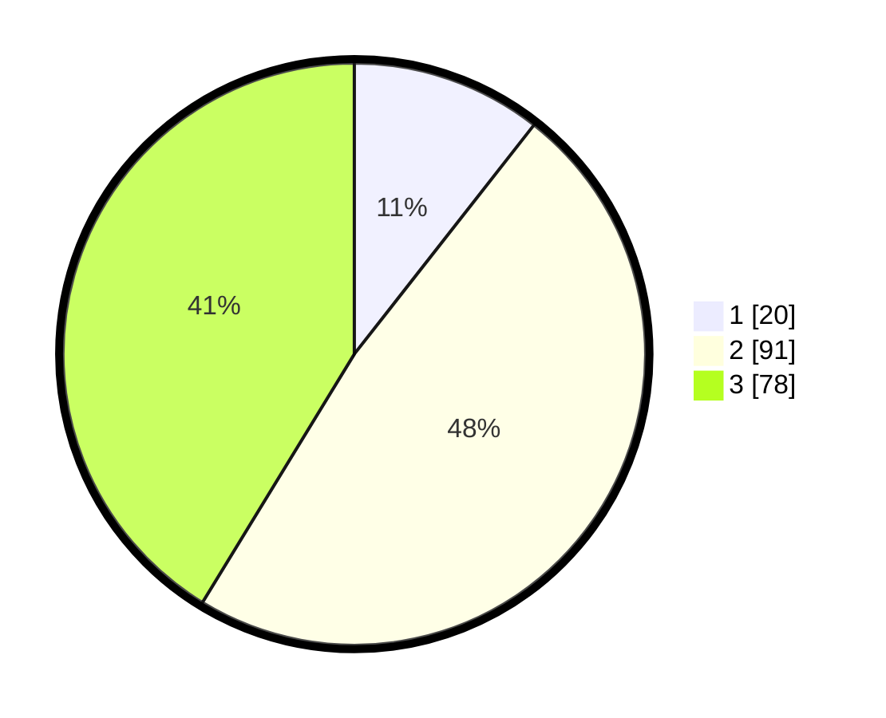

# Hasil

## Grafik

## Tabel

| No. | Nama Paslon    | Suara | Suara (raw) | Persentase |
|:--- |:-------------- | -----:| -----------:| ----------:|
| 1   | ANIES MUHAIMIN | 20    | [20][p-1]   | 10,58      |
| 2   | PRABOWO GIBRAN | 91    | [91][p-2]   | 48,15      |
| 3   | GANJAR MAHFUD  | 78    | [78][p-3]   | 41,27      |

[p-1]: https://github.com/gigit-pemilu/pemilu-2024-35-jawa-timur/blob/main/pilpres/hitung-suara/sub/35-jawa-timur/sub/78-kota-surabaya/sub/10-tambaksari/sub/1002-ploso/sub/060-tps/sub/paslon-1.txt
[p-2]: https://github.com/gigit-pemilu/pemilu-2024-35-jawa-timur/blob/main/pilpres/hitung-suara/sub/35-jawa-timur/sub/78-kota-surabaya/sub/10-tambaksari/sub/1002-ploso/sub/060-tps/sub/paslon-2.txt
[p-3]: https://github.com/gigit-pemilu/pemilu-2024-35-jawa-timur/blob/main/pilpres/hitung-suara/sub/35-jawa-timur/sub/78-kota-surabaya/sub/10-tambaksari/sub/1002-ploso/sub/060-tps/sub/paslon-3.txt

## Foto C Plano

https://sirekap-obj-formc.kpu.go.id/0b06/pemilu/ppwp/35/78/10/10/02/3578101002060-20240214-235910--ed1abbae-c166-4e31-9a55-5d023d4e7b70.jpg

https://sirekap-obj-formc.kpu.go.id/0b06/pemilu/ppwp/35/78/10/10/02/3578101002060-20240215-000022--56a7ead9-cced-4a3f-85a8-ee16c8dc2e0a.jpg

https://sirekap-obj-formc.kpu.go.id/0b06/pemilu/ppwp/35/78/10/10/02/3578101002060-20240215-000045--ca43bd0f-d66f-4ccf-9d64-983256512fc5.jpg

## Metadata

| Key        | Value               |
| ---------- | ------------------- |
| Time Stamp | 2024-02-25 11:00:00 |

