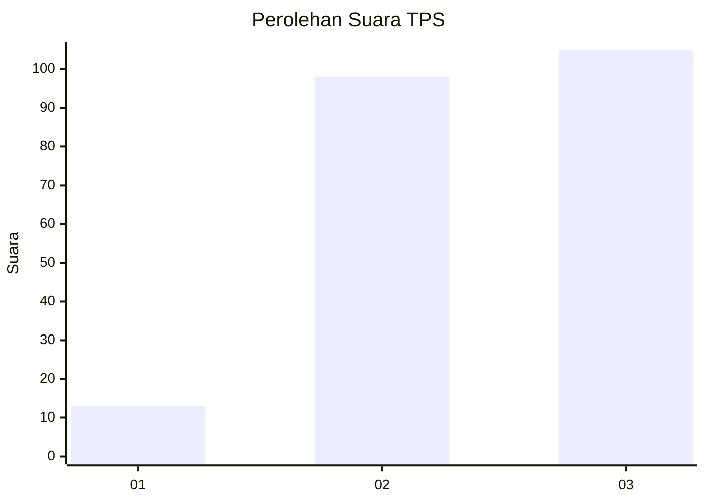
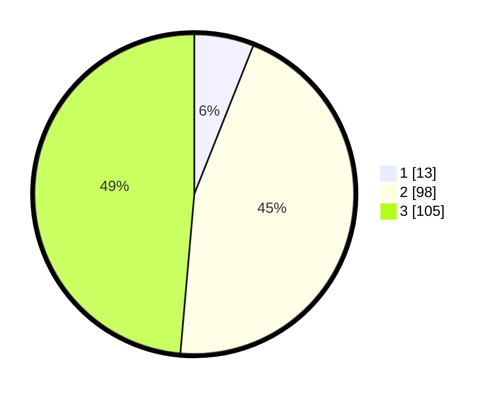

# Hasil

## Grafik

## Tabel

| No. | Nama Paslon    | Suara | Suara (raw) | Persentase |
|:--- |:-------------- | -----:| -----------:| ----------:|
| 1   | ANIES MUHAIMIN | 13    | [13][p-1]   | 6,02       |
| 2   | PRABOWO GIBRAN | 98    | [98][p-2]   | 45,37      |
| 3   | GANJAR MAHFUD  | 105   | [105][p-3]  | 48,61      |

[p-1]: https://github.com/gigit-pemilu/pemilu-2024/blob/main/pilpres/hitung-suara/sub/35-jawa-timur/sub/78-kota-surabaya/sub/10-tambaksari/sub/1002-ploso/sub/076-tps/sub/paslon-1.txt
[p-2]: https://github.com/gigit-pemilu/pemilu-2024/blob/main/pilpres/hitung-suara/sub/35-jawa-timur/sub/78-kota-surabaya/sub/10-tambaksari/sub/1002-ploso/sub/076-tps/sub/paslon-2.txt
[p-3]: https://github.com/gigit-pemilu/pemilu-2024/blob/main/pilpres/hitung-suara/sub/35-jawa-timur/sub/78-kota-surabaya/sub/10-tambaksari/sub/1002-ploso/sub/076-tps/sub/paslon-3.txt

## Foto C Plano

https://sirekap-obj-formc.kpu.go.id/ca49/pemilu/ppwp/35/78/10/10/02/3578101002076-20240214-215729--450b28d6-92d7-4086-907f-01b29864051f.jpg

https://sirekap-obj-formc.kpu.go.id/ca49/pemilu/ppwp/35/78/10/10/02/3578101002076-20240214-215839--d3983bdc-f73e-4657-9f38-0d55c19fb94e.jpg

https://sirekap-obj-formc.kpu.go.id/ca49/pemilu/ppwp/35/78/10/10/02/3578101002076-20240214-220008--16468009-d6c9-4782-abbe-e7d3c4e59c95.jpg

## Metadata

| Key        | Value               |
| ---------- | ------------------- |
| Time Stamp | 2024-02-24 22:31:28 |

