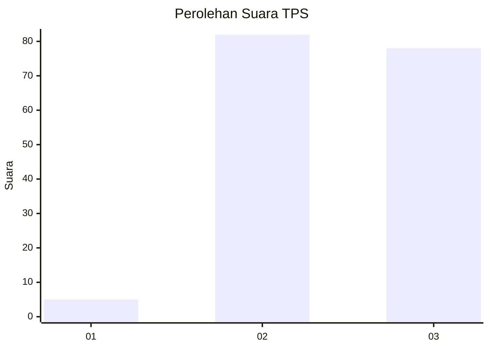
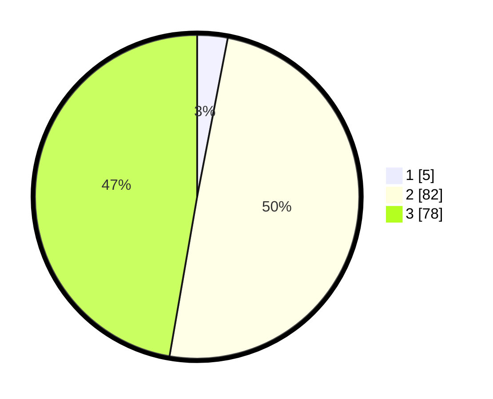

# Hasil

## Grafik

## Tabel

| No. | Nama Paslon    | Suara | Suara (raw) | Persentase |
|:--- |:-------------- | -----:| -----------:| ----------:|
| 1   | ANIES MUHAIMIN | 5     | [5][p-1]    | 3,03       |
| 2   | PRABOWO GIBRAN | 82    | [82][p-2]   | 49,70      |
| 3   | GANJAR MAHFUD  | 78    | [78][p-3]   | 47,27      |

[p-1]: https://github.com/gigit-pemilu/pemilu-2024-35-jawa-timur/blob/main/pilpres/hitung-suara/sub/35-jawa-timur/sub/78-kota-surabaya/sub/10-tambaksari/sub/1002-ploso/sub/082-tps/sub/paslon-1.txt
[p-2]: https://github.com/gigit-pemilu/pemilu-2024-35-jawa-timur/blob/main/pilpres/hitung-suara/sub/35-jawa-timur/sub/78-kota-surabaya/sub/10-tambaksari/sub/1002-ploso/sub/082-tps/sub/paslon-2.txt
[p-3]: https://github.com/gigit-pemilu/pemilu-2024-35-jawa-timur/blob/main/pilpres/hitung-suara/sub/35-jawa-timur/sub/78-kota-surabaya/sub/10-tambaksari/sub/1002-ploso/sub/082-tps/sub/paslon-3.txt

## Foto C Plano

https://sirekap-obj-formc.kpu.go.id/8cae/pemilu/ppwp/35/78/10/10/02/3578101002082-20240214-232425--0a4df9f5-6f5f-45f2-8624-c40ae049dbd8.jpg

https://sirekap-obj-formc.kpu.go.id/8cae/pemilu/ppwp/35/78/10/10/02/3578101002082-20240219-104358--dbc84425-a4ed-4d03-90dd-1d183ba8b0d7.jpg

https://sirekap-obj-formc.kpu.go.id/8cae/pemilu/ppwp/35/78/10/10/02/3578101002082-20240219-104516--c7d66059-2a1e-4126-bf21-9506963c353c.jpg

## Metadata

| Key        | Value               |
| ---------- | ------------------- |
| Time Stamp | 2024-02-24 22:31:28 |

