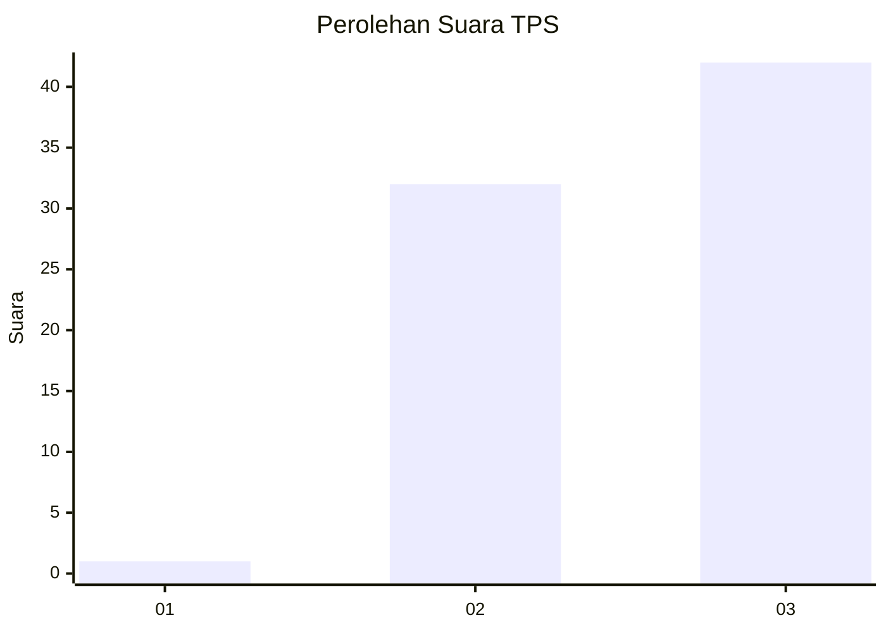
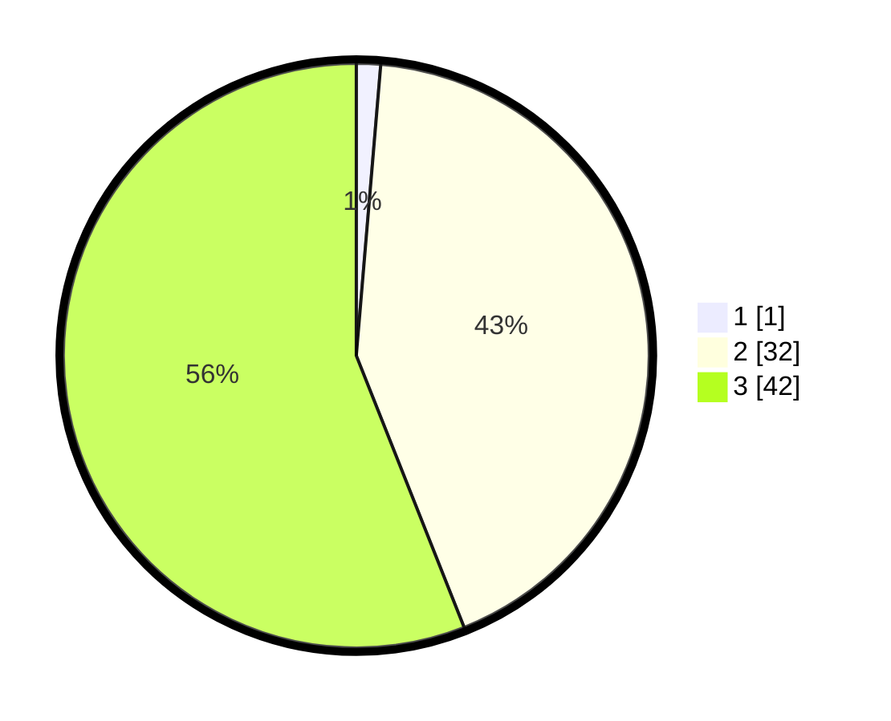

# Hasil

## Grafik

## Tabel

| No. | Nama Paslon    | Suara | Suara (raw) | Persentase |
|:--- |:-------------- | -----:| -----------:| ----------:|
| 1   | ANIES MUHAIMIN | 1     | [1][p-1]    | 1,33       |
| 2   | PRABOWO GIBRAN | 32    | [32][p-2]   | 42,67      |
| 3   | GANJAR MAHFUD  | 42    | [42][p-3]   | 56,00      |

[p-1]: https://github.com/gigit-pemilu/pemilu-2024/blob/main/pilpres/hitung-suara/sub/35-jawa-timur/sub/78-kota-surabaya/sub/10-tambaksari/sub/1003-gading/sub/031-tps/sub/paslon-1.txt
[p-2]: https://github.com/gigit-pemilu/pemilu-2024/blob/main/pilpres/hitung-suara/sub/35-jawa-timur/sub/78-kota-surabaya/sub/10-tambaksari/sub/1003-gading/sub/031-tps/sub/paslon-2.txt
[p-3]: https://github.com/gigit-pemilu/pemilu-2024/blob/main/pilpres/hitung-suara/sub/35-jawa-timur/sub/78-kota-surabaya/sub/10-tambaksari/sub/1003-gading/sub/031-tps/sub/paslon-3.txt

## Foto C Plano

https://sirekap-obj-formc.kpu.go.id/23e2/pemilu/ppwp/35/78/10/10/03/3578101003031-20240218-160706--4e0053b0-4e0f-452a-85d0-a36da617d1d4.jpg

https://sirekap-obj-formc.kpu.go.id/23e2/pemilu/ppwp/35/78/10/10/03/3578101003031-20240218-160714--dbbd3b9d-c562-4753-b0e4-97e8f1c8d264.jpg

https://sirekap-obj-formc.kpu.go.id/23e2/pemilu/ppwp/35/78/10/10/03/3578101003031-20240218-160720--a7255d16-86ab-4e7a-a39f-e72cb26e7f9f.jpg

## Metadata

| Key        | Value               |
| ---------- | ------------------- |
| Time Stamp | 2024-03-02 18:00:00 |

