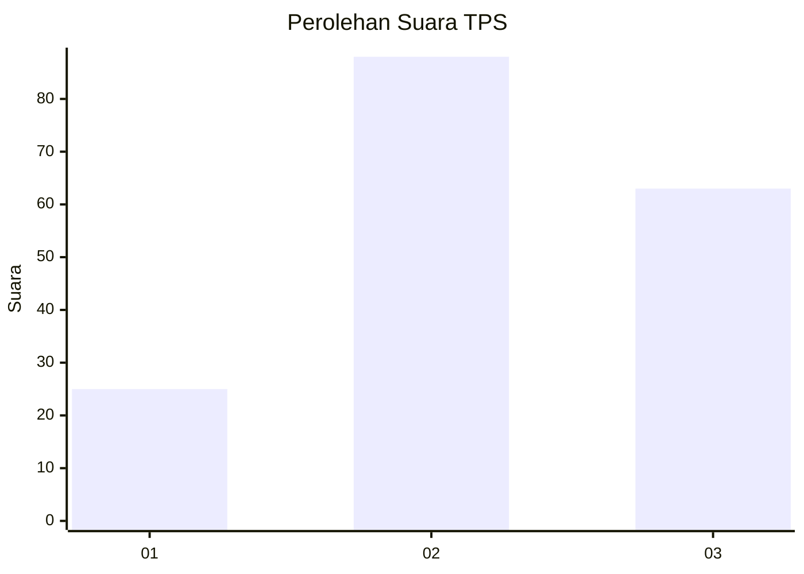
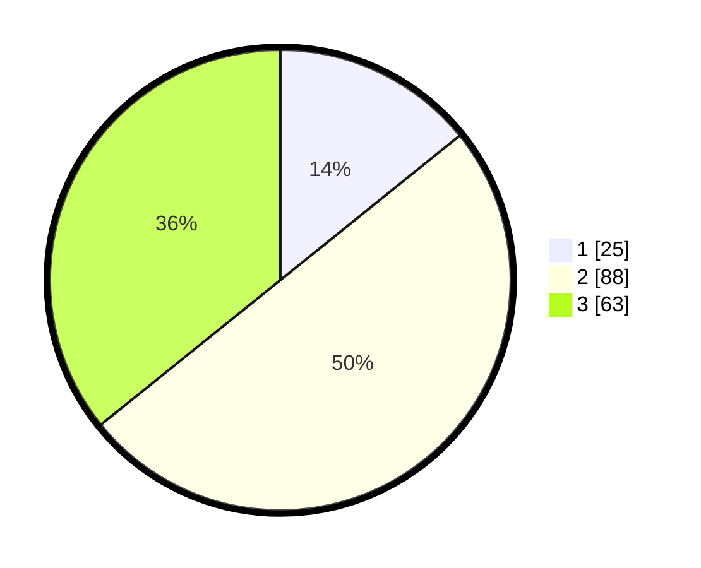

# Hasil

## Grafik

## Tabel

| No. | Nama Paslon    | Suara | Suara (raw) | Persentase |
|:--- |:-------------- | -----:| -----------:| ----------:|
| 1   | ANIES MUHAIMIN | 25    | [25][p-1]   | 14,20      |
| 2   | PRABOWO GIBRAN | 88    | [88][p-2]   | 50,00      |
| 3   | GANJAR MAHFUD  | 63    | [63][p-3]   | 35,80      |

[p-1]: https://github.com/gigit-pemilu/pemilu-2024/blob/main/pilpres/hitung-suara/sub/35-jawa-timur/sub/78-kota-surabaya/sub/11-simokerto/sub/1001-simokerto/sub/015-tps/sub/paslon-1.txt
[p-2]: https://github.com/gigit-pemilu/pemilu-2024/blob/main/pilpres/hitung-suara/sub/35-jawa-timur/sub/78-kota-surabaya/sub/11-simokerto/sub/1001-simokerto/sub/015-tps/sub/paslon-2.txt
[p-3]: https://github.com/gigit-pemilu/pemilu-2024/blob/main/pilpres/hitung-suara/sub/35-jawa-timur/sub/78-kota-surabaya/sub/11-simokerto/sub/1001-simokerto/sub/015-tps/sub/paslon-3.txt

## Foto C Plano

https://sirekap-obj-formc.kpu.go.id/a95b/pemilu/ppwp/35/78/11/10/01/3578111001015-20240215-033151--d4a7218e-3acd-4c45-9c00-a9d0672223b8.jpg

https://sirekap-obj-formc.kpu.go.id/a95b/pemilu/ppwp/35/78/11/10/01/3578111001015-20240215-033204--42d5e429-bf4a-42ff-995b-30bf8a50d8da.jpg

https://sirekap-obj-formc.kpu.go.id/a95b/pemilu/ppwp/35/78/11/10/01/3578111001015-20240215-033213--209da11a-0c71-4421-bf3b-d5da700f095b.jpg

## Metadata

| Key        | Value               |
| ---------- | ------------------- |
| Time Stamp | 2024-02-17 13:37:34 |

