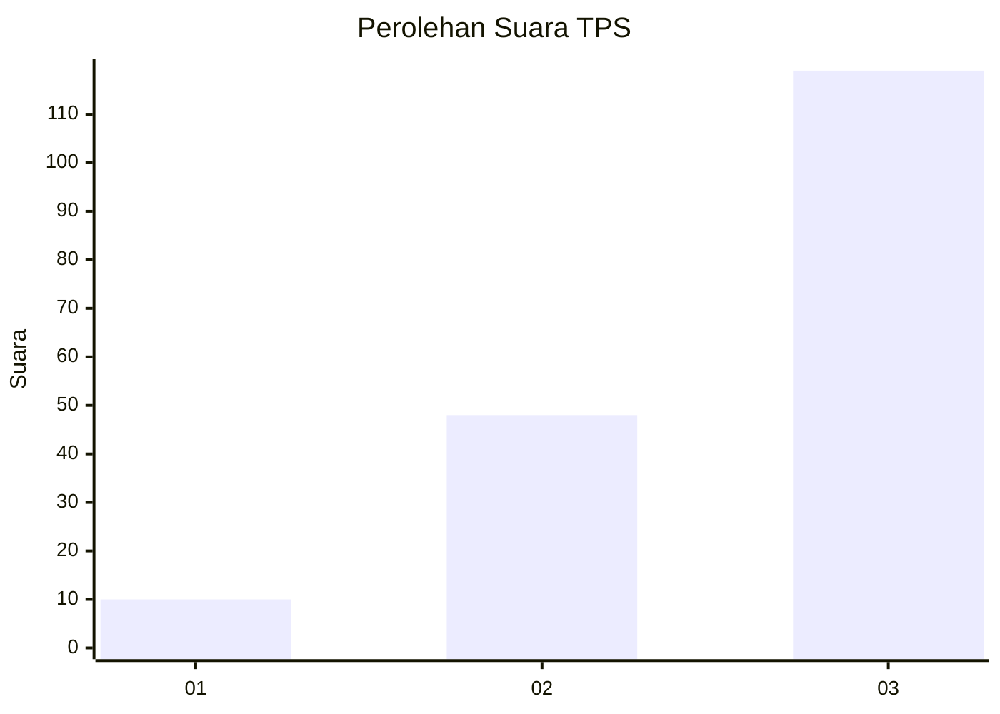
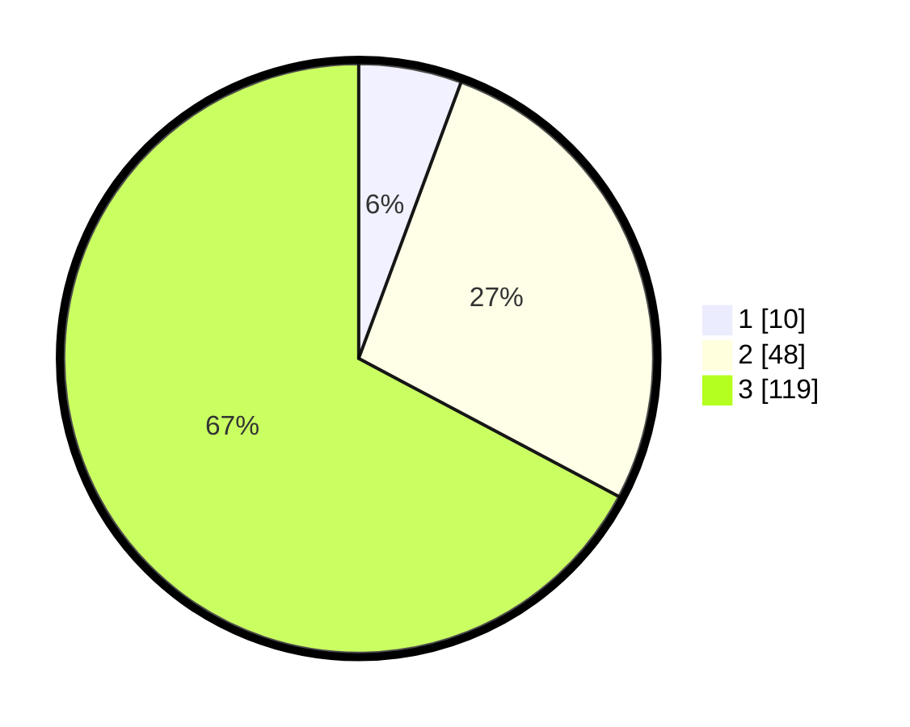

# Hasil

## Grafik

## Tabel

| No. | Nama Paslon    | Suara | Suara (raw) | Persentase |
|:--- |:-------------- | -----:| -----------:| ----------:|
| 1   | ANIES MUHAIMIN | 10    | [10][p-1]   | 5,65       |
| 2   | PRABOWO GIBRAN | 48    | [48][p-2]   | 27,12      |
| 3   | GANJAR MAHFUD  | 119   | [119][p-3]  | 67,23      |

[p-1]: https://github.com/gigit-pemilu/pemilu-2024/blob/main/pilpres/hitung-suara/sub/35-jawa-timur/sub/78-kota-surabaya/sub/11-simokerto/sub/1001-simokerto/sub/048-tps/sub/paslon-1.txt
[p-2]: https://github.com/gigit-pemilu/pemilu-2024/blob/main/pilpres/hitung-suara/sub/35-jawa-timur/sub/78-kota-surabaya/sub/11-simokerto/sub/1001-simokerto/sub/048-tps/sub/paslon-2.txt
[p-3]: https://github.com/gigit-pemilu/pemilu-2024/blob/main/pilpres/hitung-suara/sub/35-jawa-timur/sub/78-kota-surabaya/sub/11-simokerto/sub/1001-simokerto/sub/048-tps/sub/paslon-3.txt

## Foto C Plano

https://sirekap-obj-formc.kpu.go.id/df8d/pemilu/ppwp/35/78/11/10/01/3578111001048-20240214-221600--8192ad8f-198c-4581-b2d2-14b2aaae1136.jpg

https://sirekap-obj-formc.kpu.go.id/df8d/pemilu/ppwp/35/78/11/10/01/3578111001048-20240214-221734--7bed392f-4078-4bff-a21c-ad8a738a4e65.jpg

https://sirekap-obj-formc.kpu.go.id/df8d/pemilu/ppwp/35/78/11/10/01/3578111001048-20240214-221836--de890a84-cdc4-4ab7-a5a2-77d5bc16f998.jpg

## Metadata

| Key        | Value               |
| ---------- | ------------------- |
| Time Stamp | 2024-02-17 13:37:34 |

