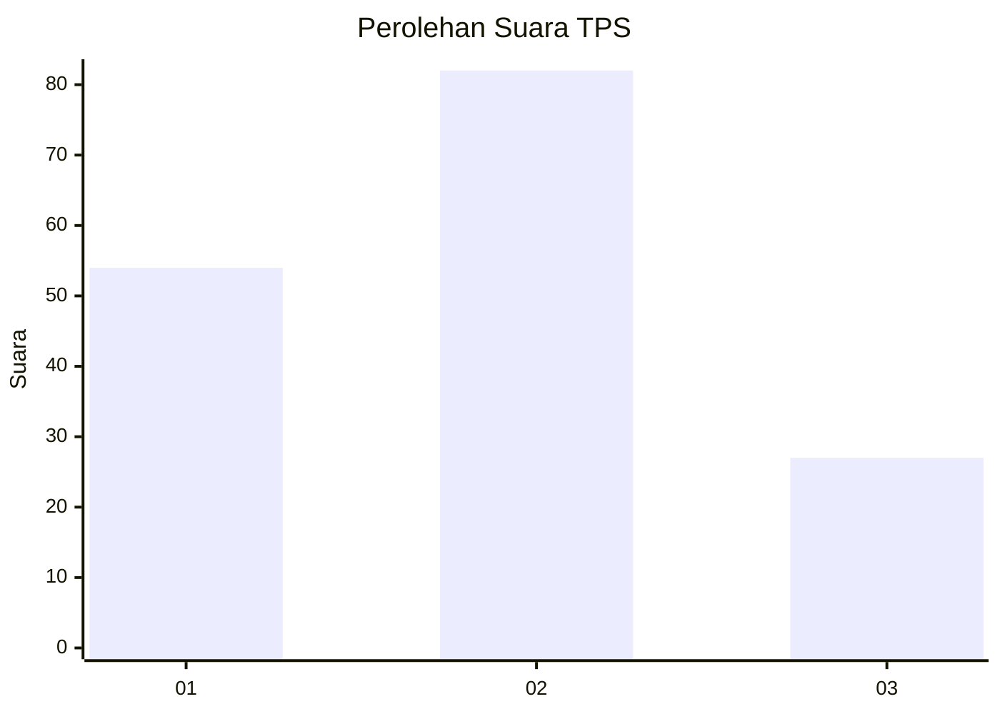
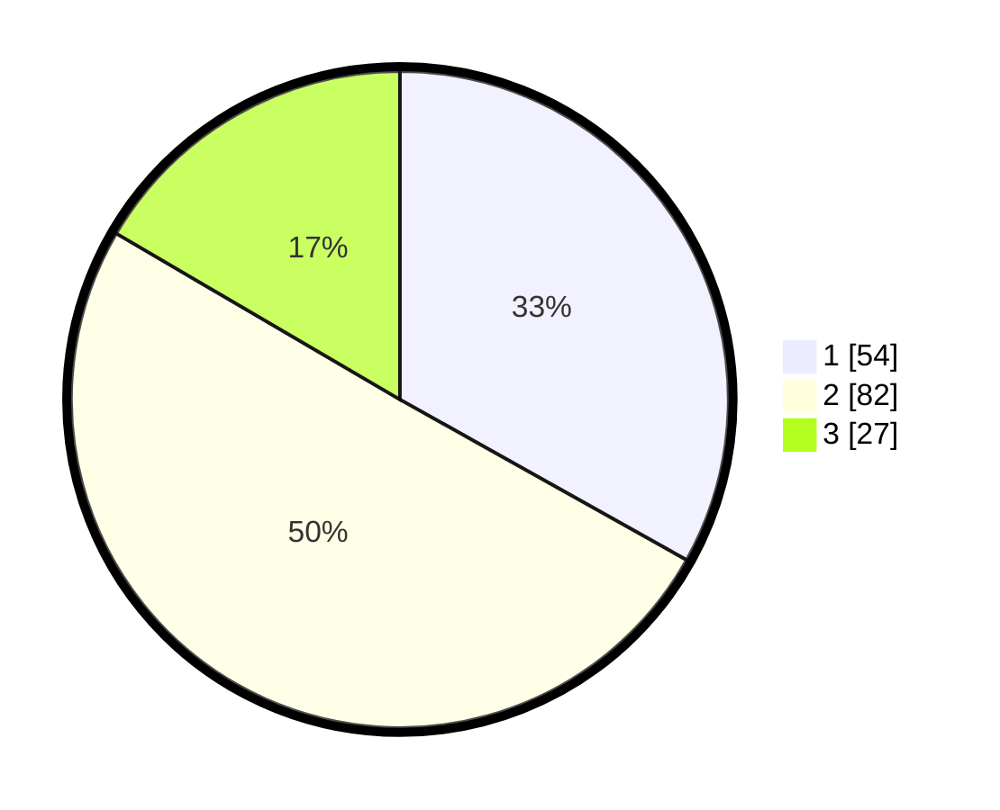

# Hasil

## Grafik

## Tabel

| No. | Nama Paslon    | Suara | Suara (raw) | Persentase |
|:--- |:-------------- | -----:| -----------:| ----------:|
| 1   | ANIES MUHAIMIN | 54    | [54][p-1]   | 33,13      |
| 2   | PRABOWO GIBRAN | 82    | [82][p-2]   | 50,31      |
| 3   | GANJAR MAHFUD  | 27    | [27][p-3]   | 16,56      |

[p-1]: https://github.com/gigit-pemilu/pemilu-2024/blob/main/pilpres/hitung-suara/sub/35-jawa-timur/sub/78-kota-surabaya/sub/11-simokerto/sub/1004-simolawang/sub/054-tps/sub/paslon-1.txt
[p-2]: https://github.com/gigit-pemilu/pemilu-2024/blob/main/pilpres/hitung-suara/sub/35-jawa-timur/sub/78-kota-surabaya/sub/11-simokerto/sub/1004-simolawang/sub/054-tps/sub/paslon-2.txt
[p-3]: https://github.com/gigit-pemilu/pemilu-2024/blob/main/pilpres/hitung-suara/sub/35-jawa-timur/sub/78-kota-surabaya/sub/11-simokerto/sub/1004-simolawang/sub/054-tps/sub/paslon-3.txt

## Foto C Plano

https://sirekap-obj-formc.kpu.go.id/2fbe/pemilu/ppwp/35/78/11/10/04/3578111004054-20240216-210845--5931fc5b-a525-41f9-b836-172da169c518.jpg

https://sirekap-obj-formc.kpu.go.id/2fbe/pemilu/ppwp/35/78/11/10/04/3578111004054-20240221-095005--8189c561-4494-416b-bef2-49a62d0bf9f2.jpg

https://sirekap-obj-formc.kpu.go.id/2fbe/pemilu/ppwp/35/78/11/10/04/3578111004054-20240221-095117--57fb7087-4ae4-4713-b02d-68c226cc4aef.jpg

## Metadata

| Key        | Value               |
| ---------- | ------------------- |
| Time Stamp | 2024-02-24 22:31:28 |

