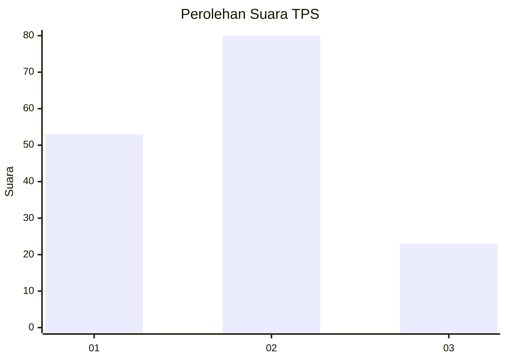
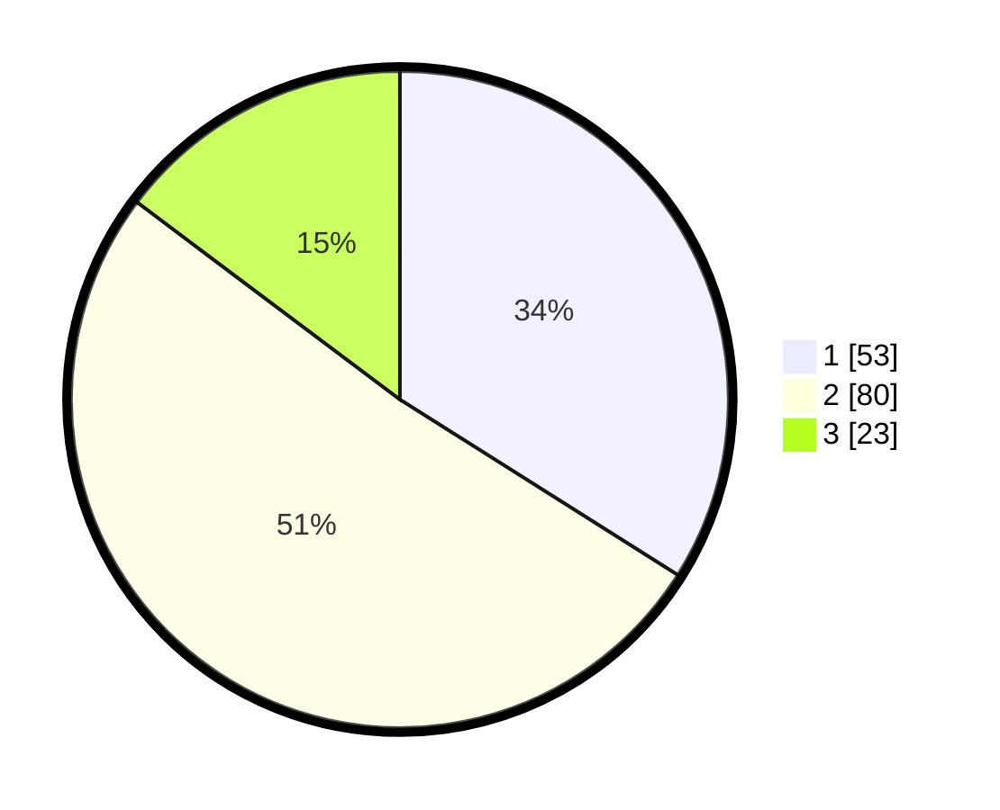

# Hasil

## Grafik

## Tabel

| No. | Nama Paslon    | Suara | Suara (raw) | Persentase |
|:--- |:-------------- | -----:| -----------:| ----------:|
| 1   | ANIES MUHAIMIN | 53    | [53][p-1]   | 33,97      |
| 2   | PRABOWO GIBRAN | 80    | [80][p-2]   | 51,28      |
| 3   | GANJAR MAHFUD  | 23    | [23][p-3]   | 14,74      |

[p-1]: https://github.com/gigit-pemilu/pemilu-2024/blob/main/pilpres/hitung-suara/sub/35-jawa-timur/sub/78-kota-surabaya/sub/11-simokerto/sub/1004-simolawang/sub/058-tps/sub/paslon-1.txt
[p-2]: https://github.com/gigit-pemilu/pemilu-2024/blob/main/pilpres/hitung-suara/sub/35-jawa-timur/sub/78-kota-surabaya/sub/11-simokerto/sub/1004-simolawang/sub/058-tps/sub/paslon-2.txt
[p-3]: https://github.com/gigit-pemilu/pemilu-2024/blob/main/pilpres/hitung-suara/sub/35-jawa-timur/sub/78-kota-surabaya/sub/11-simokerto/sub/1004-simolawang/sub/058-tps/sub/paslon-3.txt

## Foto C Plano

https://sirekap-obj-formc.kpu.go.id/b973/pemilu/ppwp/35/78/11/10/04/3578111004058-20240217-195600--10876975-9730-407d-b587-e9f918376d1f.jpg

https://sirekap-obj-formc.kpu.go.id/b973/pemilu/ppwp/35/78/11/10/04/3578111004058-20240217-195831--51e840e1-a83d-4327-b1b5-c6a3dbd811d5.jpg

https://sirekap-obj-formc.kpu.go.id/b973/pemilu/ppwp/35/78/11/10/04/3578111004058-20240217-195824--4df97f59-5364-4b80-9114-ee4b32f2cca4.jpg

## Metadata

| Key        | Value               |
| ---------- | ------------------- |
| Time Stamp | 2024-02-25 11:00:00 |

