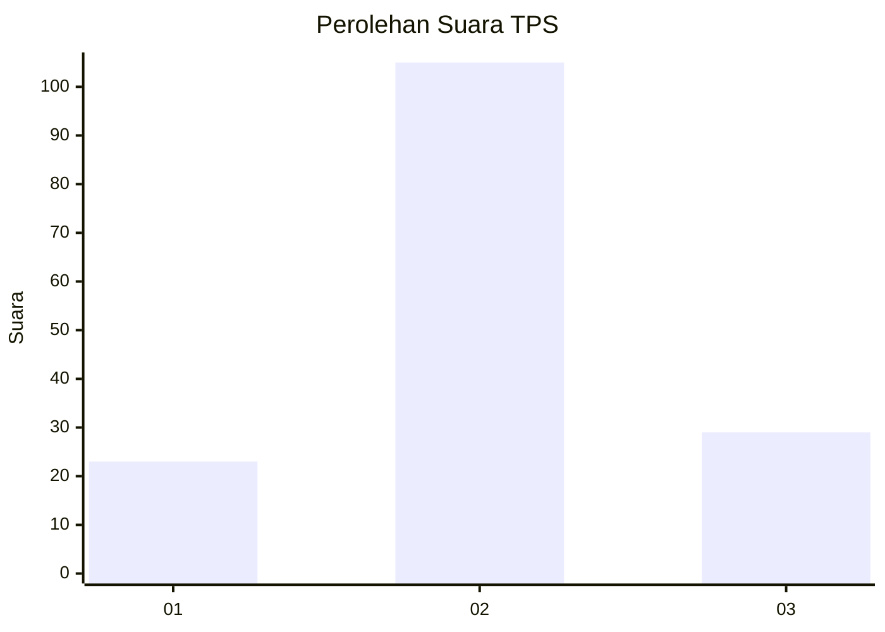
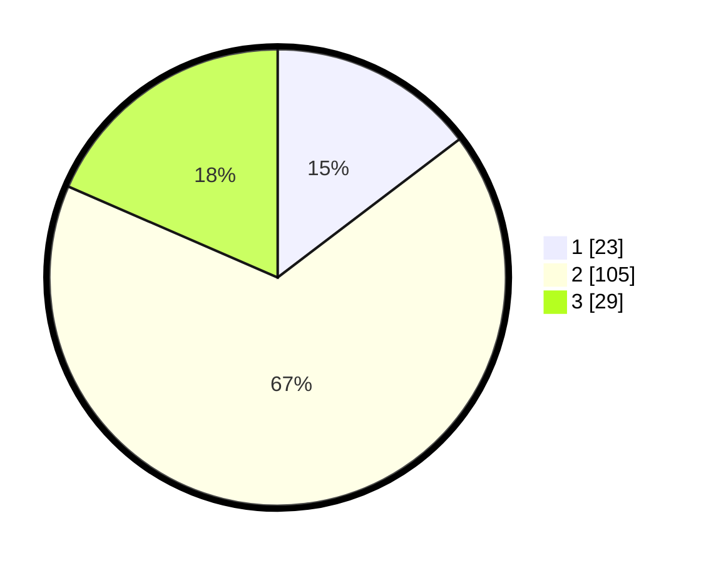

# Hasil

## Grafik

## Tabel

| No. | Nama Paslon    | Suara | Suara (raw) | Persentase |
|:--- |:-------------- | -----:| -----------:| ----------:|
| 1   | ANIES MUHAIMIN | 23    | [23][p-1]   | 14,65      |
| 2   | PRABOWO GIBRAN | 105   | [105][p-2]  | 66,88      |
| 3   | GANJAR MAHFUD  | 29    | [29][p-3]   | 18,47      |

[p-1]: https://github.com/gigit-pemilu/pemilu-2024/blob/main/pilpres/hitung-suara/sub/35-jawa-timur/sub/78-kota-surabaya/sub/12-pabean-cantian/sub/1001-bongkaran/sub/011-tps/sub/paslon-1.txt
[p-2]: https://github.com/gigit-pemilu/pemilu-2024/blob/main/pilpres/hitung-suara/sub/35-jawa-timur/sub/78-kota-surabaya/sub/12-pabean-cantian/sub/1001-bongkaran/sub/011-tps/sub/paslon-2.txt
[p-3]: https://github.com/gigit-pemilu/pemilu-2024/blob/main/pilpres/hitung-suara/sub/35-jawa-timur/sub/78-kota-surabaya/sub/12-pabean-cantian/sub/1001-bongkaran/sub/011-tps/sub/paslon-3.txt

## Foto C Plano

https://sirekap-obj-formc.kpu.go.id/776c/pemilu/ppwp/35/78/12/10/01/3578121001011-20240215-003431--e7054ca0-2a2a-4363-ae1b-480be67020b1.jpg

https://sirekap-obj-formc.kpu.go.id/776c/pemilu/ppwp/35/78/12/10/01/3578121001011-20240215-004223--9939446e-d173-4cbf-b782-d5f1e2c84f1d.jpg

https://sirekap-obj-formc.kpu.go.id/776c/pemilu/ppwp/35/78/12/10/01/3578121001011-20240215-004441--5b4ed3c1-ee79-45e3-b990-29c226bd5817.jpg

## Metadata

| Key        | Value               |
| ---------- | ------------------- |
| Time Stamp | 2024-02-24 22:31:28 |

