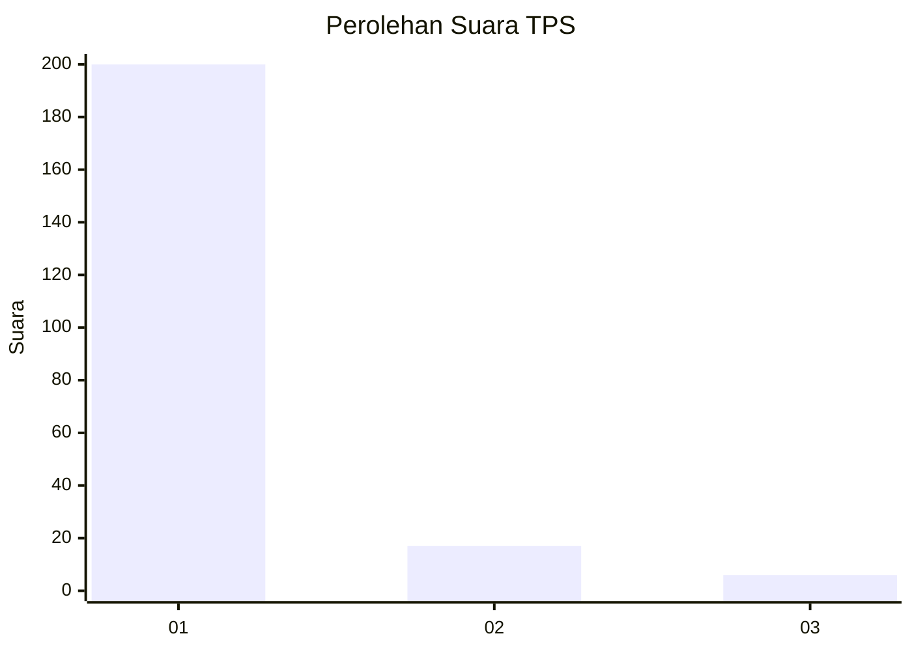
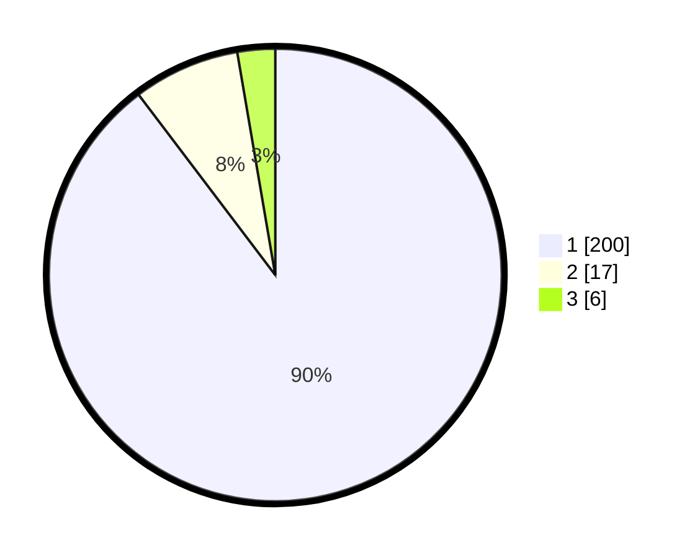

# Hasil

## Grafik

## Tabel

| No. | Nama Paslon    | Suara | Suara (raw) | Persentase |
|:--- |:-------------- | -----:| -----------:| ----------:|
| 1   | ANIES MUHAIMIN | 200   | [200][p-1]  | 89,69      |
| 2   | PRABOWO GIBRAN | 17    | [17][p-2]   | 7,62       |
| 3   | GANJAR MAHFUD  | 6     | [6][p-3]    | 2,69       |

[p-1]: https://github.com/gigit-pemilu/pemilu-2024-35-jawa-timur/blob/main/pilpres/hitung-suara/sub/35-jawa-timur/sub/78-kota-surabaya/sub/12-pabean-cantian/sub/1002-nyamplungan/sub/012-tps/sub/paslon-1.txt
[p-2]: https://github.com/gigit-pemilu/pemilu-2024-35-jawa-timur/blob/main/pilpres/hitung-suara/sub/35-jawa-timur/sub/78-kota-surabaya/sub/12-pabean-cantian/sub/1002-nyamplungan/sub/012-tps/sub/paslon-2.txt
[p-3]: https://github.com/gigit-pemilu/pemilu-2024-35-jawa-timur/blob/main/pilpres/hitung-suara/sub/35-jawa-timur/sub/78-kota-surabaya/sub/12-pabean-cantian/sub/1002-nyamplungan/sub/012-tps/sub/paslon-3.txt

## Foto C Plano

https://sirekap-obj-formc.kpu.go.id/b0ea/pemilu/ppwp/35/78/12/10/02/3578121002012-20240215-001322--103ab7a9-6ba7-4607-9919-a8fa7a2ba4f8.jpg

https://sirekap-obj-formc.kpu.go.id/b0ea/pemilu/ppwp/35/78/12/10/02/3578121002012-20240215-001350--e5ce3480-5f6c-45fb-9403-e047af436269.jpg

https://sirekap-obj-formc.kpu.go.id/b0ea/pemilu/ppwp/35/78/12/10/02/3578121002012-20240215-001434--e4725b02-b51e-4094-8cd9-651347864314.jpg

## Metadata

| Key        | Value               |
| ---------- | ------------------- |
| Time Stamp | 2024-02-19 10:00:00 |

