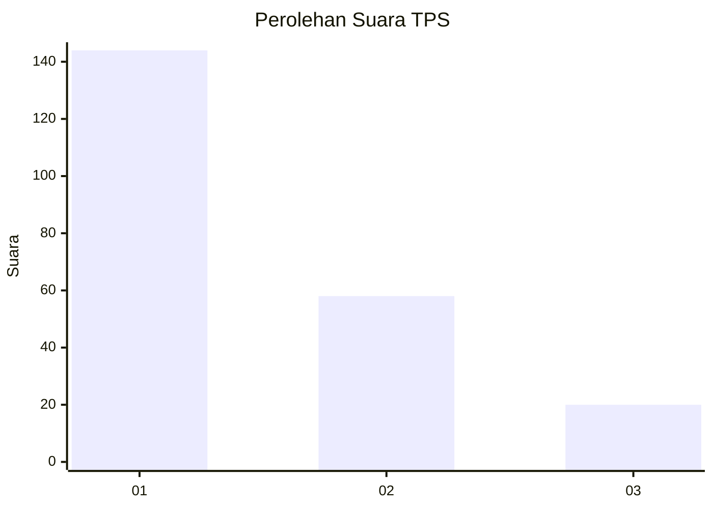
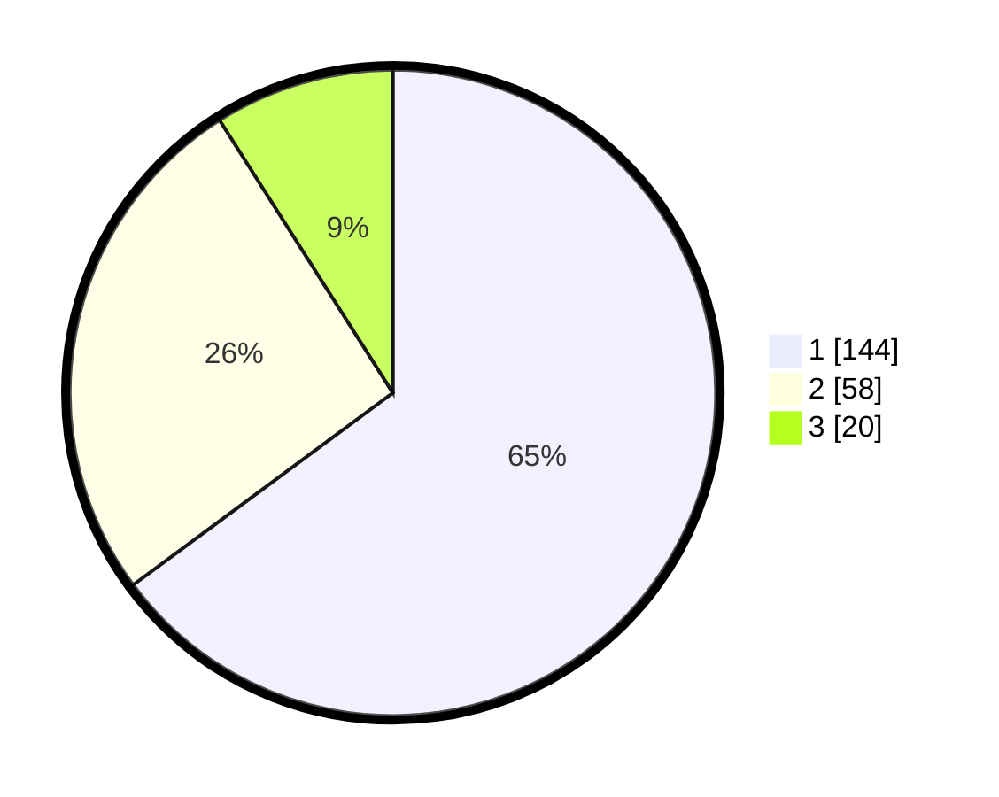

# Hasil

## Grafik

## Tabel

| No. | Nama Paslon    | Suara | Suara (raw) | Persentase |
|:--- |:-------------- | -----:| -----------:| ----------:|
| 1   | ANIES MUHAIMIN | 144   | [144][p-1]  | 64,86      |
| 2   | PRABOWO GIBRAN | 58    | [58][p-2]   | 26,13      |
| 3   | GANJAR MAHFUD  | 20    | [20][p-3]   | 9,01       |

[p-1]: https://github.com/gigit-pemilu/pemilu-2024/blob/main/pilpres/hitung-suara/sub/35-jawa-timur/sub/78-kota-surabaya/sub/12-pabean-cantian/sub/1002-nyamplungan/sub/013-tps/sub/paslon-1.txt
[p-2]: https://github.com/gigit-pemilu/pemilu-2024/blob/main/pilpres/hitung-suara/sub/35-jawa-timur/sub/78-kota-surabaya/sub/12-pabean-cantian/sub/1002-nyamplungan/sub/013-tps/sub/paslon-2.txt
[p-3]: https://github.com/gigit-pemilu/pemilu-2024/blob/main/pilpres/hitung-suara/sub/35-jawa-timur/sub/78-kota-surabaya/sub/12-pabean-cantian/sub/1002-nyamplungan/sub/013-tps/sub/paslon-3.txt

## Foto C Plano

https://sirekap-obj-formc.kpu.go.id/759e/pemilu/ppwp/35/78/12/10/02/3578121002013-20240215-014311--3c8325bd-5e9d-4dee-9f24-7a458462acc3.jpg

https://sirekap-obj-formc.kpu.go.id/759e/pemilu/ppwp/35/78/12/10/02/3578121002013-20240215-014952--7e479e6d-7f45-4faf-9596-710a7e28366e.jpg

https://sirekap-obj-formc.kpu.go.id/759e/pemilu/ppwp/35/78/12/10/02/3578121002013-20240215-015119--602ec064-7f75-4430-bc03-ce18b032b5e5.jpg

## Metadata

| Key        | Value               |
| ---------- | ------------------- |
| Time Stamp | 2024-02-24 22:31:28 |

