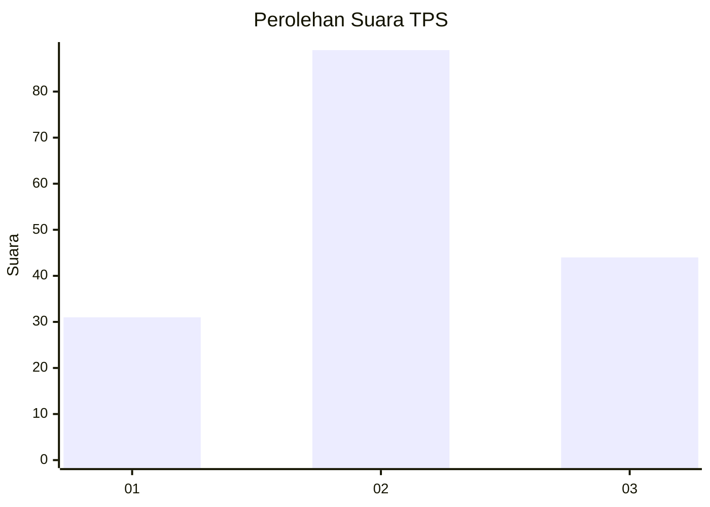
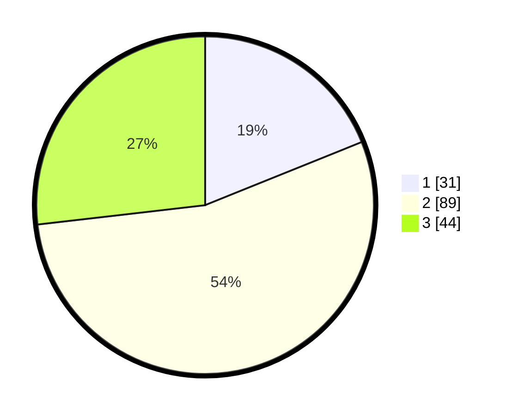

# Hasil

## Grafik

## Tabel

| No. | Nama Paslon    | Suara | Suara (raw) | Persentase |
|:--- |:-------------- | -----:| -----------:| ----------:|
| 1   | ANIES MUHAIMIN | 31    | [31][p-1]   | 18,90      |
| 2   | PRABOWO GIBRAN | 89    | [89][p-2]   | 54,27      |
| 3   | GANJAR MAHFUD  | 44    | [44][p-3]   | 26,83      |

[p-1]: https://github.com/gigit-pemilu/pemilu-2024-35-jawa-timur/blob/main/pilpres/hitung-suara/sub/35-jawa-timur/sub/78-kota-surabaya/sub/12-pabean-cantian/sub/1003-krembangan-utara/sub/002-tps/sub/paslon-1.txt
[p-2]: https://github.com/gigit-pemilu/pemilu-2024-35-jawa-timur/blob/main/pilpres/hitung-suara/sub/35-jawa-timur/sub/78-kota-surabaya/sub/12-pabean-cantian/sub/1003-krembangan-utara/sub/002-tps/sub/paslon-2.txt
[p-3]: https://github.com/gigit-pemilu/pemilu-2024-35-jawa-timur/blob/main/pilpres/hitung-suara/sub/35-jawa-timur/sub/78-kota-surabaya/sub/12-pabean-cantian/sub/1003-krembangan-utara/sub/002-tps/sub/paslon-3.txt

## Foto C Plano

https://sirekap-obj-formc.kpu.go.id/61d9/pemilu/ppwp/35/78/12/10/03/3578121003002-20240214-195242--094bd7b6-cebc-4cf2-ab2c-6b1a5975573d.jpg

https://sirekap-obj-formc.kpu.go.id/61d9/pemilu/ppwp/35/78/12/10/03/3578121003002-20240214-225744--215828a3-3687-44fb-89ef-74a3ce6f4eba.jpg

https://sirekap-obj-formc.kpu.go.id/61d9/pemilu/ppwp/35/78/12/10/03/3578121003002-20240214-224807--6848bc2d-47dc-441b-9cc9-87cbb3e0a806.jpg

## Metadata

| Key        | Value               |
| ---------- | ------------------- |
| Time Stamp | 2024-02-22 17:00:00 |

