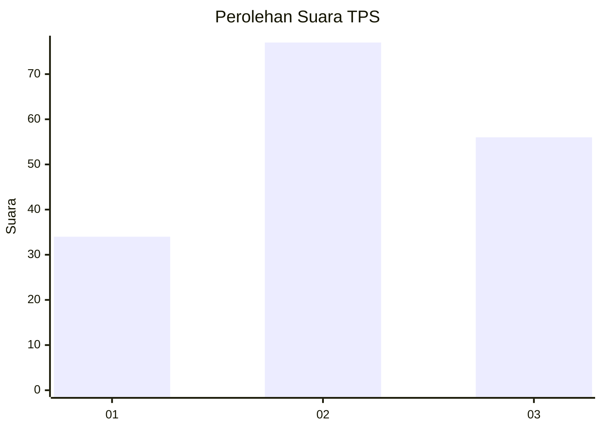
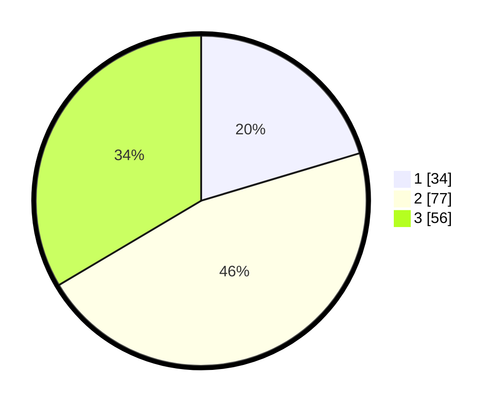

# Hasil

## Grafik

## Tabel

| No. | Nama Paslon    | Suara | Suara (raw) | Persentase |
|:--- |:-------------- | -----:| -----------:| ----------:|
| 1   | ANIES MUHAIMIN | 34    | [34][p-1]   | 20,36      |
| 2   | PRABOWO GIBRAN | 77    | [77][p-2]   | 46,11      |
| 3   | GANJAR MAHFUD  | 56    | [56][p-3]   | 33,53      |

[p-1]: https://github.com/gigit-pemilu/pemilu-2024-35-jawa-timur/blob/main/pilpres/hitung-suara/sub/35-jawa-timur/sub/78-kota-surabaya/sub/12-pabean-cantian/sub/1003-krembangan-utara/sub/037-tps/sub/paslon-1.txt
[p-2]: https://github.com/gigit-pemilu/pemilu-2024-35-jawa-timur/blob/main/pilpres/hitung-suara/sub/35-jawa-timur/sub/78-kota-surabaya/sub/12-pabean-cantian/sub/1003-krembangan-utara/sub/037-tps/sub/paslon-2.txt
[p-3]: https://github.com/gigit-pemilu/pemilu-2024-35-jawa-timur/blob/main/pilpres/hitung-suara/sub/35-jawa-timur/sub/78-kota-surabaya/sub/12-pabean-cantian/sub/1003-krembangan-utara/sub/037-tps/sub/paslon-3.txt

## Foto C Plano

https://sirekap-obj-formc.kpu.go.id/4a09/pemilu/ppwp/35/78/12/10/03/3578121003037-20240215-014851--95282159-f614-45e5-a933-12a0199f325e.jpg

https://sirekap-obj-formc.kpu.go.id/4a09/pemilu/ppwp/35/78/12/10/03/3578121003037-20240215-014831--48e1d511-cb1e-4118-be10-b6bc01f3983d.jpg

https://sirekap-obj-formc.kpu.go.id/4a09/pemilu/ppwp/35/78/12/10/03/3578121003037-20240215-014812--35baf540-16e0-417a-b5b3-9fa0e886468f.jpg

## Metadata

| Key        | Value               |
| ---------- | ------------------- |
| Time Stamp | 2024-02-25 16:00:00 |

