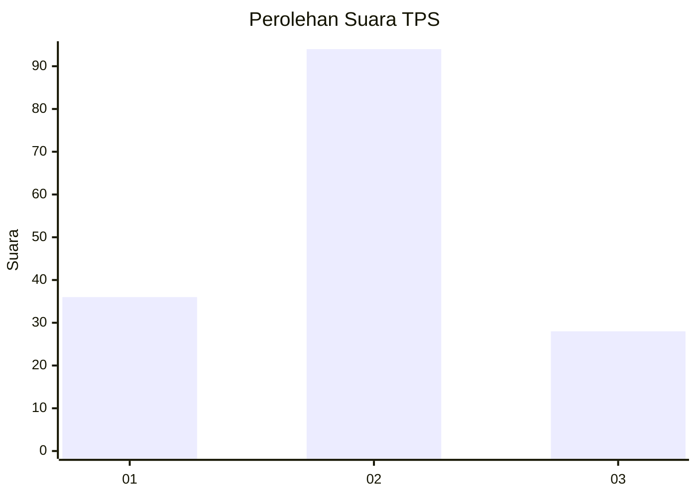
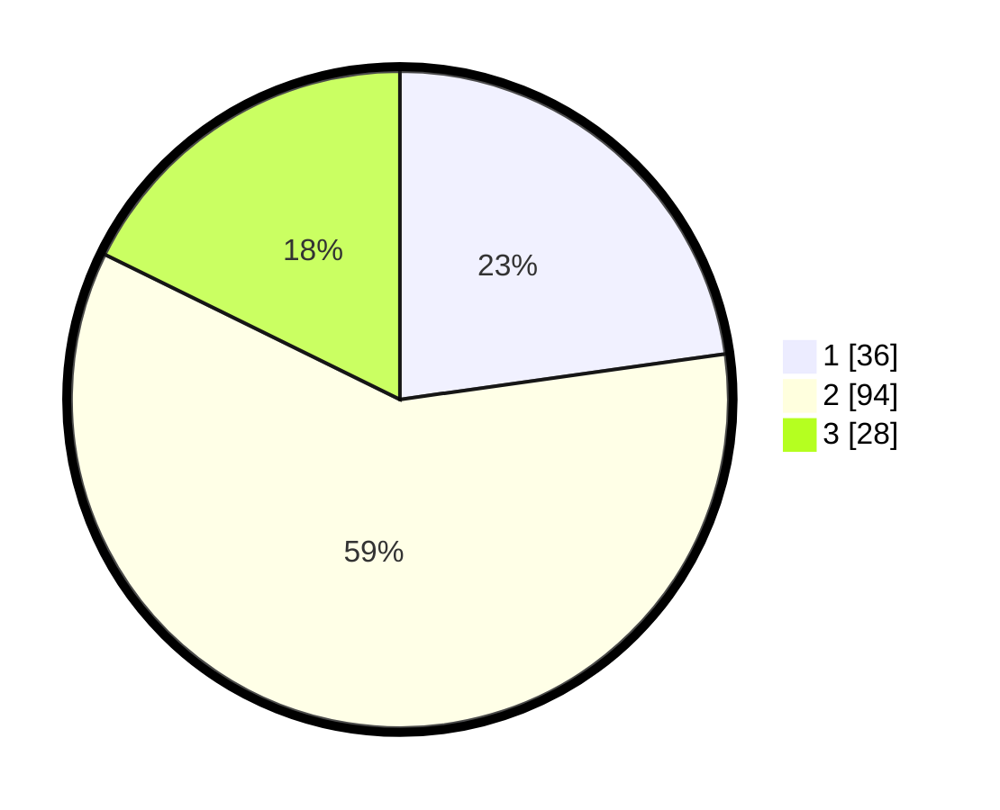

# Hasil

## Grafik

## Tabel

| No. | Nama Paslon    | Suara | Suara (raw) | Persentase |
|:--- |:-------------- | -----:| -----------:| ----------:|
| 1   | ANIES MUHAIMIN | 36    | [36][p-1]   | 22,78      |
| 2   | PRABOWO GIBRAN | 94    | [94][p-2]   | 59,49      |
| 3   | GANJAR MAHFUD  | 28    | [28][p-3]   | 17,72      |

[p-1]: https://github.com/gigit-pemilu/pemilu-2024/blob/main/pilpres/hitung-suara/sub/35-jawa-timur/sub/78-kota-surabaya/sub/12-pabean-cantian/sub/1003-krembangan-utara/sub/046-tps/sub/paslon-1.txt
[p-2]: https://github.com/gigit-pemilu/pemilu-2024/blob/main/pilpres/hitung-suara/sub/35-jawa-timur/sub/78-kota-surabaya/sub/12-pabean-cantian/sub/1003-krembangan-utara/sub/046-tps/sub/paslon-2.txt
[p-3]: https://github.com/gigit-pemilu/pemilu-2024/blob/main/pilpres/hitung-suara/sub/35-jawa-timur/sub/78-kota-surabaya/sub/12-pabean-cantian/sub/1003-krembangan-utara/sub/046-tps/sub/paslon-3.txt

## Foto C Plano

https://sirekap-obj-formc.kpu.go.id/f9b2/pemilu/ppwp/35/78/12/10/03/3578121003046-20240214-235631--512734bf-af2c-401b-8018-083199557558.jpg

https://sirekap-obj-formc.kpu.go.id/f9b2/pemilu/ppwp/35/78/12/10/03/3578121003046-20240214-235852--094ad821-9537-420c-bed0-48ec337c832f.jpg

https://sirekap-obj-formc.kpu.go.id/f9b2/pemilu/ppwp/35/78/12/10/03/3578121003046-20240215-000521--47156d7a-275f-4133-9e1a-92735d1ec09c.jpg

## Metadata

| Key        | Value               |
| ---------- | ------------------- |
| Time Stamp | 2024-02-24 22:31:28 |

