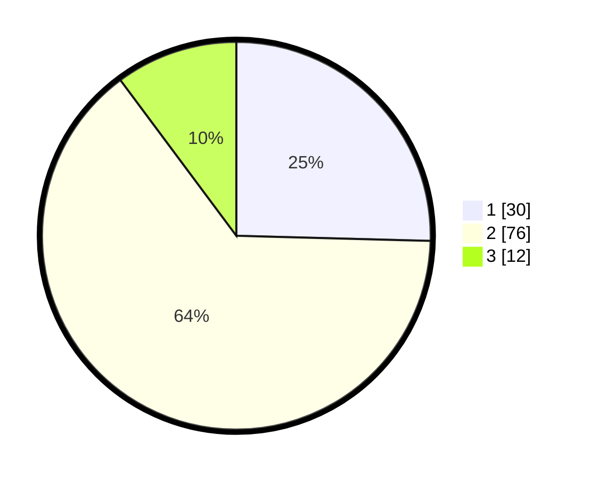

# Hasil

## Grafik

## Tabel

| No. | Nama Paslon    | Suara | Suara (raw) | Persentase |
|:--- |:-------------- | -----:| -----------:| ----------:|
| 1   | ANIES MUHAIMIN | 30    | [30][p-1]   | 25,42      |
| 2   | PRABOWO GIBRAN | 76    | [76][p-2]   | 64,41      |
| 3   | GANJAR MAHFUD  | 12    | [12][p-3]   | 10,17      |

[p-1]: https://github.com/gigit-pemilu/pemilu-2024-35-jawa-timur/blob/main/pilpres/hitung-suara/sub/35-jawa-timur/sub/78-kota-surabaya/sub/12-pabean-cantian/sub/1006-tanjung-perak/sub/003-tps/sub/paslon-1.txt
[p-2]: https://github.com/gigit-pemilu/pemilu-2024-35-jawa-timur/blob/main/pilpres/hitung-suara/sub/35-jawa-timur/sub/78-kota-surabaya/sub/12-pabean-cantian/sub/1006-tanjung-perak/sub/003-tps/sub/paslon-2.txt
[p-3]: https://github.com/gigit-pemilu/pemilu-2024-35-jawa-timur/blob/main/pilpres/hitung-suara/sub/35-jawa-timur/sub/78-kota-surabaya/sub/12-pabean-cantian/sub/1006-tanjung-perak/sub/003-tps/sub/paslon-3.txt

## Foto C Plano

https://sirekap-obj-formc.kpu.go.id/9dca/pemilu/ppwp/35/78/12/10/06/3578121006003-20240214-212243--cc95ec2d-40c1-45a2-9e1d-fd48d00f7baa.jpg

https://sirekap-obj-formc.kpu.go.id/9dca/pemilu/ppwp/35/78/12/10/06/3578121006003-20240219-092947--227bfced-802e-4453-be9c-dd73a2036ebb.jpg

https://sirekap-obj-formc.kpu.go.id/9dca/pemilu/ppwp/35/78/12/10/06/3578121006003-20240219-093012--9859ffcb-6354-4292-ac3d-4e64ca81df68.jpg

## Metadata

| Key        | Value               |
| ---------- | ------------------- |
| Time Stamp | 2024-02-21 21:00:04 |

