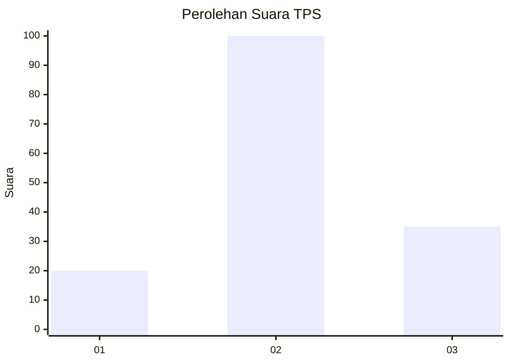
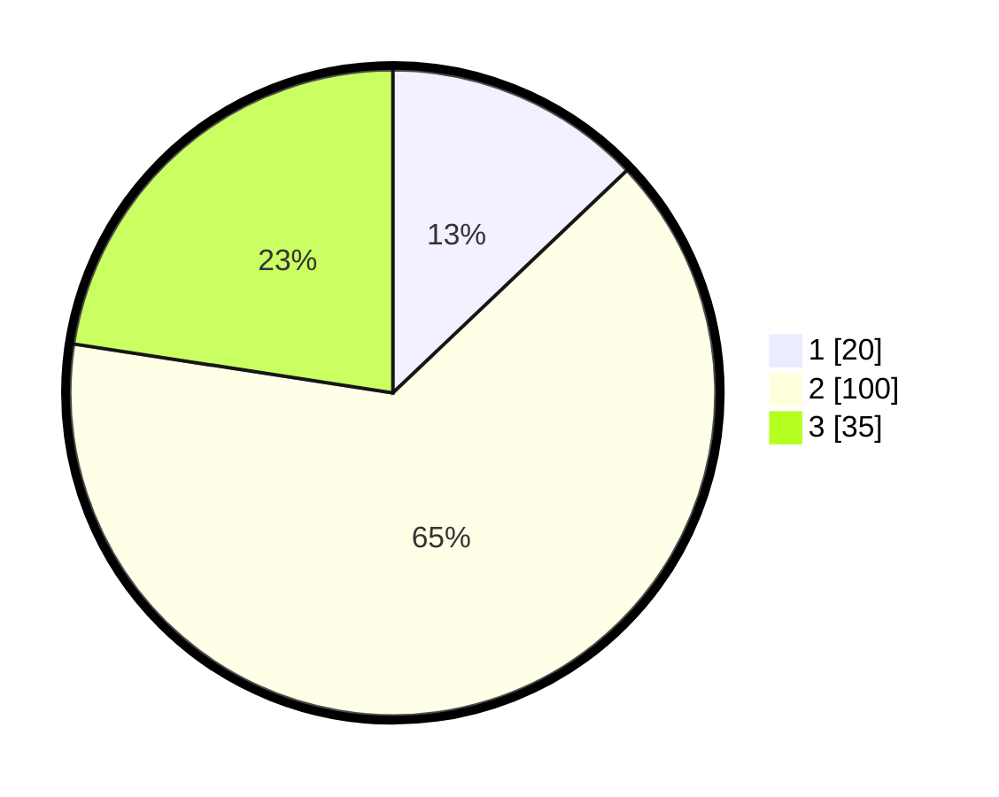

# Hasil

## Grafik

## Tabel

| No. | Nama Paslon    | Suara | Suara (raw) | Persentase |
|:--- |:-------------- | -----:| -----------:| ----------:|
| 1   | ANIES MUHAIMIN | 20    | [20][p-1]   | 12,90      |
| 2   | PRABOWO GIBRAN | 100   | [100][p-2]  | 64,52      |
| 3   | GANJAR MAHFUD  | 35    | [35][p-3]   | 22,58      |

[p-1]: https://github.com/gigit-pemilu/pemilu-2024/blob/main/pilpres/hitung-suara/sub/35-jawa-timur/sub/78-kota-surabaya/sub/12-pabean-cantian/sub/1006-tanjung-perak/sub/042-tps/sub/paslon-1.txt
[p-2]: https://github.com/gigit-pemilu/pemilu-2024/blob/main/pilpres/hitung-suara/sub/35-jawa-timur/sub/78-kota-surabaya/sub/12-pabean-cantian/sub/1006-tanjung-perak/sub/042-tps/sub/paslon-2.txt
[p-3]: https://github.com/gigit-pemilu/pemilu-2024/blob/main/pilpres/hitung-suara/sub/35-jawa-timur/sub/78-kota-surabaya/sub/12-pabean-cantian/sub/1006-tanjung-perak/sub/042-tps/sub/paslon-3.txt

## Foto C Plano

https://sirekap-obj-formc.kpu.go.id/f4f1/pemilu/ppwp/35/78/12/10/06/3578121006042-20240215-000618--1c35745f-ad3b-4880-979f-a5ac7ed4aeef.jpg

https://sirekap-obj-formc.kpu.go.id/f4f1/pemilu/ppwp/35/78/12/10/06/3578121006042-20240215-010838--404bb137-0ce2-410f-8609-042364637a9a.jpg

https://sirekap-obj-formc.kpu.go.id/f4f1/pemilu/ppwp/35/78/12/10/06/3578121006042-20240215-010959--505ace1f-9381-4862-a481-77dbeb0c9274.jpg

## Metadata

| Key        | Value               |
| ---------- | ------------------- |
| Time Stamp | 2024-02-24 22:31:28 |

