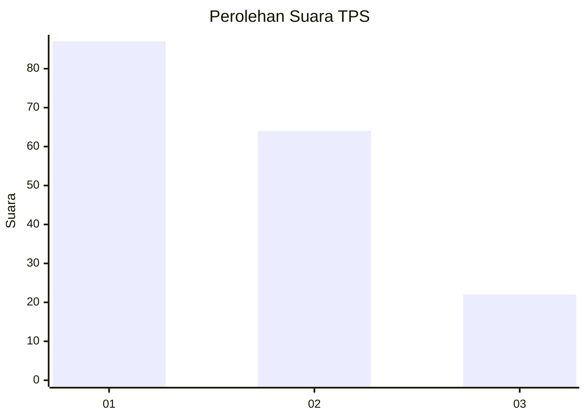
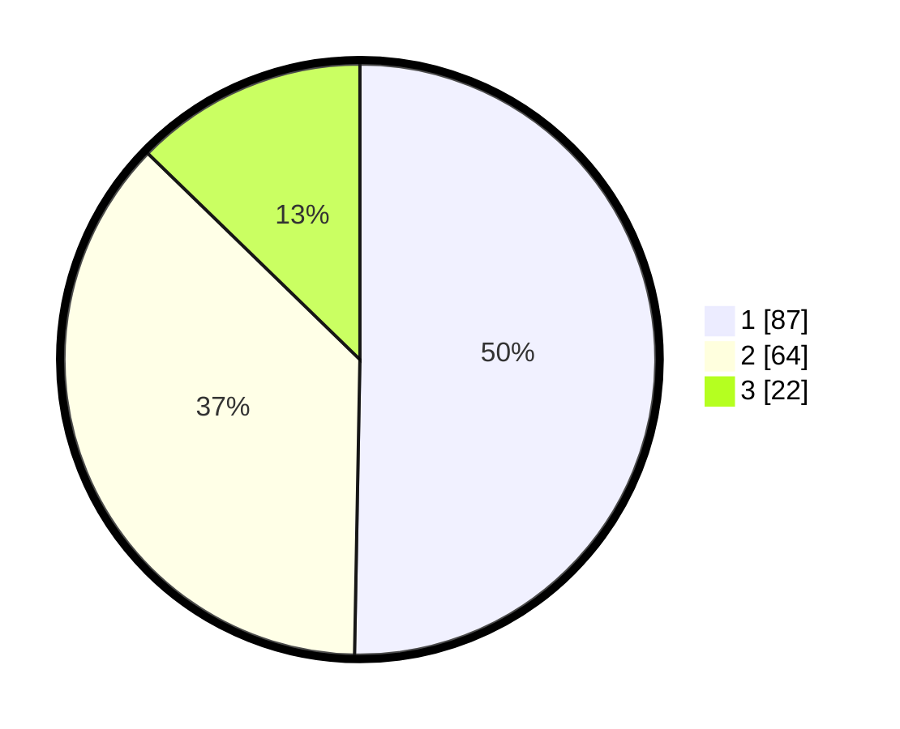

# Hasil

## Grafik

## Tabel

| No. | Nama Paslon    | Suara | Suara (raw) | Persentase |
|:--- |:-------------- | -----:| -----------:| ----------:|
| 1   | ANIES MUHAIMIN | 87    | [87][p-1]   | 50,29      |
| 2   | PRABOWO GIBRAN | 64    | [64][p-2]   | 36,99      |
| 3   | GANJAR MAHFUD  | 22    | [22][p-3]   | 12,72      |

[p-1]: https://github.com/gigit-pemilu/pemilu-2024-35-jawa-timur/blob/main/pilpres/hitung-suara/sub/35-jawa-timur/sub/78-kota-surabaya/sub/12-pabean-cantian/sub/1006-tanjung-perak/sub/057-tps/sub/paslon-1.txt
[p-2]: https://github.com/gigit-pemilu/pemilu-2024-35-jawa-timur/blob/main/pilpres/hitung-suara/sub/35-jawa-timur/sub/78-kota-surabaya/sub/12-pabean-cantian/sub/1006-tanjung-perak/sub/057-tps/sub/paslon-2.txt
[p-3]: https://github.com/gigit-pemilu/pemilu-2024-35-jawa-timur/blob/main/pilpres/hitung-suara/sub/35-jawa-timur/sub/78-kota-surabaya/sub/12-pabean-cantian/sub/1006-tanjung-perak/sub/057-tps/sub/paslon-3.txt

## Foto C Plano

https://sirekap-obj-formc.kpu.go.id/e1c7/pemilu/ppwp/35/78/12/10/06/3578121006057-20240214-215943--de9282fd-e3e8-4b80-8c29-76332fbca8eb.jpg

https://sirekap-obj-formc.kpu.go.id/e1c7/pemilu/ppwp/35/78/12/10/06/3578121006057-20240214-220000--d0f0ff9c-92d0-4958-9324-75120c1b1d0d.jpg

https://sirekap-obj-formc.kpu.go.id/e1c7/pemilu/ppwp/35/78/12/10/06/3578121006057-20240214-220113--69ff8e06-240f-49dc-b7d5-d3392cf9339a.jpg

## Metadata

| Key        | Value               |
| ---------- | ------------------- |
| Time Stamp | 2024-02-25 11:00:00 |

