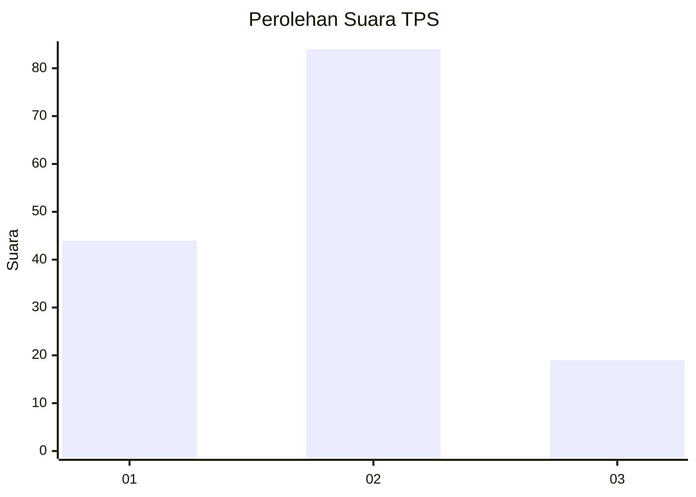
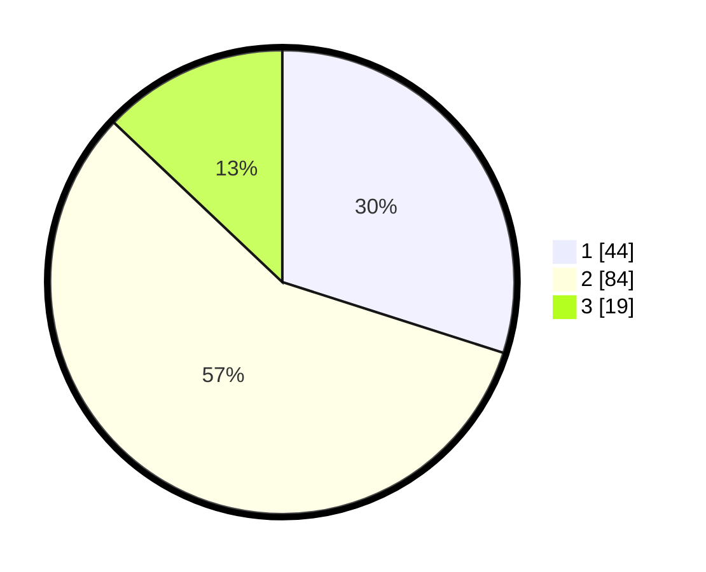

# Hasil

## Grafik

## Tabel

| No. | Nama Paslon    | Suara | Suara (raw) | Persentase |
|:--- |:-------------- | -----:| -----------:| ----------:|
| 1   | ANIES MUHAIMIN | 44    | [44][p-1]   | 29,93      |
| 2   | PRABOWO GIBRAN | 84    | [84][p-2]   | 57,14      |
| 3   | GANJAR MAHFUD  | 19    | [19][p-3]   | 12,93      |

[p-1]: https://github.com/gigit-pemilu/pemilu-2024-35-jawa-timur/blob/main/pilpres/hitung-suara/sub/35-jawa-timur/sub/78-kota-surabaya/sub/12-pabean-cantian/sub/1006-tanjung-perak/sub/059-tps/sub/paslon-1.txt
[p-2]: https://github.com/gigit-pemilu/pemilu-2024-35-jawa-timur/blob/main/pilpres/hitung-suara/sub/35-jawa-timur/sub/78-kota-surabaya/sub/12-pabean-cantian/sub/1006-tanjung-perak/sub/059-tps/sub/paslon-2.txt
[p-3]: https://github.com/gigit-pemilu/pemilu-2024-35-jawa-timur/blob/main/pilpres/hitung-suara/sub/35-jawa-timur/sub/78-kota-surabaya/sub/12-pabean-cantian/sub/1006-tanjung-perak/sub/059-tps/sub/paslon-3.txt

## Foto C Plano

https://sirekap-obj-formc.kpu.go.id/85ed/pemilu/ppwp/35/78/12/10/06/3578121006059-20240214-195013--bcea17fb-2ba5-4fe9-b508-2d66c17fae63.jpg

https://sirekap-obj-formc.kpu.go.id/85ed/pemilu/ppwp/35/78/12/10/06/3578121006059-20240214-195245--f3511c6a-018f-46d7-b737-6cdfb655e975.jpg

https://sirekap-obj-formc.kpu.go.id/85ed/pemilu/ppwp/35/78/12/10/06/3578121006059-20240214-195340--a7c486c0-f95c-4240-99f0-65c5991052b5.jpg

## Metadata

| Key        | Value               |
| ---------- | ------------------- |
| Time Stamp | 2024-02-19 06:16:00 |

