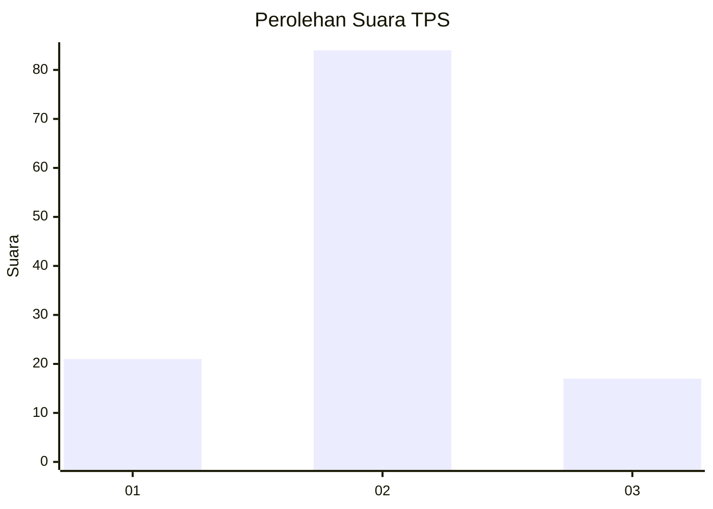
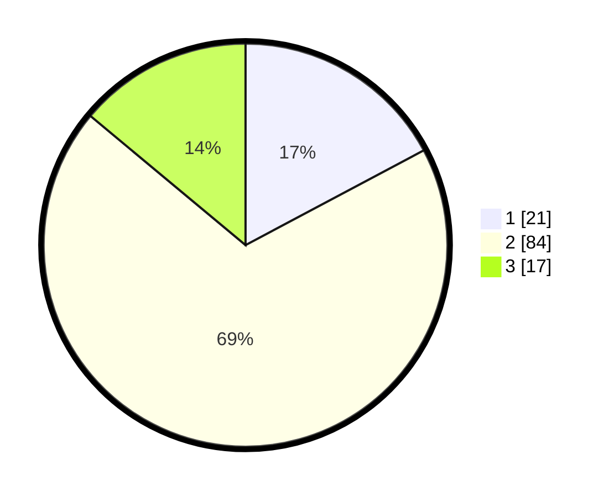

# Hasil

## Grafik

## Tabel

| No. | Nama Paslon    | Suara | Suara (raw) | Persentase |
|:--- |:-------------- | -----:| -----------:| ----------:|
| 1   | ANIES MUHAIMIN | 21    | [21][p-1]   | 17,21      |
| 2   | PRABOWO GIBRAN | 84    | [84][p-2]   | 68,85      |
| 3   | GANJAR MAHFUD  | 17    | [17][p-3]   | 13,93      |

[p-1]: https://github.com/gigit-pemilu/pemilu-2024-35-jawa-timur/blob/main/pilpres/hitung-suara/sub/35-jawa-timur/sub/78-kota-surabaya/sub/12-pabean-cantian/sub/1006-tanjung-perak/sub/064-tps/sub/paslon-1.txt
[p-2]: https://github.com/gigit-pemilu/pemilu-2024-35-jawa-timur/blob/main/pilpres/hitung-suara/sub/35-jawa-timur/sub/78-kota-surabaya/sub/12-pabean-cantian/sub/1006-tanjung-perak/sub/064-tps/sub/paslon-2.txt
[p-3]: https://github.com/gigit-pemilu/pemilu-2024-35-jawa-timur/blob/main/pilpres/hitung-suara/sub/35-jawa-timur/sub/78-kota-surabaya/sub/12-pabean-cantian/sub/1006-tanjung-perak/sub/064-tps/sub/paslon-3.txt

## Foto C Plano

https://sirekap-obj-formc.kpu.go.id/00fe/pemilu/ppwp/35/78/12/10/06/3578121006064-20240215-034256--8896506a-8b27-4288-9f55-96995af7ff7b.jpg

https://sirekap-obj-formc.kpu.go.id/00fe/pemilu/ppwp/35/78/12/10/06/3578121006064-20240215-034502--a698849d-57ee-4a73-ac3e-a8591aacfd17.jpg

https://sirekap-obj-formc.kpu.go.id/00fe/pemilu/ppwp/35/78/12/10/06/3578121006064-20240217-155536--823221fe-a5b1-47ab-83b9-8a6569f7c2a7.jpg

## Metadata

| Key        | Value               |
| ---------- | ------------------- |
| Time Stamp | 2024-02-24 22:31:28 |

