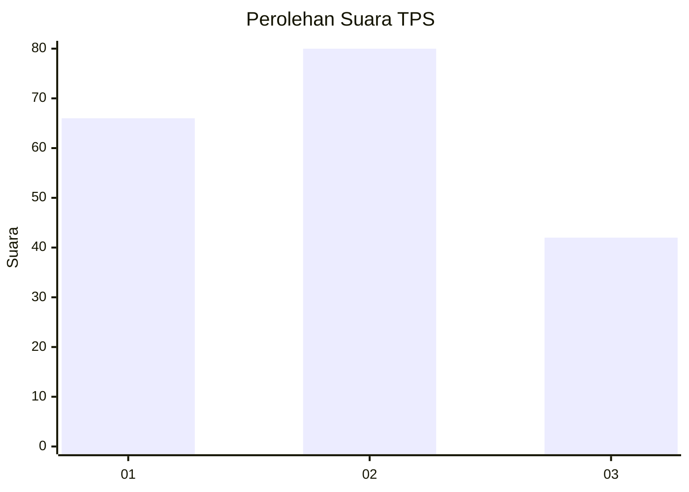
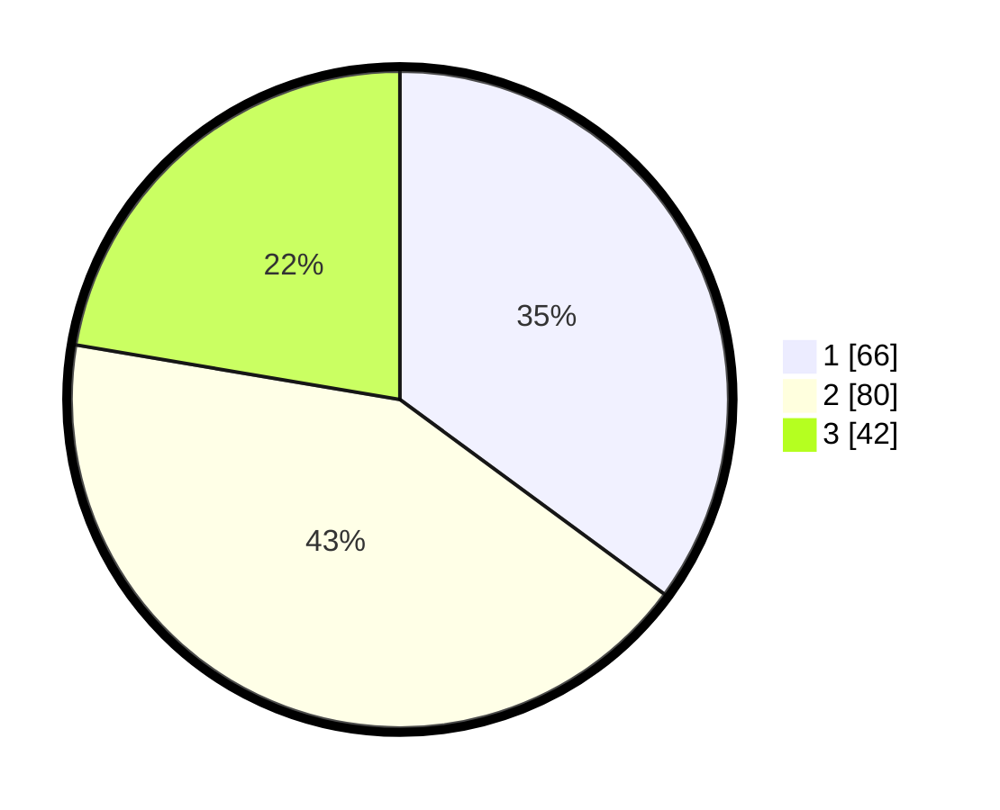

# Hasil

## Grafik

## Tabel

| No. | Nama Paslon    | Suara | Suara (raw) | Persentase |
|:--- |:-------------- | -----:| -----------:| ----------:|
| 1   | ANIES MUHAIMIN | 66    | [66][p-1]   | 35,11      |
| 2   | PRABOWO GIBRAN | 80    | [80][p-2]   | 42,55      |
| 3   | GANJAR MAHFUD  | 42    | [42][p-3]   | 22,34      |

[p-1]: https://github.com/gigit-pemilu/pemilu-2024-35-jawa-timur/blob/main/pilpres/hitung-suara/sub/35-jawa-timur/sub/78-kota-surabaya/sub/12-pabean-cantian/sub/1006-tanjung-perak/sub/067-tps/sub/paslon-1.txt
[p-2]: https://github.com/gigit-pemilu/pemilu-2024-35-jawa-timur/blob/main/pilpres/hitung-suara/sub/35-jawa-timur/sub/78-kota-surabaya/sub/12-pabean-cantian/sub/1006-tanjung-perak/sub/067-tps/sub/paslon-2.txt
[p-3]: https://github.com/gigit-pemilu/pemilu-2024-35-jawa-timur/blob/main/pilpres/hitung-suara/sub/35-jawa-timur/sub/78-kota-surabaya/sub/12-pabean-cantian/sub/1006-tanjung-perak/sub/067-tps/sub/paslon-3.txt

## Foto C Plano

https://sirekap-obj-formc.kpu.go.id/5710/pemilu/ppwp/35/78/12/10/06/3578121006067-20240214-160103--dc191d53-0623-4d61-90ee-72d9372ed7b3.jpg

https://sirekap-obj-formc.kpu.go.id/5710/pemilu/ppwp/35/78/12/10/06/3578121006067-20240214-155608--18804ae8-d712-42a9-b286-72fa8df75419.jpg

https://sirekap-obj-formc.kpu.go.id/5710/pemilu/ppwp/35/78/12/10/06/3578121006067-20240214-155703--2c80a30d-5543-4d3a-adba-e87892744ae5.jpg

## Metadata

| Key        | Value               |
| ---------- | ------------------- |
| Time Stamp | 2024-02-24 22:31:28 |

