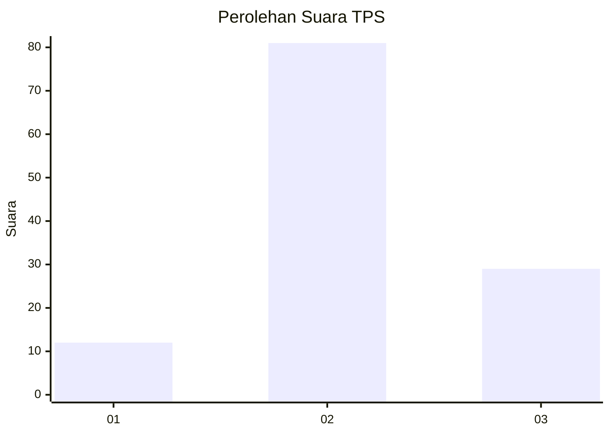
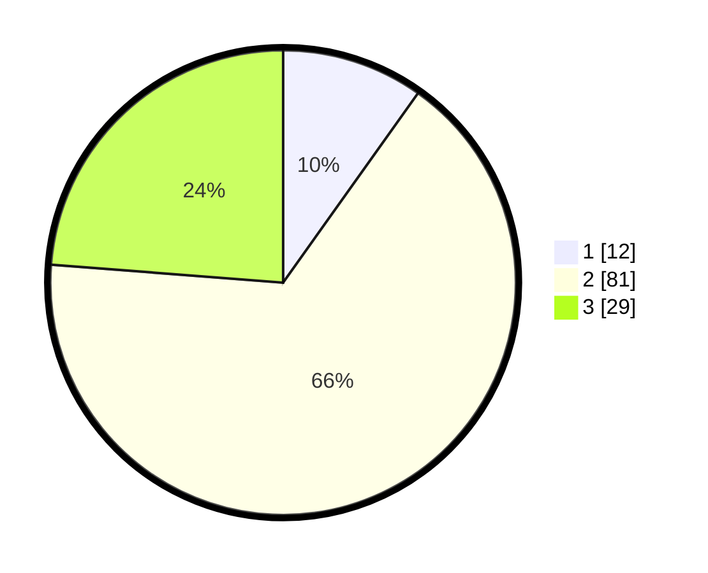

# Hasil

## Grafik

## Tabel

| No. | Nama Paslon    | Suara | Suara (raw) | Persentase |
|:--- |:-------------- | -----:| -----------:| ----------:|
| 1   | ANIES MUHAIMIN | 12    | [12][p-1]   | 9,84       |
| 2   | PRABOWO GIBRAN | 81    | [81][p-2]   | 66,39      |
| 3   | GANJAR MAHFUD  | 29    | [29][p-3]   | 23,77      |

[p-1]: https://github.com/gigit-pemilu/pemilu-2024-35-jawa-timur/blob/main/pilpres/hitung-suara/sub/35-jawa-timur/sub/78-kota-surabaya/sub/12-pabean-cantian/sub/1006-tanjung-perak/sub/073-tps/sub/paslon-1.txt
[p-2]: https://github.com/gigit-pemilu/pemilu-2024-35-jawa-timur/blob/main/pilpres/hitung-suara/sub/35-jawa-timur/sub/78-kota-surabaya/sub/12-pabean-cantian/sub/1006-tanjung-perak/sub/073-tps/sub/paslon-2.txt
[p-3]: https://github.com/gigit-pemilu/pemilu-2024-35-jawa-timur/blob/main/pilpres/hitung-suara/sub/35-jawa-timur/sub/78-kota-surabaya/sub/12-pabean-cantian/sub/1006-tanjung-perak/sub/073-tps/sub/paslon-3.txt

## Foto C Plano

https://sirekap-obj-formc.kpu.go.id/dafd/pemilu/ppwp/35/78/12/10/06/3578121006073-20240214-232349--2eb166f2-ea03-48d6-9a79-ef0fff6dab4a.jpg

https://sirekap-obj-formc.kpu.go.id/dafd/pemilu/ppwp/35/78/12/10/06/3578121006073-20240214-232432--27b1180a-fca1-4c0c-a38c-23e6a815b677.jpg

https://sirekap-obj-formc.kpu.go.id/dafd/pemilu/ppwp/35/78/12/10/06/3578121006073-20240214-232621--641788b5-5a61-4a68-8ca2-97b534e658d5.jpg

## Metadata

| Key        | Value               |
| ---------- | ------------------- |
| Time Stamp | 2024-02-25 13:00:00 |

