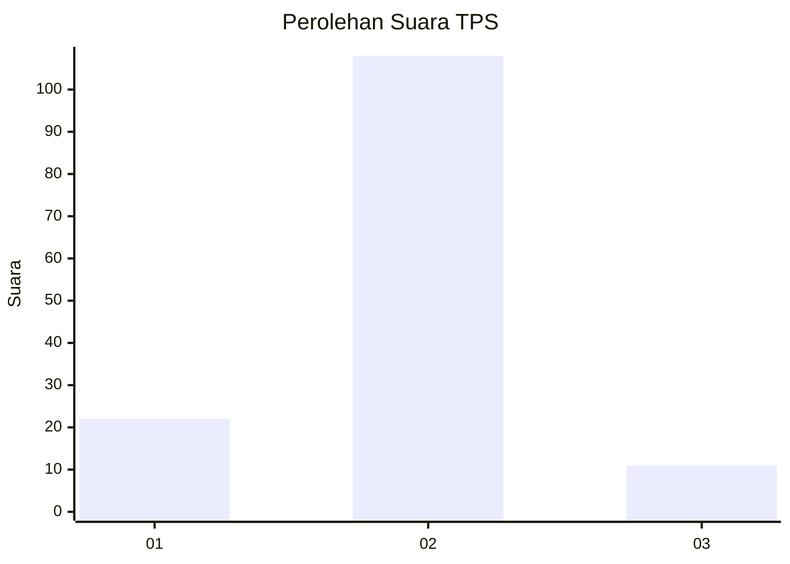
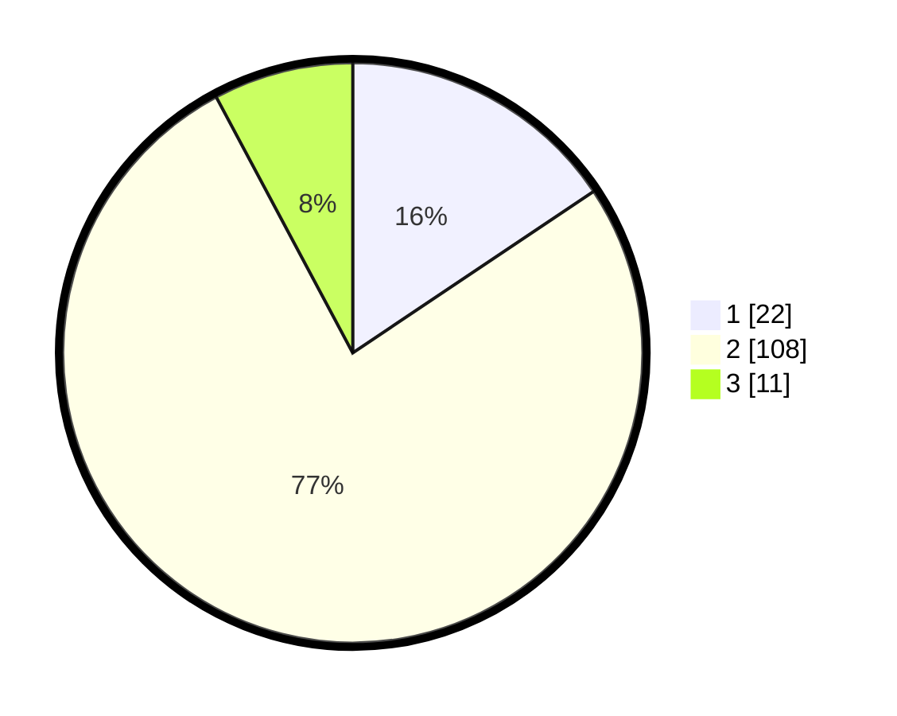

# Hasil

## Grafik

## Tabel

| No. | Nama Paslon    | Suara | Suara (raw) | Persentase |
|:--- |:-------------- | -----:| -----------:| ----------:|
| 1   | ANIES MUHAIMIN | 22    | [22][p-1]   | 15,60      |
| 2   | PRABOWO GIBRAN | 108   | [108][p-2]  | 76,60      |
| 3   | GANJAR MAHFUD  | 11    | [11][p-3]   | 7,80       |

[p-1]: https://github.com/gigit-pemilu/pemilu-2024/blob/main/pilpres/hitung-suara/sub/35-jawa-timur/sub/78-kota-surabaya/sub/12-pabean-cantian/sub/1006-tanjung-perak/sub/089-tps/sub/paslon-1.txt
[p-2]: https://github.com/gigit-pemilu/pemilu-2024/blob/main/pilpres/hitung-suara/sub/35-jawa-timur/sub/78-kota-surabaya/sub/12-pabean-cantian/sub/1006-tanjung-perak/sub/089-tps/sub/paslon-2.txt
[p-3]: https://github.com/gigit-pemilu/pemilu-2024/blob/main/pilpres/hitung-suara/sub/35-jawa-timur/sub/78-kota-surabaya/sub/12-pabean-cantian/sub/1006-tanjung-perak/sub/089-tps/sub/paslon-3.txt

## Foto C Plano

https://sirekap-obj-formc.kpu.go.id/371c/pemilu/ppwp/35/78/12/10/06/3578121006089-20240214-225901--5ef8db5e-72bc-45fc-912b-68e65c48764d.jpg

https://sirekap-obj-formc.kpu.go.id/371c/pemilu/ppwp/35/78/12/10/06/3578121006089-20240214-225957--75136d5b-27bd-4229-abfe-7bbb9b9aac38.jpg

https://sirekap-obj-formc.kpu.go.id/371c/pemilu/ppwp/35/78/12/10/06/3578121006089-20240214-230028--3b775326-d316-4d52-9c39-0d2980285f1a.jpg

## Metadata

| Key        | Value               |
| ---------- | ------------------- |
| Time Stamp | 2024-02-19 06:16:00 |

