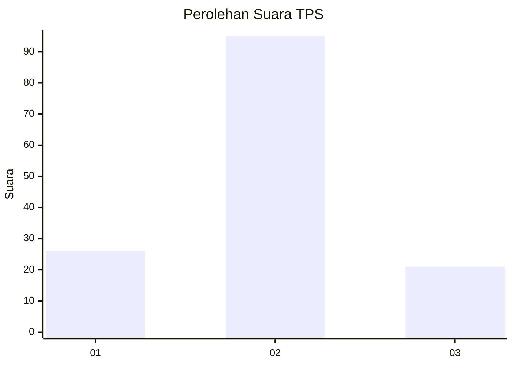
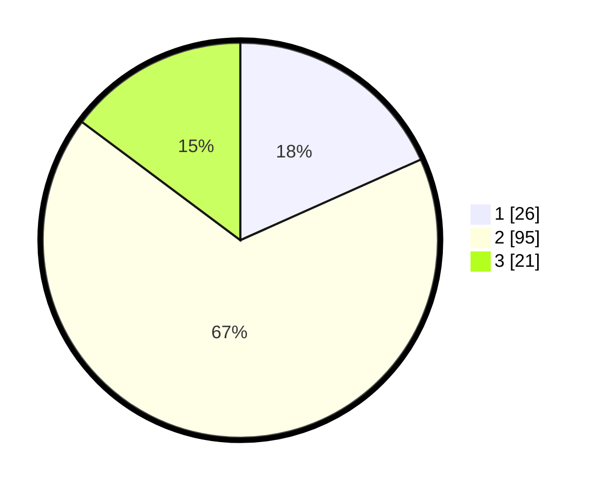

# Hasil

## Grafik

## Tabel

| No. | Nama Paslon    | Suara | Suara (raw) | Persentase |
|:--- |:-------------- | -----:| -----------:| ----------:|
| 1   | ANIES MUHAIMIN | 26    | [26][p-1]   | 18,31      |
| 2   | PRABOWO GIBRAN | 95    | [95][p-2]   | 66,90      |
| 3   | GANJAR MAHFUD  | 21    | [21][p-3]   | 14,79      |

[p-1]: https://github.com/gigit-pemilu/pemilu-2024/blob/main/pilpres/hitung-suara/sub/35-jawa-timur/sub/78-kota-surabaya/sub/12-pabean-cantian/sub/1006-tanjung-perak/sub/091-tps/sub/paslon-1.txt
[p-2]: https://github.com/gigit-pemilu/pemilu-2024/blob/main/pilpres/hitung-suara/sub/35-jawa-timur/sub/78-kota-surabaya/sub/12-pabean-cantian/sub/1006-tanjung-perak/sub/091-tps/sub/paslon-2.txt
[p-3]: https://github.com/gigit-pemilu/pemilu-2024/blob/main/pilpres/hitung-suara/sub/35-jawa-timur/sub/78-kota-surabaya/sub/12-pabean-cantian/sub/1006-tanjung-perak/sub/091-tps/sub/paslon-3.txt

## Foto C Plano

https://sirekap-obj-formc.kpu.go.id/4d9e/pemilu/ppwp/35/78/12/10/06/3578121006091-20240215-010939--7a3d8b42-a591-4fa9-87f6-07f4d741abcb.jpg

https://sirekap-obj-formc.kpu.go.id/4d9e/pemilu/ppwp/35/78/12/10/06/3578121006091-20240215-010956--721321fd-9470-4f48-8189-ab843daa9ec1.jpg

https://sirekap-obj-formc.kpu.go.id/4d9e/pemilu/ppwp/35/78/12/10/06/3578121006091-20240215-011011--5fb9e290-4d7e-4ab4-a77e-50126b3672e7.jpg

## Metadata

| Key        | Value               |
| ---------- | ------------------- |
| Time Stamp | 2024-02-25 16:00:00 |

