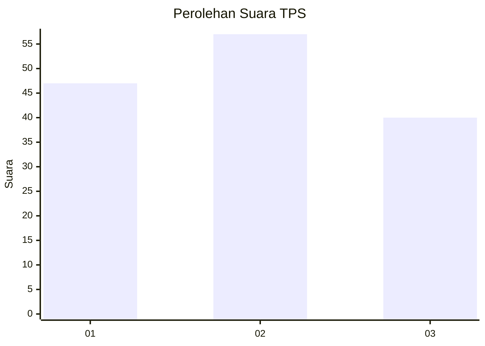
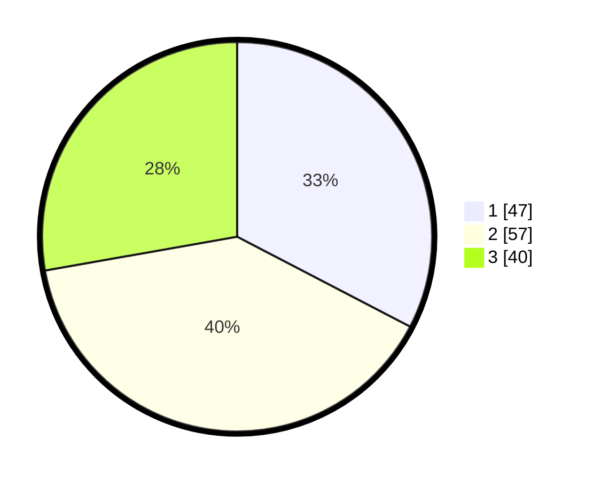

# Hasil

## Grafik

## Tabel

| No. | Nama Paslon    | Suara | Suara (raw) | Persentase |
|:--- |:-------------- | -----:| -----------:| ----------:|
| 1   | ANIES MUHAIMIN | 47    | [47][p-1]   | 32,64      |
| 2   | PRABOWO GIBRAN | 57    | [57][p-2]   | 39,58      |
| 3   | GANJAR MAHFUD  | 40    | [40][p-3]   | 27,78      |

[p-1]: https://github.com/gigit-pemilu/pemilu-2024/blob/main/pilpres/hitung-suara/sub/35-jawa-timur/sub/78-kota-surabaya/sub/12-pabean-cantian/sub/1006-tanjung-perak/sub/096-tps/sub/paslon-1.txt
[p-2]: https://github.com/gigit-pemilu/pemilu-2024/blob/main/pilpres/hitung-suara/sub/35-jawa-timur/sub/78-kota-surabaya/sub/12-pabean-cantian/sub/1006-tanjung-perak/sub/096-tps/sub/paslon-2.txt
[p-3]: https://github.com/gigit-pemilu/pemilu-2024/blob/main/pilpres/hitung-suara/sub/35-jawa-timur/sub/78-kota-surabaya/sub/12-pabean-cantian/sub/1006-tanjung-perak/sub/096-tps/sub/paslon-3.txt

## Foto C Plano

https://sirekap-obj-formc.kpu.go.id/6a04/pemilu/ppwp/35/78/12/10/06/3578121006096-20240214-201531--ab6fcbd7-0e83-4857-8d67-d0eb181d8ea2.jpg

https://sirekap-obj-formc.kpu.go.id/6a04/pemilu/ppwp/35/78/12/10/06/3578121006096-20240214-201619--c55ff193-8e0d-4c44-87b1-e6f20fafb2e2.jpg

https://sirekap-obj-formc.kpu.go.id/6a04/pemilu/ppwp/35/78/12/10/06/3578121006096-20240214-201751--905ab615-4697-49ea-a613-08b65ea2615f.jpg

## Metadata

| Key        | Value               |
| ---------- | ------------------- |
| Time Stamp | 2024-02-25 16:00:00 |

