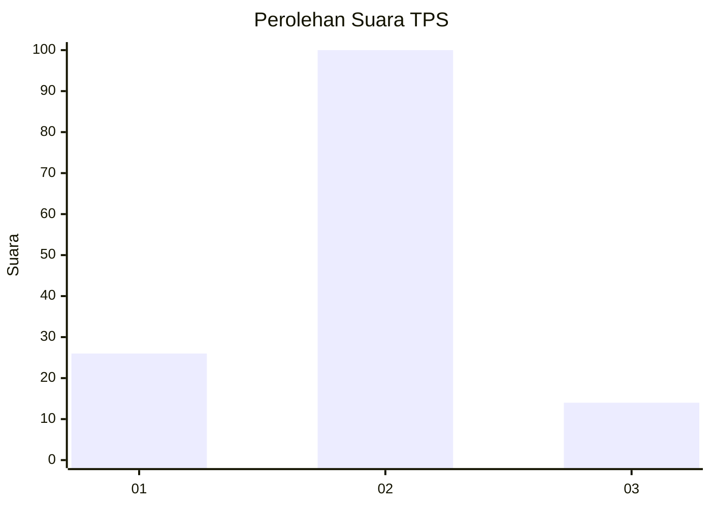
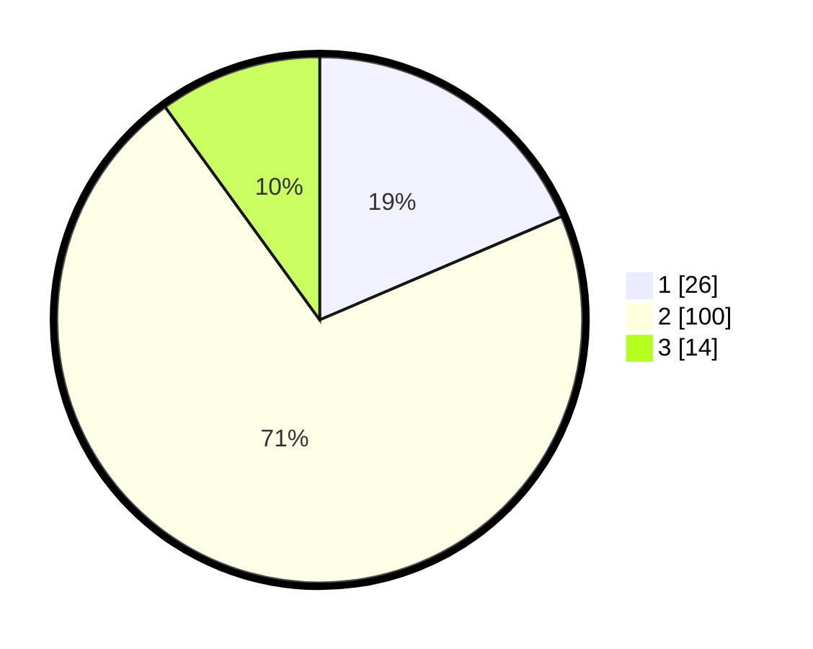

# Hasil

## Grafik

## Tabel

| No. | Nama Paslon    | Suara | Suara (raw) | Persentase |
|:--- |:-------------- | -----:| -----------:| ----------:|
| 1   | ANIES MUHAIMIN | 26    | [26][p-1]   | 18,57      |
| 2   | PRABOWO GIBRAN | 100   | [100][p-2]  | 71,43      |
| 3   | GANJAR MAHFUD  | 14    | [14][p-3]   | 10,00      |

[p-1]: https://github.com/gigit-pemilu/pemilu-2024/blob/main/pilpres/hitung-suara/sub/35-jawa-timur/sub/78-kota-surabaya/sub/12-pabean-cantian/sub/1006-tanjung-perak/sub/112-tps/sub/paslon-1.txt
[p-2]: https://github.com/gigit-pemilu/pemilu-2024/blob/main/pilpres/hitung-suara/sub/35-jawa-timur/sub/78-kota-surabaya/sub/12-pabean-cantian/sub/1006-tanjung-perak/sub/112-tps/sub/paslon-2.txt
[p-3]: https://github.com/gigit-pemilu/pemilu-2024/blob/main/pilpres/hitung-suara/sub/35-jawa-timur/sub/78-kota-surabaya/sub/12-pabean-cantian/sub/1006-tanjung-perak/sub/112-tps/sub/paslon-3.txt

## Foto C Plano

https://sirekap-obj-formc.kpu.go.id/36a5/pemilu/ppwp/35/78/12/10/06/3578121006112-20240214-212121--242f2198-c827-4a2c-9fb7-e6b5909c6a48.jpg

https://sirekap-obj-formc.kpu.go.id/36a5/pemilu/ppwp/35/78/12/10/06/3578121006112-20240214-212252--4ca9c156-f8aa-4a01-abe0-6dfaf74ce1b7.jpg

https://sirekap-obj-formc.kpu.go.id/36a5/pemilu/ppwp/35/78/12/10/06/3578121006112-20240214-212411--b1d825c2-14af-44c4-a922-92a3a7d18942.jpg

## Metadata

| Key        | Value               |
| ---------- | ------------------- |
| Time Stamp | 2024-02-19 10:00:00 |

