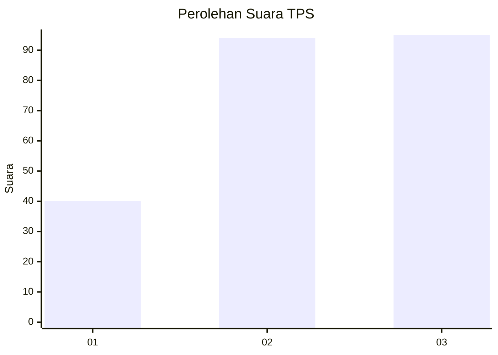
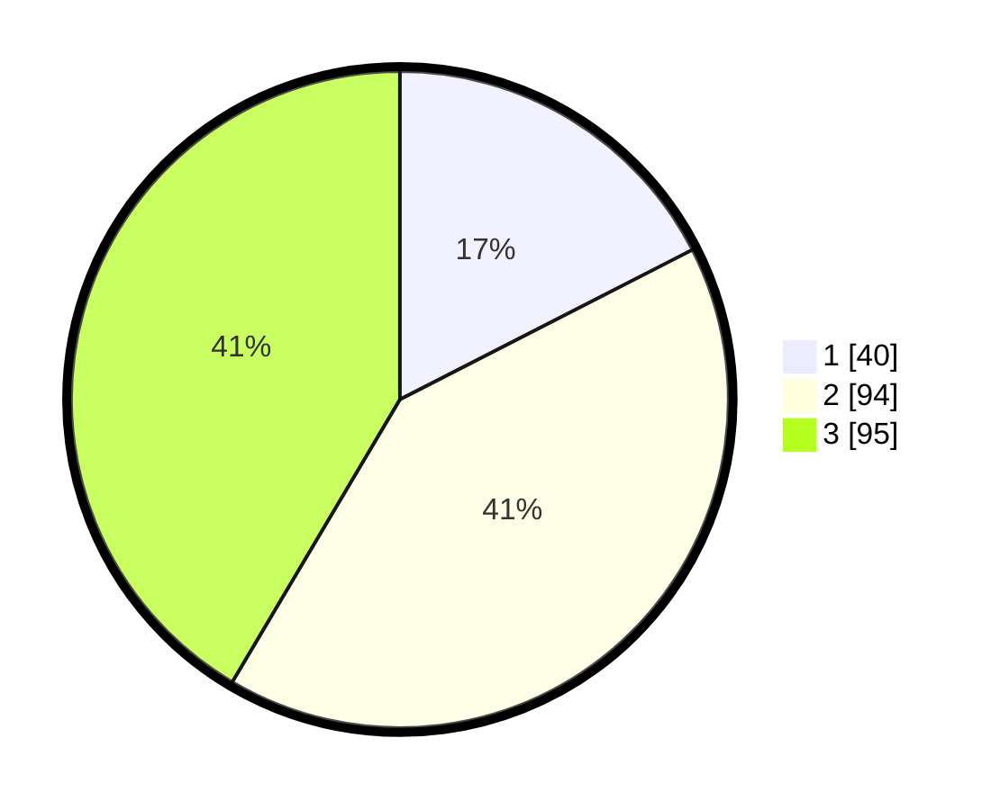

# Hasil

## Grafik

## Tabel

| No. | Nama Paslon    | Suara | Suara (raw) | Persentase |
|:--- |:-------------- | -----:| -----------:| ----------:|
| 1   | ANIES MUHAIMIN | 40    | [40][p-1]   | 17,47      |
| 2   | PRABOWO GIBRAN | 94    | [94][p-2]   | 41,05      |
| 3   | GANJAR MAHFUD  | 95    | [95][p-3]   | 41,48      |

[p-1]: https://github.com/gigit-pemilu/pemilu-2024-35-jawa-timur/blob/main/pilpres/hitung-suara/sub/35-jawa-timur/sub/78-kota-surabaya/sub/13-bubutan/sub/1001-alun-alun-contong/sub/001-tps/sub/paslon-1.txt
[p-2]: https://github.com/gigit-pemilu/pemilu-2024-35-jawa-timur/blob/main/pilpres/hitung-suara/sub/35-jawa-timur/sub/78-kota-surabaya/sub/13-bubutan/sub/1001-alun-alun-contong/sub/001-tps/sub/paslon-2.txt
[p-3]: https://github.com/gigit-pemilu/pemilu-2024-35-jawa-timur/blob/main/pilpres/hitung-suara/sub/35-jawa-timur/sub/78-kota-surabaya/sub/13-bubutan/sub/1001-alun-alun-contong/sub/001-tps/sub/paslon-3.txt

## Foto C Plano

https://sirekap-obj-formc.kpu.go.id/b504/pemilu/ppwp/35/78/13/10/01/3578131001001-20240223-171751--a8c2c28d-82e2-4c11-a9c6-02aded2c961d.jpg

https://sirekap-obj-formc.kpu.go.id/b504/pemilu/ppwp/35/78/13/10/01/3578131001001-20240223-171835--bfd410b5-e6e0-4aa7-9c31-fa063dd5ba0e.jpg

https://sirekap-obj-formc.kpu.go.id/b504/pemilu/ppwp/35/78/13/10/01/3578131001001-20240223-171916--d4210831-82f7-4bb4-8725-af50a3f77075.jpg

## Metadata

| Key        | Value               |
| ---------- | ------------------- |
| Time Stamp | 2024-02-24 22:31:28 |

## DATA PEMILIH TETAP

Jumlah pemilih dalam DPT: **254**.
 * L: **24**.
 * P: **489**.

## DATA PENGGUNA HAK PILIH

Jumlah pengguna hak pilih dalam DPT: **200**.
 * L: **86**.
 * P: **184**.

Jumlah pengguna hak pilih dalam DPTb: **72**.
 * L: **0**.
 * P: **0**.

Jumlah pengguna hak pilih dalam DPK: **2**.
 * L: **1**.
 * P: **1**.

Jumlah pengguna hak pilih: **292**.
 * L: **82**.
 * P: **112**.

## JUMLAH SUARA SAH DAN TIDAK SAH

JUMLAH SELURUH SUARA SAH: **199**.

JUMLAH SUARA TIDAK SAH: **3**.

JUMLAH SELURUH SUARA SAH DAN SUARA TIDAK SAH: **202**.

