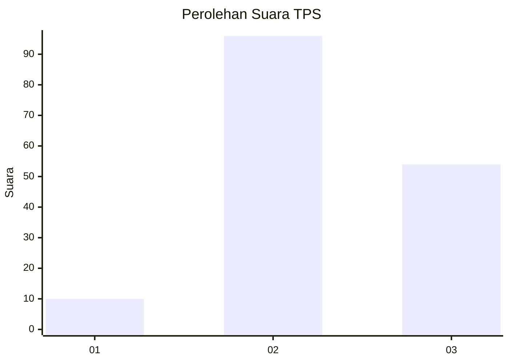
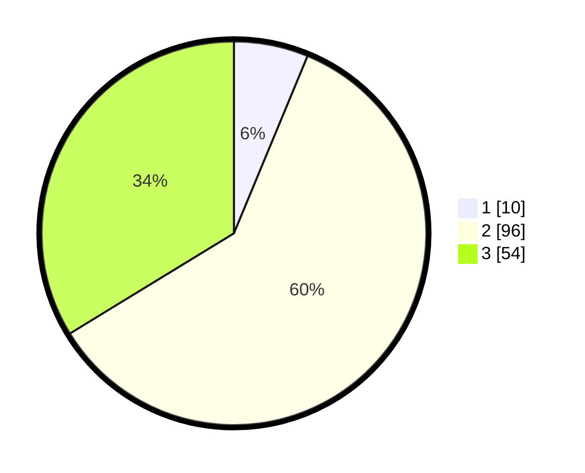

# Hasil

## Grafik

## Tabel

| No. | Nama Paslon    | Suara | Suara (raw) | Persentase |
|:--- |:-------------- | -----:| -----------:| ----------:|
| 1   | ANIES MUHAIMIN | 10    | [10][p-1]   | 6,25       |
| 2   | PRABOWO GIBRAN | 96    | [96][p-2]   | 60,00      |
| 3   | GANJAR MAHFUD  | 54    | [54][p-3]   | 33,75      |

[p-1]: https://github.com/gigit-pemilu/pemilu-2024/blob/main/pilpres/hitung-suara/sub/35-jawa-timur/sub/78-kota-surabaya/sub/13-bubutan/sub/1001-alun-alun-contong/sub/009-tps/sub/paslon-1.txt
[p-2]: https://github.com/gigit-pemilu/pemilu-2024/blob/main/pilpres/hitung-suara/sub/35-jawa-timur/sub/78-kota-surabaya/sub/13-bubutan/sub/1001-alun-alun-contong/sub/009-tps/sub/paslon-2.txt
[p-3]: https://github.com/gigit-pemilu/pemilu-2024/blob/main/pilpres/hitung-suara/sub/35-jawa-timur/sub/78-kota-surabaya/sub/13-bubutan/sub/1001-alun-alun-contong/sub/009-tps/sub/paslon-3.txt

## Foto C Plano

https://sirekap-obj-formc.kpu.go.id/a9f7/pemilu/ppwp/35/78/13/10/01/3578131001009-20240214-233022--a81c5431-d080-45fb-a33d-802c1d7ae093.jpg

https://sirekap-obj-formc.kpu.go.id/a9f7/pemilu/ppwp/35/78/13/10/01/3578131001009-20240222-184456--00b7ba25-defe-4a10-9289-ba27846a743c.jpg

https://sirekap-obj-formc.kpu.go.id/a9f7/pemilu/ppwp/35/78/13/10/01/3578131001009-20240215-001442--3cd351f3-1e8a-47fb-9e97-85623b18946c.jpg

## Metadata

| Key        | Value               |
| ---------- | ------------------- |
| Time Stamp | 2024-02-22 19:00:00 |

