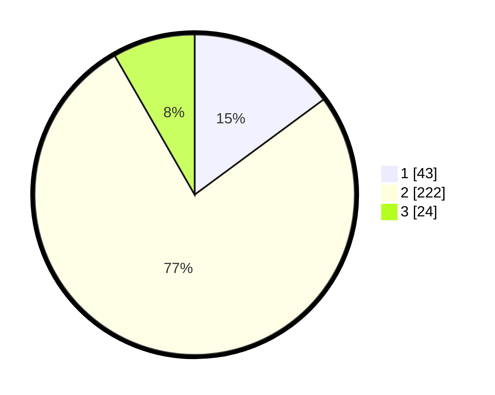

# Hasil

## Grafik

## Tabel

| No. | Nama Paslon    | Suara | Suara (raw) | Persentase |
|:--- |:-------------- | -----:| -----------:| ----------:|
| 1   | ANIES MUHAIMIN | 43    | [43][p-1]   | 14,88      |
| 2   | PRABOWO GIBRAN | 222   | [222][p-2]  | 76,82      |
| 3   | GANJAR MAHFUD  | 24    | [24][p-3]   | 8,30       |

[p-1]: https://github.com/gigit-pemilu/pemilu-2024-35-jawa-timur/blob/main/pilpres/hitung-suara/sub/35-jawa-timur/sub/78-kota-surabaya/sub/13-bubutan/sub/1002-bubutan/sub/002-tps/sub/paslon-1.txt
[p-2]: https://github.com/gigit-pemilu/pemilu-2024-35-jawa-timur/blob/main/pilpres/hitung-suara/sub/35-jawa-timur/sub/78-kota-surabaya/sub/13-bubutan/sub/1002-bubutan/sub/002-tps/sub/paslon-2.txt
[p-3]: https://github.com/gigit-pemilu/pemilu-2024-35-jawa-timur/blob/main/pilpres/hitung-suara/sub/35-jawa-timur/sub/78-kota-surabaya/sub/13-bubutan/sub/1002-bubutan/sub/002-tps/sub/paslon-3.txt

## Foto C Plano

https://sirekap-obj-formc.kpu.go.id/a2a8/pemilu/ppwp/35/78/13/10/02/3578131002002-20240214-215506--acae32c3-b1e5-47bd-8139-1c511f2eec63.jpg

https://sirekap-obj-formc.kpu.go.id/a2a8/pemilu/ppwp/35/78/13/10/02/3578131002002-20240220-140848--b34adc42-275c-4d67-aa52-348cc8d85502.jpg

https://sirekap-obj-formc.kpu.go.id/a2a8/pemilu/ppwp/35/78/13/10/02/3578131002002-20240220-140925--ff3818e8-60f5-428e-81d1-d04e6edc35aa.jpg

## Metadata

| Key        | Value               |
| ---------- | ------------------- |
| Time Stamp | 2024-02-20 15:00:00 |

