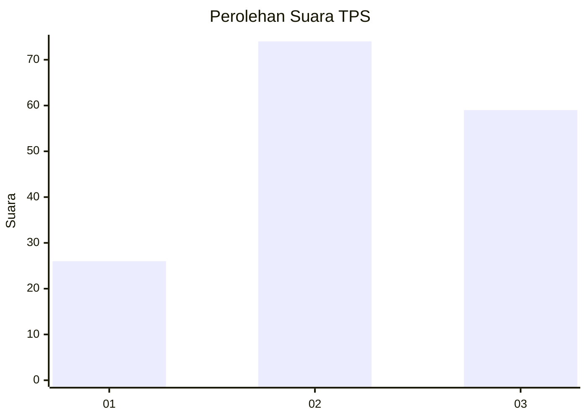
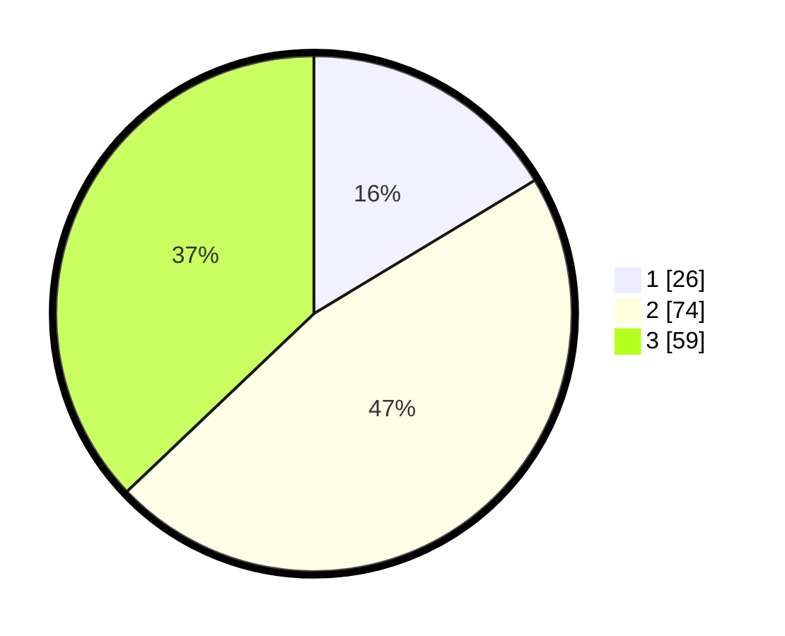

# Hasil

## Grafik

## Tabel

| No. | Nama Paslon    | Suara | Suara (raw) | Persentase |
|:--- |:-------------- | -----:| -----------:| ----------:|
| 1   | ANIES MUHAIMIN | 26    | [26][p-1]   | 16,35      |
| 2   | PRABOWO GIBRAN | 74    | [74][p-2]   | 46,54      |
| 3   | GANJAR MAHFUD  | 59    | [59][p-3]   | 37,11      |

[p-1]: https://github.com/gigit-pemilu/pemilu-2024/blob/main/pilpres/hitung-suara/sub/35-jawa-timur/sub/78-kota-surabaya/sub/13-bubutan/sub/1002-bubutan/sub/021-tps/sub/paslon-1.txt
[p-2]: https://github.com/gigit-pemilu/pemilu-2024/blob/main/pilpres/hitung-suara/sub/35-jawa-timur/sub/78-kota-surabaya/sub/13-bubutan/sub/1002-bubutan/sub/021-tps/sub/paslon-2.txt
[p-3]: https://github.com/gigit-pemilu/pemilu-2024/blob/main/pilpres/hitung-suara/sub/35-jawa-timur/sub/78-kota-surabaya/sub/13-bubutan/sub/1002-bubutan/sub/021-tps/sub/paslon-3.txt

## Foto C Plano

https://sirekap-obj-formc.kpu.go.id/afdf/pemilu/ppwp/35/78/13/10/02/3578131002021-20240221-212123--9f77c17a-f9df-4de2-bd2a-f0b0ddeaa669.jpg

https://sirekap-obj-formc.kpu.go.id/afdf/pemilu/ppwp/35/78/13/10/02/3578131002021-20240221-212510--9c9d4e65-d96c-4831-bb04-889eb84473fe.jpg

https://sirekap-obj-formc.kpu.go.id/afdf/pemilu/ppwp/35/78/13/10/02/3578131002021-20240221-212533--9eb00181-06fd-4b60-886c-29cf07d30758.jpg

## Metadata

| Key        | Value               |
| ---------- | ------------------- |
| Time Stamp | 2024-02-21 22:00:00 |

