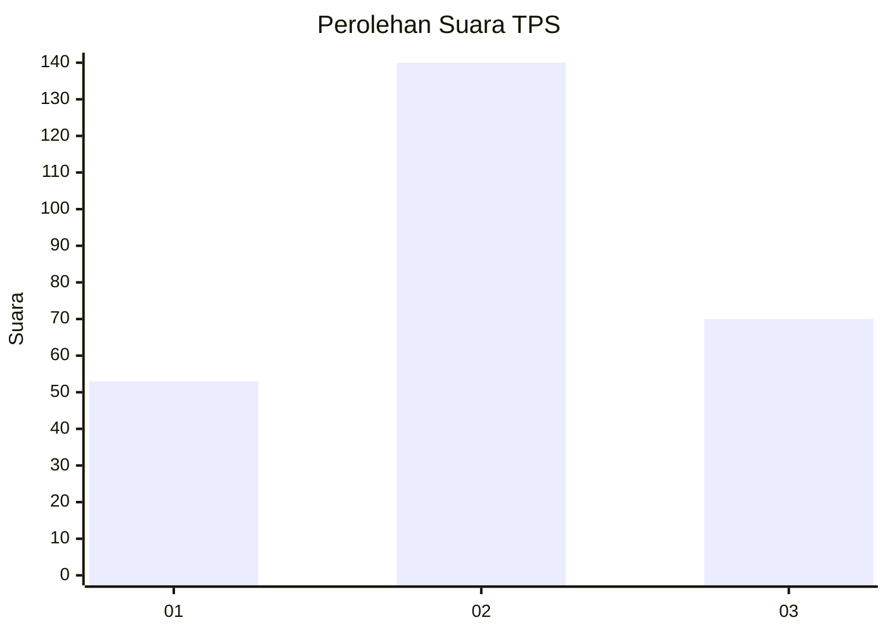
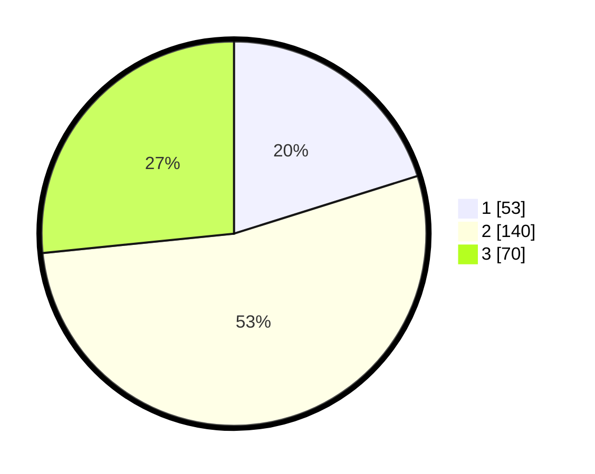

# Hasil

## Grafik

## Tabel

| No. | Nama Paslon    | Suara | Suara (raw) | Persentase |
|:--- |:-------------- | -----:| -----------:| ----------:|
| 1   | ANIES MUHAIMIN | 53    | [53][p-1]   | 20,15      |
| 2   | PRABOWO GIBRAN | 140   | [140][p-2]  | 53,23      |
| 3   | GANJAR MAHFUD  | 70    | [70][p-3]   | 26,62      |

[p-1]: https://github.com/gigit-pemilu/pemilu-2024-35-jawa-timur/blob/main/pilpres/hitung-suara/sub/35-jawa-timur/sub/78-kota-surabaya/sub/13-bubutan/sub/1002-bubutan/sub/022-tps/sub/paslon-1.txt
[p-2]: https://github.com/gigit-pemilu/pemilu-2024-35-jawa-timur/blob/main/pilpres/hitung-suara/sub/35-jawa-timur/sub/78-kota-surabaya/sub/13-bubutan/sub/1002-bubutan/sub/022-tps/sub/paslon-2.txt
[p-3]: https://github.com/gigit-pemilu/pemilu-2024-35-jawa-timur/blob/main/pilpres/hitung-suara/sub/35-jawa-timur/sub/78-kota-surabaya/sub/13-bubutan/sub/1002-bubutan/sub/022-tps/sub/paslon-3.txt

## Foto C Plano

https://sirekap-obj-formc.kpu.go.id/cd0b/pemilu/ppwp/35/78/13/10/02/3578131002022-20240222-150924--c49a56c6-7389-4257-a4f5-63b4b671eeaf.jpg

https://sirekap-obj-formc.kpu.go.id/cd0b/pemilu/ppwp/35/78/13/10/02/3578131002022-20240222-150854--12e2cb2f-91cf-419a-8444-b60f19c1f8fa.jpg

https://sirekap-obj-formc.kpu.go.id/cd0b/pemilu/ppwp/35/78/13/10/02/3578131002022-20240222-150827--9fa81906-4055-4d13-a1d4-53de734c879e.jpg

## Metadata

| Key        | Value               |
| ---------- | ------------------- |
| Time Stamp | 2024-02-22 16:00:00 |

## DATA PEMILIH TETAP

Jumlah pemilih dalam DPT: **399**.
 * L: **138**.
 * P: **152**.

## DATA PENGGUNA HAK PILIH

Jumlah pengguna hak pilih dalam DPT: **329**.
 * L: **237**.
 * P: **273**.

Jumlah pengguna hak pilih dalam DPTb: **55**.
 * L: **201**.
 * P: **84**.

Jumlah pengguna hak pilih dalam DPK: **403**.
 * L: **321**.
 * P: **1**.

Jumlah pengguna hak pilih: **327**.
 * L: **233**.
 * P: **229**.

## JUMLAH SUARA SAH DAN TIDAK SAH

JUMLAH SELURUH SUARA SAH: **223**.

JUMLAH SUARA TIDAK SAH: **4**.

JUMLAH SELURUH SUARA SAH DAN SUARA TIDAK SAH: **227**.

