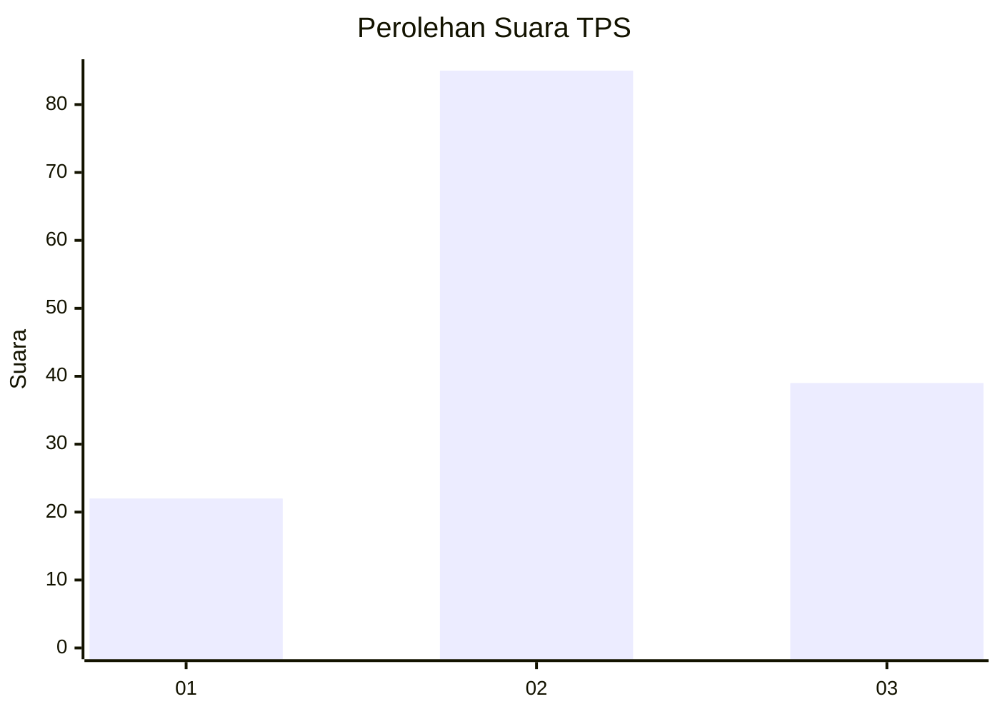
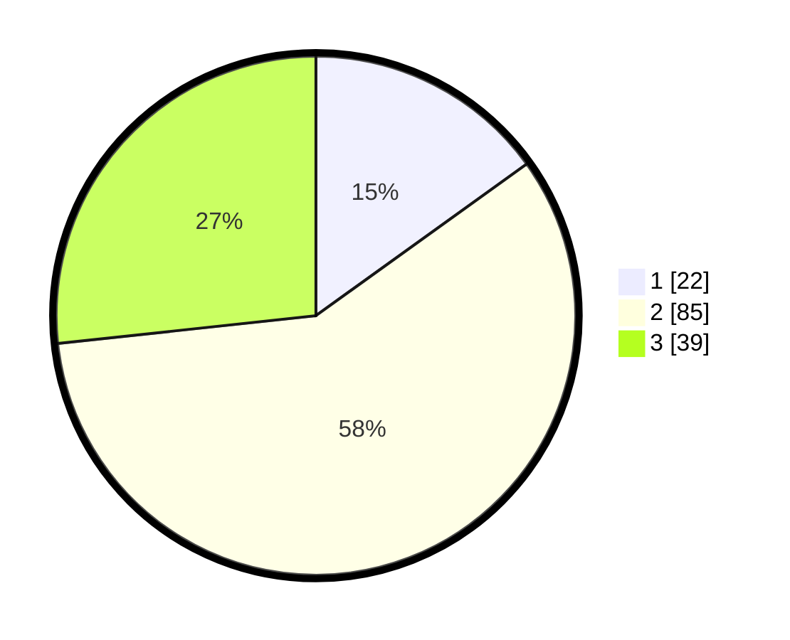

# Hasil

## Grafik

## Tabel

| No. | Nama Paslon    | Suara | Suara (raw) | Persentase |
|:--- |:-------------- | -----:| -----------:| ----------:|
| 1   | ANIES MUHAIMIN | 22    | [22][p-1]   | 15,07      |
| 2   | PRABOWO GIBRAN | 85    | [85][p-2]   | 58,22      |
| 3   | GANJAR MAHFUD  | 39    | [39][p-3]   | 26,71      |

[p-1]: https://github.com/gigit-pemilu/pemilu-2024/blob/main/pilpres/hitung-suara/sub/35-jawa-timur/sub/78-kota-surabaya/sub/13-bubutan/sub/1003-gundih/sub/039-tps/sub/paslon-1.txt
[p-2]: https://github.com/gigit-pemilu/pemilu-2024/blob/main/pilpres/hitung-suara/sub/35-jawa-timur/sub/78-kota-surabaya/sub/13-bubutan/sub/1003-gundih/sub/039-tps/sub/paslon-2.txt
[p-3]: https://github.com/gigit-pemilu/pemilu-2024/blob/main/pilpres/hitung-suara/sub/35-jawa-timur/sub/78-kota-surabaya/sub/13-bubutan/sub/1003-gundih/sub/039-tps/sub/paslon-3.txt

## Foto C Plano

https://sirekap-obj-formc.kpu.go.id/fe3e/pemilu/ppwp/35/78/13/10/03/3578131003039-20240215-005512--2bd30f60-af02-4a37-a9e6-c363ef6c8db6.jpg

https://sirekap-obj-formc.kpu.go.id/fe3e/pemilu/ppwp/35/78/13/10/03/3578131003039-20240215-005608--d13fdb85-a65e-468b-bb60-699606e65cd9.jpg

https://sirekap-obj-formc.kpu.go.id/fe3e/pemilu/ppwp/35/78/13/10/03/3578131003039-20240215-005722--0d848b01-5563-4201-b8d1-6fc47b3ec58a.jpg

## Metadata

| Key        | Value               |
| ---------- | ------------------- |
| Time Stamp | 2024-02-17 16:00:02 |

