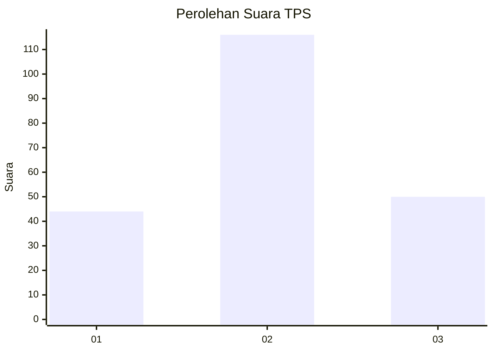
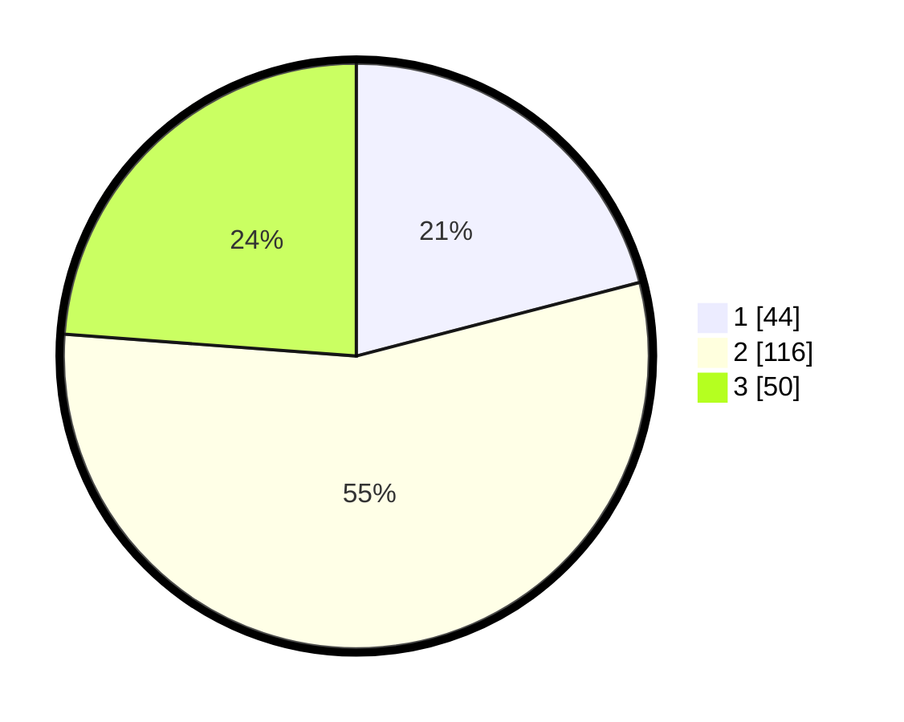

# Hasil

## Grafik

## Tabel

| No. | Nama Paslon    | Suara | Suara (raw) | Persentase |
|:--- |:-------------- | -----:| -----------:| ----------:|
| 1   | ANIES MUHAIMIN | 44    | [44][p-1]   | 20,95      |
| 2   | PRABOWO GIBRAN | 116   | [116][p-2]  | 55,24      |
| 3   | GANJAR MAHFUD  | 50    | [50][p-3]   | 23,81      |

[p-1]: https://github.com/gigit-pemilu/pemilu-2024-35-jawa-timur/blob/main/pilpres/hitung-suara/sub/35-jawa-timur/sub/78-kota-surabaya/sub/13-bubutan/sub/1003-gundih/sub/042-tps/sub/paslon-1.txt
[p-2]: https://github.com/gigit-pemilu/pemilu-2024-35-jawa-timur/blob/main/pilpres/hitung-suara/sub/35-jawa-timur/sub/78-kota-surabaya/sub/13-bubutan/sub/1003-gundih/sub/042-tps/sub/paslon-2.txt
[p-3]: https://github.com/gigit-pemilu/pemilu-2024-35-jawa-timur/blob/main/pilpres/hitung-suara/sub/35-jawa-timur/sub/78-kota-surabaya/sub/13-bubutan/sub/1003-gundih/sub/042-tps/sub/paslon-3.txt

## Foto C Plano

https://sirekap-obj-formc.kpu.go.id/8fcf/pemilu/ppwp/35/78/13/10/03/3578131003042-20240221-193740--dd50dc78-a09c-41f5-8f07-ae864e940a16.jpg

https://sirekap-obj-formc.kpu.go.id/8fcf/pemilu/ppwp/35/78/13/10/03/3578131003042-20240221-193114--d83aeb45-e536-44f7-a49f-594544716e12.jpg

https://sirekap-obj-formc.kpu.go.id/8fcf/pemilu/ppwp/35/78/13/10/03/3578131003042-20240221-193826--617f3a46-b77f-40ae-9750-1cbb90669b73.jpg

## Metadata

| Key        | Value               |
| ---------- | ------------------- |
| Time Stamp | 2024-02-24 22:31:28 |

## DATA PEMILIH TETAP

Jumlah pemilih dalam DPT: **0**.
 * L: **139**.
 * P: **100**.

## DATA PENGGUNA HAK PILIH

Jumlah pengguna hak pilih dalam DPT: **0**.
 * L: **904**.
 * P: **100**.

Jumlah pengguna hak pilih dalam DPTb: **777**.
 * L: **577**.
 * P: **707**.

Jumlah pengguna hak pilih dalam DPK: **20**.
 * L: **0**.
 * P: **0**.

Jumlah pengguna hak pilih: **574**.
 * L: **707**.
 * P: **735**.

## JUMLAH SUARA SAH DAN TIDAK SAH

JUMLAH SELURUH SUARA SAH: **210**.

JUMLAH SUARA TIDAK SAH: **2**.

JUMLAH SELURUH SUARA SAH DAN SUARA TIDAK SAH: **212**.

