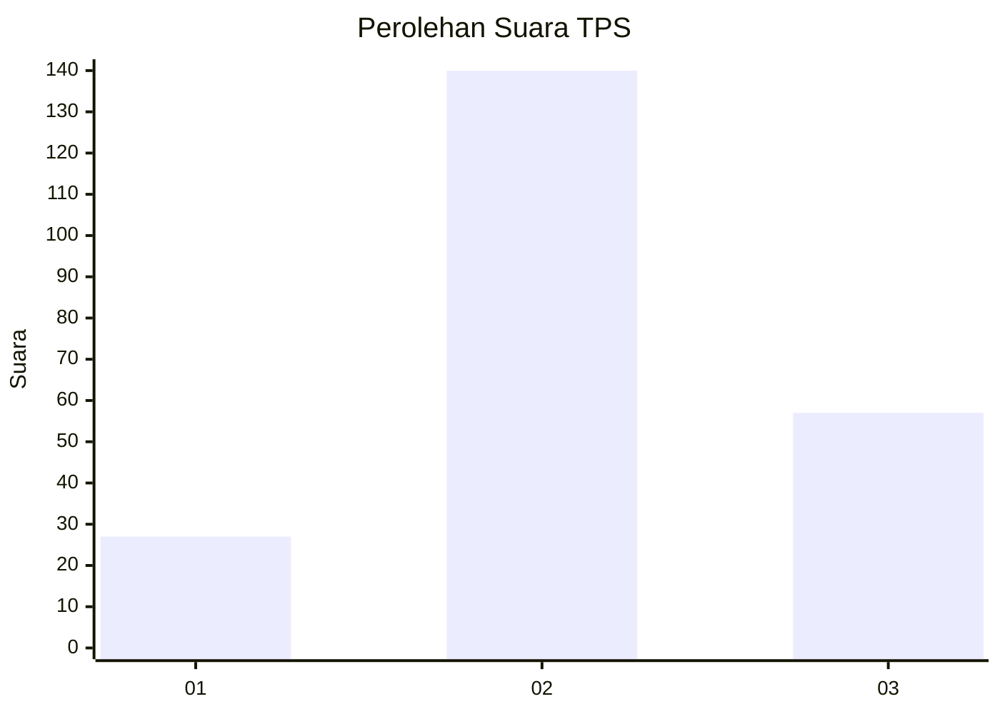
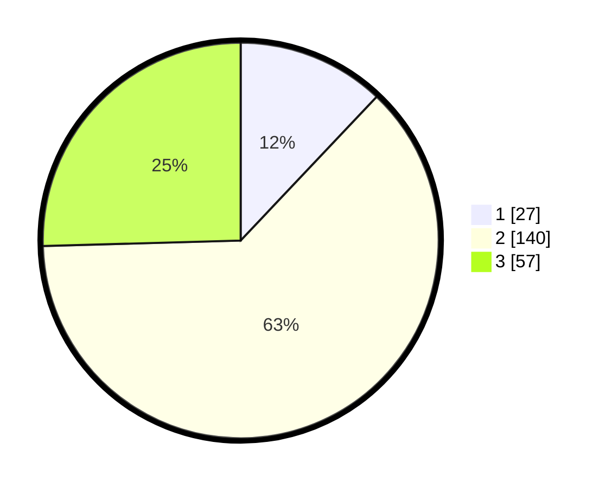

# Hasil

## Grafik

## Tabel

| No. | Nama Paslon    | Suara | Suara (raw) | Persentase |
|:--- |:-------------- | -----:| -----------:| ----------:|
| 1   | ANIES MUHAIMIN | 27    | [27][p-1]   | 12,05      |
| 2   | PRABOWO GIBRAN | 140   | [140][p-2]  | 62,50      |
| 3   | GANJAR MAHFUD  | 57    | [57][p-3]   | 25,45      |

[p-1]: https://github.com/gigit-pemilu/pemilu-2024/blob/main/pilpres/hitung-suara/sub/35-jawa-timur/sub/78-kota-surabaya/sub/13-bubutan/sub/1003-gundih/sub/046-tps/sub/paslon-1.txt
[p-2]: https://github.com/gigit-pemilu/pemilu-2024/blob/main/pilpres/hitung-suara/sub/35-jawa-timur/sub/78-kota-surabaya/sub/13-bubutan/sub/1003-gundih/sub/046-tps/sub/paslon-2.txt
[p-3]: https://github.com/gigit-pemilu/pemilu-2024/blob/main/pilpres/hitung-suara/sub/35-jawa-timur/sub/78-kota-surabaya/sub/13-bubutan/sub/1003-gundih/sub/046-tps/sub/paslon-3.txt

## Foto C Plano

https://sirekap-obj-formc.kpu.go.id/d6c6/pemilu/ppwp/35/78/13/10/03/3578131003046-20240221-124731--6ed1e019-ad37-4a81-b7e9-09440e6e018c.jpg

https://sirekap-obj-formc.kpu.go.id/d6c6/pemilu/ppwp/35/78/13/10/03/3578131003046-20240221-125051--c1a40526-47eb-45c3-aa1b-7932c94c34e0.jpg

https://sirekap-obj-formc.kpu.go.id/d6c6/pemilu/ppwp/35/78/13/10/03/3578131003046-20240221-125022--d64a632b-bbe4-4768-a617-a0d6eb202f46.jpg

## Metadata

| Key        | Value               |
| ---------- | ------------------- |
| Time Stamp | 2024-02-22 10:00:00 |

## DATA PEMILIH TETAP

Jumlah pemilih dalam DPT: **1**.
 * L: **0**.
 * P: **0**.

## DATA PENGGUNA HAK PILIH

Jumlah pengguna hak pilih dalam DPT: **4**.
 * L: **7**.
 * P: **7**.

Jumlah pengguna hak pilih dalam DPTb: **254**.
 * L: **254**.
 * P: **254**.

Jumlah pengguna hak pilih dalam DPK: **554**.
 * L: **527**.
 * P: **257**.

Jumlah pengguna hak pilih: **551**.
 * L: **552**.
 * P: **551**.

## JUMLAH SUARA SAH DAN TIDAK SAH

JUMLAH SELURUH SUARA SAH: **224**.

JUMLAH SUARA TIDAK SAH: **3**.

JUMLAH SELURUH SUARA SAH DAN SUARA TIDAK SAH: **227**.

